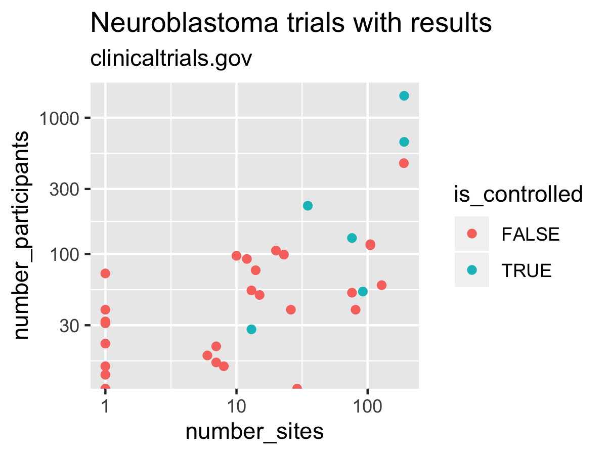
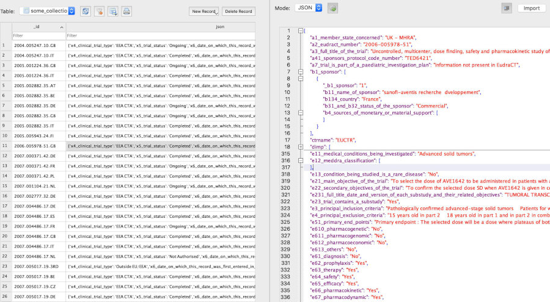

---
output:
  github_document:
    toc: false
    toc_depth: 1
editor_options: 
  chunk_output_type: console
---

<!-- README.md is generated from README.Rmd -->

```{r setup, include=FALSE}
knitr::opts_chunk$set(
  collapse = TRUE,
  eval = FALSE,
  comment = "#>",
  fig.path = "inst/image/README-",
  out.width = "100%"
)

# devtools::install_github("hadley/emo")
# devtools::install_github("ropenscilabs/icon")
```

<!-- badges: start -->
[](https://cran.r-project.org/package=ctrdata)
[](https://codecov.io/gh/rfhb/ctrdata)
[](https://github.com/rfhb/ctrdata/actions?query=workflow%3AR-CMD-check-win-macos)
[](https://github.com/rfhb/ctrdata/actions?query=workflow%3AR-CMD-check-linux)
[](https://rfhb.slack.com/messages/C6N1Y75B6)
<!-- badges: end -->

# ctrdata for aggregating and analysing clinical trials

The package `ctrdata` provides functions for retrieving (downloading) information on clinical trials from public registers, and for aggregating and analysing this information. Use with  [R](https://www.r-project.org/) for the European Union Clinical Trials Register ("EUCTR", https://www.clinicaltrialsregister.eu/), ClinicalTrials.gov ("CTGOV", https://clinicaltrials.gov/) and `r emo::ji("new")` ISRCTN (https://www.isrctn.com/). The motivation is to understand trends in design and conduct of trials, their availability for patients and their detailled results. The package is to be used within the [R](https://www.r-project.org/) system. 

Last reviewed on 2021-04-25 for version 1.5.3.9001

Main features:

* Protocol-related trial information is easily retrieved (downloaded): Users define a query in a register's web interface and then use `ctrdata` to retrieve in one step all trials resulting from the query. Results-related trial information and personal annotations can be including during retrieval. Synonyms of an active substance can also be found. 

* Retrieved (downloaded) trial information is transformed and stored in a document-centric database, for fast and offline access. Uses `RSQLite`, local or remote MongoDB servers, via R package `nodbi`. Easily re-run a previous query to update a database.  

* Analysis can be done with `R` (using `ctrdata` convenience functions) or others systems. Unique (de-duplicated) trial records are identified across registers. `ctrdata` can merge and recode information (fields) and also provides easy access even to deeply-nested fields (`r emo::ji("new")` new in version 1.4).

Remember to respect the registers' terms and conditions (see `ctrOpenSearchPagesInBrowser(copyright = TRUE)`). Please cite this package in any publication as follows: Ralf Herold (2021). ctrdata: Retrieve and Analyze Clinical Trials in Public Registers. R package version 1.5, https://cran.r-project.org/package=ctrdata

<!--
```{r}
citation("ctrdata")
```
-->

Package `ctrdata` has been used for: 

- Blogging on [Innovation coming to paediatric research](https://paediatricdata.eu/innovation-coming-to-paediatric-research/)

- Report on [The impact of collaboration: The value of UK medical research to EU science and health](https://www.cancerresearchuk.org/about-us/we-develop-policy/we-work-with-government/exiting-the-eu/uk-and-eu-research#downloads)

# Installation

## 1. Install package in R

Package `ctrdata` is [on CRAN](https://cran.r-project.org/package=ctrdata) and [on GitHub](https://github.com/rfhb/ctrdata). Within [R](https://www.r-project.org/), use the following commands to install package `ctrdata`:

```{r, eval=FALSE}
# Install CRAN version:
install.packages("ctrdata")

# Alternatively, install development version: 
install.packages("devtools")
devtools::install_github("rfhb/ctrdata", build_vignettes = TRUE)
```

These commands also install the package dependencies, which are `nodbi`, `jsonlite`, `httr`, `curl`, `clipr`, `xml2`, `rvest`. 

## 2. Command line tools `perl`, `sed`, `cat` and `php` (5.2 or higher)

These command line tools are required for `ctrLoadQueryIntoDb()`, the main function of package `ctrdata`. 

- For MS Windows, install [cygwin](https://cygwin.org/install.html): In `R`, run `ctrdata::installCygwinWindowsDoInstall()` for an automated minimal installation. Alternatively, install manually cygwin with packages `perl`, `php-jsonc` and `php-simplexml` into `c:\cygwin`. The installation needs about 160 MB disk space; no administrator credentials needed. 

- In macOS (including version 11.2 Big Sur), these are usually already installed; in case of errors, [`homebrew`](https://brew.sh/) can be used to install these binaries. 

- In Linux, these are usually already installed; tools for installation vary by distribution (e.g., `apt`). 

## Testing

Once installed, a comprehensive testing can be executed as follows (this will take several minutes): 

```{r, eval=FALSE}
tinytest::test_package("ctrdata", at_home = TRUE)
```


# Overview of functions in `ctrdata`

The functions are listed in the approximate order of use. 

Function name | Function purpose
---------------------------- | --------------------------------------------
`ctrOpenSearchPagesInBrowser()`	| Open search pages of registers or execute search in web browser
`ctrFindActiveSubstanceSynonyms()` | Find synonyms and alternative names for an active substance
`ctrGetQueryUrl()`	| Import from clipboard the URL of a search in one of the registers
`ctrLoadQueryIntoDb()` | Retrieve (download) or update, and annotate, information on trials from a register and store in database
`dbQueryHistory()` | Show the history of queries that were downloaded into the database
`dbFindIdsUniqueTrials()` | Get the identifiers of de-duplicated trials in the database
`dbFindFields()` | Find names of variables (fields) in the database
`dbGetFieldsIntoDf()` | Create a data.frame from trial records in the database with the specified fields
`dfTrials2Long()` `r emo::ji("new")` | Transform a data.frame from `dbGetFieldsIntoDf()` into a long name-value data.frame, including deeply nested fields
`dfName2Value()` `r emo::ji("new")` | From a long name-value data.frame, extract values for variables (fields) of interest (e.g., endpoints)
`dfMergeTwoVariablesRelevel()` | Merge two simple variables into a new variable, optionally map values to a new set of values
`installCygwinWindowsDoInstall()` | Convenience function to install a cygwin environment (MS Windows only)

# Example workflow

The aim is to download protocol-related trial information and tabulate the trials' status of conduct. 

* Attach package `ctrdata`: 
```{r}
library(ctrdata)
```

* Open registers' advanced search pages in browser: 
```{r}
ctrOpenSearchPagesInBrowser()

# Please review and respect register copyrights:
ctrOpenSearchPagesInBrowser(copyright = TRUE)
```

* Adjust search parameters and execute search in browser 

* When trials of interest are listed in browser, _copy the address from the browser's address bar to the clipboard_

* Get address from clipboard: 
```{r}
q <- ctrGetQueryUrl()
# * Found search query from EUCTR.

q
#                                                   query-term  query-register
# 1 query=cancer&age=under-18&phase=phase-one&status=completed           EUCTR
```

* Retrieve protocol-related information, transform and save to database:

Under the hood, scripts `euctr2json.sh` and `xml2json.php` (in `ctrdata/exec`) transform EUCTR plain text files and CTGOV `XML` files to `ndjson` format, which is imported into the database. The database is specified first, using `nodbi` (using `RSQlite` or `MongoDB` as backend); then, trial information is retrieved and loaded into the database: 

```{r, include=FALSE}
q <- "https://www.clinicaltrialsregister.eu/ctr-search/search?query=cancer&age=under-18&phase=phase-one&status=completed"
ctrOpenSearchPagesInBrowser(q)
```


```{r}
# Connect to (or newly create) an SQLite database 
# that is stored in a file on the local system:
db <- nodbi::src_sqlite(
  dbname = "some_database_name.sqlite_file", 
  collection = "some_collection_name")

# See section Databases below 
# for MongoDB as alternative

# Retrieve trials from public register:
ctrLoadQueryIntoDb(
  queryterm = q,
  con = db)
```

* Analyse 

Tabulate the status of trials that are part of an agreed paediatric development program (paediatric investigation plan, PIP): 

```{r}
# Get all records that have values in the fields of interest:
result <- dbGetFieldsIntoDf(
  fields = c(
    "a7_trial_is_part_of_a_paediatric_investigation_plan", 
    "p_end_of_trial_status", 
    "a2_eudract_number"),
  con = db)

# Find unique trial identifiers for trials that have nore than 
# one record, for example for several EU Member States: 
uniqueids <- dbFindIdsUniqueTrials(con = db)
# Searching for duplicate trials... 
# * Total of 232 records in collection.
#  - 169 EUCTR _id were not preferred EU Member State record of trial

# Keep only unique / de-duplicated records:
result <- result[ result[["_id"]] %in% uniqueids, ]

# Tabulate the selected clinical trial information:
with(result, 
     table(
       p_end_of_trial_status, 
       a7_trial_is_part_of_a_paediatric_investigation_plan))
#                  a7_trial_is_part_of_a_paediatric_investigation_plan
# p_end_of_trial_status      Information not present in EudraCT No Yes
#   Completed                                                 6 31  15
#   GB - no longer in EU/EEA                                  0  4   4
#   Ongoing                                                   0  1   0
#   Prematurely Ended                                         1  1   0
```

* Add records from another register (CTGOV) into the same database

```{r}
# Retrieve trials from another register:
ctrLoadQueryIntoDb(
  queryterm = "cond=neuroblastoma&rslt=With&recrs=e&age=0&intr=Drug", 
  register = "CTGOV",
  con = db)
```

* Add records from another register (ISRCTN) into the same database

```{r}
# Retrieve trials from another register:
ctrLoadQueryIntoDb(
  queryterm = "https://www.isrctn.com/search?q=neuroblastoma",
  con = db)
```

* Result-related trial information 

Analyse some simple result details (see vignette for more examples): 

```{r}
# Get all records that have values in any of the specified fields
result <- dbGetFieldsIntoDf(
  fields = c(
    "clinical_results.baseline.analyzed_list.analyzed.count_list.count",
    "clinical_results.baseline.group_list.group",
    "clinical_results.baseline.analyzed_list.analyzed.units", 
    "study_design_info.allocation", 
    "location"),
  con = db)

# Transform all fields into long name - value format
result <- dfTrials2Long(df = result)
# Total 5896 rows, 12 unique names of variables

# [1.] get counts of subjects for all arms into data frame
# This count is in the group that has "Total" in its name
nsubj <- dfName2Value(
  df = result, 
  valuename = "clinical_results.baseline.analyzed_list.analyzed.count_list.count.value",
  wherename = "clinical_results.baseline.group_list.group.title",
  wherevalue = "Total"
)

# [2.] count number of sites
nsite <- dfName2Value(
  df = result, 
  # some ctgov records use
  # location.name, others use
  # location.facility.name
  valuename = "^location.*name$"
) 
# count
nsite <- tapply(
  X = nsite[["value"]], 
  INDEX = nsite[["_id"]],
  FUN = length,
  simplify = TRUE
)
nsite <- data.frame(
  "_id" = names(nsite),
  nsite, 
  check.names = FALSE,
  stringsAsFactors = FALSE,
  row.names = NULL
)

# [3.] randomised?
ncon <- dfName2Value(
  df = result, 
  valuename = "study_design_info.allocation"
) 

# merge sets
nset <- merge(nsubj, nsite, by = "_id")
nset <- merge(nset, ncon, by = "_id")

# Example plot
library(ggplot2)
ggplot(data = nset) + 
  labs(title = "Neuroblastoma trials with results",
       subtitle = "clinicaltrials.gov") +
  geom_point(
    mapping = aes(
      x = nsite,
      y = value.x,
      colour = value.y == "Randomized")) + 
  scale_x_log10() + 
  scale_y_log10() 
ggsave(filename = "inst/image/README-ctrdata_results_neuroblastoma.png",
       width = 5, height = 3, units = "in")
```


```{r, include=FALSE}
# cleanup
unlink("some_database_name.sqlite_file")
```


# Databases

The database connection object `con` is created by calling `nodbi::src_*()`, with parameters that are specific to the database (e.g., `url`) and with a special parameter `collection` that is used by `ctrdata` to identify which table or collection in the database to use. Any such connection object can then be used by `ctrdata` and generic functions of `nodbi` in a consistent way, as shown in the table: 

Purpose | SQLite | MongoDB
-------------------- | -------------------- | -------------------- 
Create database connection | `dbc <- nodbi::src_sqlite(dbname = ":memory:", collection = "name_of_my_collection")` | `dbc <- nodbi::src_mongo(db = "name_of_my_database", collection = "name_of_my_collection", url = "mongodb://localhost")`
Use connection with ctrdata functions | `ctrdata::{ctr,db}*(con = dbc)` | `ctrdata::{ctr,db}*(con = dbc)` 
Use connection with nodbi functions | `nodbi::docdb_*(src = dbc, key = dbc$collection)` | `nodbi::docdb_*(src = dbc, key = dbc$collection)` 

# Features in the works

* Merge results-related information retrieved from different registers (e.g. corresponding endpoints) for analyses across trials

* Explore relevance to retrieve previous versions of protocol- or results-related information


# Acknowledgements 

* Data providers and curators of the clinical trial registers. Please review and respect their copyrights and terms and conditions (`ctrOpenSearchPagesInBrowser(copyright = TRUE)`). 

* This package `ctrdata` has been made possible building on the work done for 
[R](https://www.r-project.org/), 
[curl](https://cran.r-project.org/package=curl), 
[httr](https://cran.r-project.org/package=httr), 
[xml2](https://cran.r-project.org/package=xml2), 
[rvest](https://cran.r-project.org/package=rvest),
[mongolite](https://cran.r-project.org/package=mongolite), 
[nodbi](https://cran.r-project.org/package=nodbi), 
[RSQLite](https://CRAN.R-project.org/package=RSQLite) and
[clipr](https://cran.r-project.org/package=clipr). 

# Issues and notes

* Please file issues and bugs [here](https://github.com/rfhb/ctrdata/issues). 

* Information in trial registers may not be fully correct; see for example [this publication on CTGOV](https://www.bmj.com/content/361/bmj.k1452). 

* No attempts were made to harmonise field names between registers (nevertheless, `dfMergeTwoVariablesRelevel()` can be used to merge and map two variables / fields into one).

# Trial records' JSON in databases

## MongoDB


## SQLite




