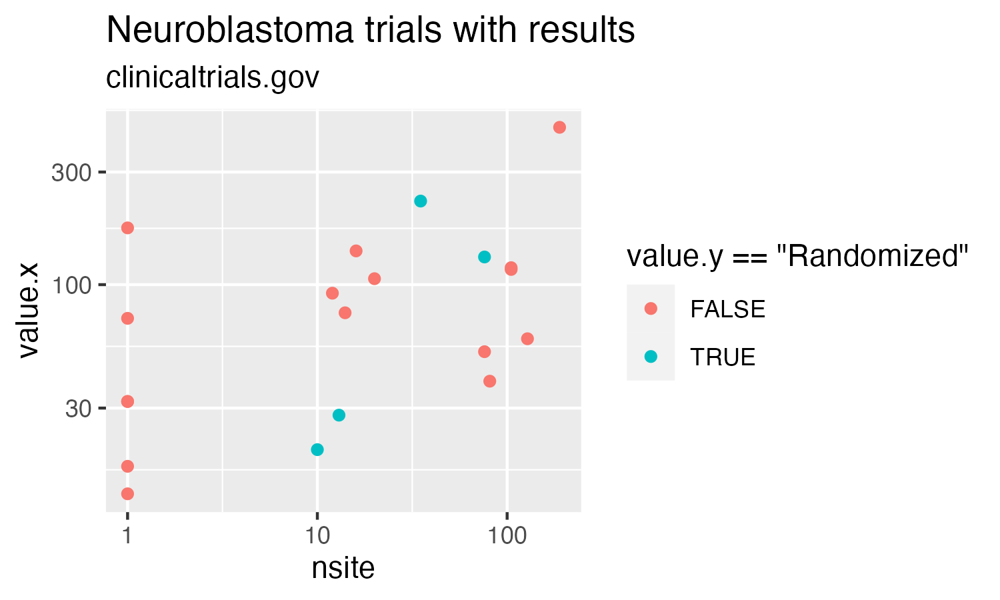

---
output:
  github_document:
    toc: false
    toc_depth: 1
editor_options: 
  chunk_output_type: console
---

<!-- README.md is generated from README.Rmd -->

```{r setup, include=FALSE}
knitr::opts_chunk$set(
  collapse = TRUE,
  eval = FALSE,
  comment = "#>",
  fig.path = "inst/image/README-",
  out.width = "100%"
)
```

<!-- badges: start -->
[](https://cran.r-project.org/package=ctrdata)
[](https://github.com/rfhb/ctrdata/actions)
[](https://codecov.io/gh/rfhb/ctrdata)
[](https://codecov.io/gh/rfhb/ctrdata)
[](https://rfhb.slack.com/messages/C6N1Y75B6)
<!-- badges: end -->

# ctrdata for aggregating and analysing clinical trials

The package `ctrdata` provides functions for retrieving (downloading) information on clinical trials from public registers, and for aggregating and analysing such information. It can be used for the European Union Clinical Trials Register ("EUCTR", https://www.clinicaltrialsregister.eu/) and for ClinicalTrials.gov ("CTGOV", https://clinicaltrials.gov/). Development of `ctrdata` started in 2015 and was motivated by the wish to understand trends in designs and conduct of trials and their availability for patients. The package is to be used within the [R](https://www.r-project.org/) system. 

Last reviewed on 2020-07-05 for version 1.2.1.9001

Main features:

* Protocol-related information on clinical trials is easily retrieved (downloaded) from public online sources: Users define a query using a register's web interfaces and then use `ctrdata` for retrieving all trials resulting from the query. Personal annotations can be added when retrieving trial information. Synonyms of an active substance can also be found. 

* Results-related information on trials can be included when information is retrieved (downloaded). All information is retrieved with multiple parallel webstreams, to speed up operations. 

* Retrieved (downloaded) trial information is transformed and stored in a document-centric database (since registers provide nested data), for fast and offline access. This can then be analysed with `R` (or others systems). Easily re-run a previous query to update a database. Uses `RSQLite`, local or remote MongoDB servers, via R package `nodbi`. 

* Unique (de-duplicated) trial records are identified, across registers and when there are several records in any register. `ctrdata` also can merge and recode information (fields) from different registers. Vignettes are provided to get started and with detailed examples, such as analyses of time trends of details of clinical trial protocols and for analysing results. 

Remember to respect the registers' copyrights and terms and conditions (see `ctrOpenSearchPagesInBrowser(copyright = TRUE)`). Please cite this package in any publication as follows: `Ralf Herold (2020). ctrdata: Retrieve and Analyze Clinical Trials from Public Registers. R package version 1.2, https://github.com/rfhb/ctrdata`

<!--
```{r}
citation("ctrdata")
```
-->

Package `ctrdata` has been used for example for: 

- Blogging on [Innovation coming to paediatric research](https://paediatricdata.eu/2018/01/14/innovation-coming-to-paediatric-research/)

- Report on [The impact of collaboration: The value of UK medical research to EU science and health](https://www.cancerresearchuk.org/about-us/we-develop-policy/we-work-with-government/exiting-the-eu/uk-and-eu-research#downloads)

# Installation

## 1. Install package in R

Package `ctrdata` can be found [here on CRAN](https://cran.r-project.org/package=ctrdata) and [here on github](https://github.com/rfhb/ctrdata). Within [R](https://www.r-project.org/), use the following commands to install package `ctrdata`:

```{r}
# Install CRAN version:
install.packages("ctrdata")

# Alternatively, install development version: 
# - Preparation:
install.packages("devtools")
# - Install ctrdata:
devtools::install_github("rfhb/ctrdata")
```

These commands also install the package dependencies, which are `nodbi`, `jsonlite`, `httr`, `curl`, `clipr`, `xml2`, `rvest`. 

## 2. Command line tools `perl`, `sed`, `cat` and `php` (5.2 or higher)

These command line tools are required for `ctrLoadQueryIntoDb()`, the main function of package `ctrdata`. 

In Linux and macOS (including version 10.15 Catalina), these are usually already installed. 

For MS Windows, install [cygwin](https://cygwin.org/install.html): In `R`, run `ctrdata::installCygwinWindowsDoInstall()` for an automated minimal installation into `c:\cygwin` (installations in folders corresponding to `c:\cygw*` will also be recognised and used). Alternatively, install manually cygwin with packages `perl`, `php-jsonc` and `php-simplexml` into `c:\cygwin`. This installation will consume about 160 MB disk space; administrator credentials not needed. 

# Overview of functions in `ctrdata`

The functions are listed in the approximate order of use. 

Function name | Function purpose
---------------------------- | --------------------------------------------
`ctrOpenSearchPagesInBrowser()`	| Open search pages of registers or execute search in web browser
`ctrFindActiveSubstanceSynonyms()` | Find synonyms and alternative names for an active substance
`ctrGetQueryUrlFromBrowser()`	| Import from clipboard the URL of a search in one of the registers
`ctrLoadQueryIntoDb()` | Retrieve (download) or update, and annotate, information on clinical trials from a register and store in a database
`dbQueryHistory()` | Show the history of queries that were downloaded into the database collection
`dbFindIdsUniqueTrials()` | Produce a vector of de-duplicated identifiers of clinical trial records in the database
`dbFindFields()` | Find names of fields in the database
`dbGetFieldsIntoDf()` | Create a data.frame from records in the database with the specified fields 
`dfMergeTwoVariablesRelevel()` | Merge two variables into a single variable, optionally map values to a new set of values
`dfListExtractKey()` | Extract an element based on its name (key) from a list in a complex data.frame such as obtained from `dbGetFieldsIntoDf()` for deeply nested fields
`installCygwinWindowsDoInstall()` | Convenience function to install a cygwin environment (MS Windows only)

# Example workflow

The aim is to download protocol-related trial information and tabulate the trials' status of conduct. 

* Attach package `ctrdata`: 
```{r}
library(ctrdata)
```

* Open registers' advanced search pages in browser: 
```{r}
ctrOpenSearchPagesInBrowser()

# Please review and respect register copyrights:
ctrOpenSearchPagesInBrowser(copyright = TRUE)
```

* Adjust search parameters and execute search in browser 

* When trials of interest are listed in browser, copy the address from the browser's address bar to the clipboard

* Get address from clipboard: 
```{r}
q <- ctrGetQueryUrlFromBrowser()
# * Found search query from EUCTR.

q
#                                  query-term query-register
# 1 query=cancer&age=under-18&phase=phase-one          EUCTR
```

* Retrieve protocol-related information, transform and save to database:

Under the hood, scripts `euctr2json.sh` and `xml2json.php` (in `ctrdata/exec`) transform EUCTR plain text files and CTGOV `XML` files to `ndjson` format, which is imported into the database. As a first step, the database is specified using `nodbi` (using RSQlite or MongoDB as backend). Second, trial information is retrieved and loaded into the database. 

```{r}
# Connect to (or newly create) a SQLite database 
# that is stored in a file on the local system:
db <- nodbi::src_sqlite(
  dbname = "some_database_name.sqlite_file", 
  collection = "some_collection_name")

# Alternative, for a MongoDB database:
# db <- nodbi::src_mongo(url = "mongodb://localhost", 
#                        db = "some_database_name",
#                        collection = "some_collection_name")

# Retrieve trials from public register:
ctrLoadQueryIntoDb(
  queryterm = 
    paste0("https://www.clinicaltrialsregister.eu/ctr-search/search?", 
           "query=cancer&age=under-18&phase=phase-one"),
  con = d)
```

* Analyse 

Tabulate the status of those trials that are recorded to be part of an agreed paediatric development program (paediatric investigation plan, PIP): 

```{r}
# Get all records that have values in the fields of interest:
result <- dbGetFieldsIntoDf(
  fields = c(
    "a7_trial_is_part_of_a_paediatric_investigation_plan", 
    "p_end_of_trial_status", 
    "a2_eudract_number"),
  con = db)

# Find unique trial identifiers for trials that have nore than one record, 
# for example for several EU Member States: 
uniqueids <- dbFindIdsUniqueTrials(con = db)
# * Total of 454 records in collection.
# Searching for duplicates, found 
#  - 292 EUCTR _id were not preferred EU Member State record of trial
# No CTGOV records found.
# = Returning keys (_id) of 162 out of total 454 records in collection "some_collection_name".

# Keep only unique / deduplicated records:
result <- result[ result[["_id"]] %in% uniqueids, ]

# Tabulate the clinical trial information:
with(result, table(p_end_of_trial_status, 
                   a7_trial_is_part_of_a_paediatric_investigation_plan))
#
#                      a7_trial_is_part_of_a_paediatric_investigation_plan
# p_end_of_trial_status   Information not present in EudraCT No Yes
#    Completed                                             6 14   8
#    Ongoing                                               3 62  22
#    Prematurely Ended                                     1  4   2
#    Temporarily Halted                                    0  1   1
```

* Add records from another register into database

```{r}
# Retrieve trials from public register:
ctrLoadQueryIntoDb(
  queryterm = "cond=neuroblastoma&rslt=With&recrs=e&age=0&intr=Drug", 
  register = "CTGOV",
  con = db)
```

* Result-related trial information 

Analyse some result details; note how information fields are used with slightly different approaches: 

```{r}
# Get all records that have values in all specified fields. 
# Note the fields are specific to CTGOV, thus not in EUCTR,
# which results in a warning that not all reacords in the 
# database have information on the specified fields:  
result <- dbGetFieldsIntoDf(
  fields = c(
    "clinical_results.baseline.analyzed_list.analyzed.count_list.count",
    "clinical_results.baseline.group_list.group",
    "clinical_results.baseline.analyzed_list.analyzed.units", 
    "study_design_info.allocation", 
    "location"),
  con = db)

# - Count sites: location is a list of lists, 
#   hence the hierarchical extraction by
#   facility and then name of facility
result$number_sites <- sapply(
  result$location, function(x) length(x[["facility"]][["name"]]))

#   an alternative approach uses a function provided by
#   ctrdata to extract keys from a list in a data frame:
with(
  dfListExtractKey(
    df = result, 
    list.key = list(c("location", "facility.name"))), 
  by(item, `_id`, max)
)

# - Count total participant numbers, by summing the reporting groups
#   for which their description does not contain the word "total" 
#   (such as in "Total participants")
result$number_participants <- sapply(
  seq_len(nrow(result)), function(i) {
    
    # Participant counts are in a list of elements with attributes, 
    # where attribute value has a vector of numbers per reporting group
    tmp <- result$clinical_results.baseline.analyzed_list.analyzed.count_list.count[[i]]
    
    # Information on reporting groups is in a list with a subelement description
    tot <- result$clinical_results.baseline.group_list.group[[i]]
    
    # see for example https://clinicaltrials.gov/ct2/show/results/NCT00253435#base
    tmp <- tmp[["@attributes"]][["value"]]
    tmp <- tmp[ !grepl("(^| )[tT]otal( |$)", tot[["description"]])]
    
    # to sum up, change string into integer value.
    # note that e.g. sum(..., na.rm = TRUE) is not used
    # since there are no empty entries in these trials
    tmp <- sum(as.integer(tmp))
    tmp
    
  })

# Allocation is part of study design information and available
# as a simple character string, suitable for routine manipulation
result$is_controlled <- grepl(
  pattern = "^Random", 
  x = result$study_design_info.allocation)

# Example plot
library(ggplot2)
ggplot(data = result) + 
  labs(title = "Neuroblastoma trials with results",
       subtitle = "clinicaltrials.gov") +
  geom_point(mapping = aes(x = number_sites,
                           y = number_participants,
                           colour = is_controlled)) + 
  scale_x_log10() + 
  scale_y_log10() 
ggsave(filename = "inst/image/README-ctrdata_results_neuroblastoma.png",
       width = 4, height = 3, units = "in")
```


```{r, include=FALSE}
# cleanup
unlink("some_database_name.sqlite_file")
```


# Databases

The database connection object `con` is created by calling `nodbi::src_*()`, with parameters that are specific to the database (e.g., `url`) and with a special parameter `collection` that is used by `ctrdata` to identify which table or collection in the database to use. Any such connection object can then be used by `ctrdata` and generic functions of `nodbi` in a consistent way, as shown in the table: 

Purpose | SQLite | MongoDB
-------------------- | -------------------- | -------------------- 
Create database connection | `dbc <- nodbi::src_sqlite(dbname = ":memory:", collection = "name_of_my_collection")` | `dbc <- nodbi::src_mongo(db = "name_of_my_database", collection = "name_of_my_collection", url = "mongodb://localhost")`
Use connection with any ctrdata function | `ctrdata::{ctr,db}*(con = dbc)` | `ctrdata::{ctr,db}*(con = dbc)` 
Use connection with any nodbi function | `nodbi::docdb_*(src = dbc, key = dbc$collection)` | `nodbi::docdb_*(src = dbc, key = dbc$collection)` 

# Features in the works

* Explore using the Windows Subsystem for Linux (WSL) instead of `cygwin`

* Merge results-related information retrieved from different registers (e.g. corresponding endpoints) and prepare for analysis across trials. 

* Explore relevance to retrieve previous versions of protocol- and results-related information


# Acknowledgements 

* Data providers and curators of the clinical trial registers. Please review and respect their copyrights and terms and conditions (`ctrOpenSearchPagesInBrowser(copyright = TRUE)`). 

* This package `ctrdata` has been made possible building on the work done for 
[R](https://www.r-project.org/), 
[curl](https://cran.r-project.org/package=curl), 
[httr](https://cran.r-project.org/package=httr), 
[xml2](https://cran.r-project.org/package=xml2), 
[rvest](https://cran.r-project.org/package=rvest),
[mongolite](https://cran.r-project.org/package=mongolite), 
[nodbi](https://cran.r-project.org/package=nodbi), 
[RSQLite](https://CRAN.R-project.org/package=RSQLite) and
[clipr](https://cran.r-project.org/package=clipr). 

# Issues and notes

* Please file issues and bugs [here](https://github.com/rfhb/ctrdata/issues). 

* Package `ctrdata` should work and is continually tested on Linux, Mac OS X and MS Windows systems. Linux and MS Windows are tested using continuous integration, see badges at the beginning of this document. Please file an issue for any problems. 

* The information in the registers may not be fully correct; see for example [this publication on CTGOV](https://www.bmj.com/content/361/bmj.k1452). 

* No attempts were made to harmonise field names between registers (nevertheless, `dfMergeTwoVariablesRelevel()` can be used to merge and map two variables / fields into one).

# Annex: Representation of trial records' JSON in databases

## MongoDB


## SQLite


