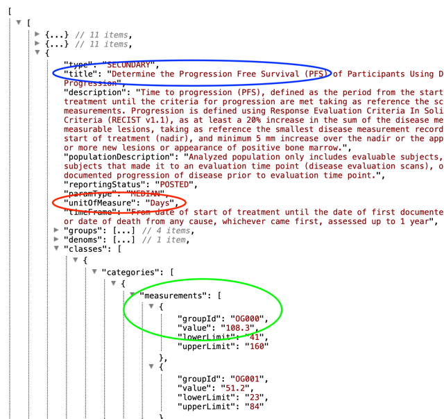
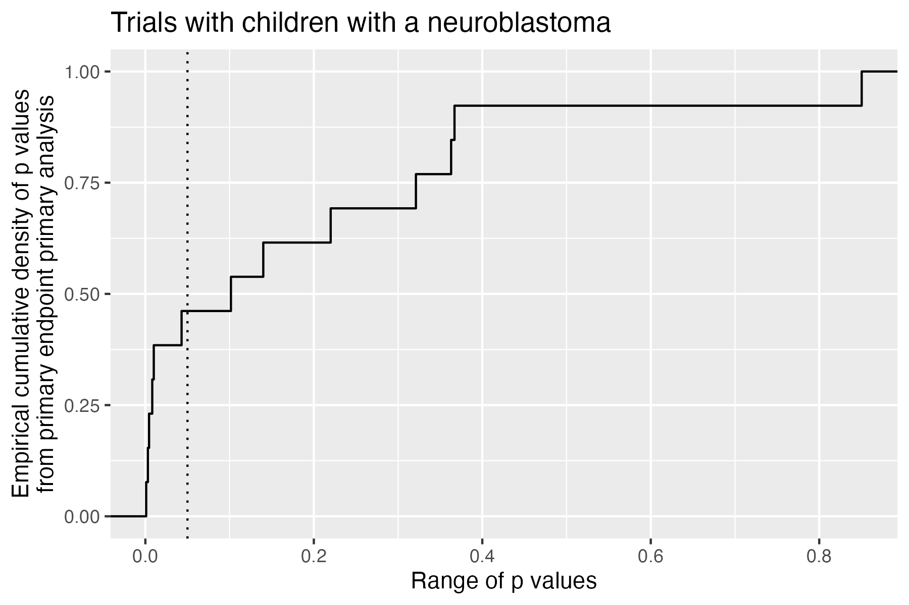

# Summarise and analyse clinical trial information

General information on the `ctrdata` package is available here:
<https://github.com/rfhb/ctrdata>.

Remember to respect the registers’ terms and conditions (see
`ctrOpenSearchPagesInBrowser(copyright = TRUE)`). Please cite this
package in any publication as follows: Ralf Herold (2025). ctrdata:
Retrieve and Analyze Clinical Trials in Public Registers. R package
version 1.24.1. <https://cran.r-project.org/package=ctrdata>

## Preparations

Here using MongoDB, which may be faster than SQLite, can handle
credentials, provides access to remote servers and can directly retrieve
nested elements from paths. See
[README.md](https://rfhb.github.io/ctrdata/README.md) and [Retrieve
clinical trial
information](https://rfhb.github.io/ctrdata/articles/ctrdata_retrieve.Rmd)
for examples using SQLite. Also PostgreSQL can be used as database, see
[Install R package
ctrdata](https://rfhb.github.io/ctrdata/articles/ctrdata_install.Rmd).

``` r

db <- nodbi::src_mongo(
  url = "mongodb://localhost",
  db = "my_database_name",
  collection = "my_collection_name"
)
db
# src: MongoDB
# ver: 8.0.10
# db(s): my_database_name
# size(s): 0 MB

# empty collection if exists
nodbi::docdb_delete(db, db$collection)
```

See [Retrieve clinical trial
information](https://rfhb.github.io/ctrdata/articles/ctrdata_retrieve.Rmd)
for more details.

``` r

# Load package
library(ctrdata)

# Model queries
queries <- ctrGenerateQueries(
  condition = "neuroblastoma",
  population = "P"
)

# Load trials from all queries into collection
result <- lapply(
  queries, 
  ctrLoadQueryIntoDb, 
  euctrresults = TRUE, 
  euctrprotocolsall = FALSE,
  con = db)
# * Found search query from EUCTR: query=neuroblastoma&age=children&
# age=adolescent&age=infant-and-toddler&age=newborn&age=preterm-new-born-
# infants&age=under-18
# * Checking trials in EUCTR, found 106 trials 
# - Downloading in 6 batch(es) (20 trials each; estimate: 10 MB)
# - Downloading 106 records of 106 trials (estimate: 6 s)             
# - Converting to NDJSON (estimate: 0.3 s)...                           
# - Importing records into database...
# = Imported or updated 106 records on 106 trial(s)
# * Checking results if available from EUCTR for 106 trials: 
# - Downloading results...
# - Extracting results (. = data, F = file[s] and data, x = none): . F . . F . 
# F . F . . F . . . . F . . F F . . . . . . . . F . . F . F . . . . . F . . . . 
# F . . F . . 
# - Data found for 51 trials
# - Converting to NDJSON (estimate: 2 s)...
# - Importing 51 results into database (may take some time)...
# - Results history: not retrieved (euctrresultshistory = FALSE)
# = Imported or updated results for 51 trials
# Updated history ("meta-info" in "my_collection_name")
# * Found search query from ISRCTN: &q=&filters=condition:neuroblastoma,
# ageRange:Child,primaryStudyDesign:Interventional,phase:Phase 0,phase:
# Phase I,phase:Phase II,phase:Phase III,phase:Phase IV,phase:Phase I/II,
# phase:Phase II/III,phase:Phase III/IV
# * Checking trials in ISRCTN, found 1 trials 
# - Downloading trial file (estimate: 0.02 MB)
# - Converting to NDJSON (estimate: 0.006 s)...
# - Importing records into database...
# = Imported or updated 1 trial(s)                 
# Updated history ("meta-info" in "my_collection_name")
# * Found search query from CTGOV2: cond=neuroblastoma&intr=Drug OR Biological&term=AREA[DesignPrimaryPurpose](DIAGNOSTIC OR PREVENTION OR TREATMENT)&aggFilters=ages:child,studyType:int
# * Checking trials in CTGOV2, found 467 trials
# - Downloading in 1 batch(es) (max. 1000 trials each; estimate: 47 Mb total)
# - Load and convert batch 1...
# - Importing records into database...
# JSON file #: 1 / 1                               
# = Imported or updated 467 trial(s)
# Updated history ("meta-info" in "my_collection_name")
# * Found search query from CTGOV2: term=AREA[ConditionSearch]"neuroblastoma" 
# AND (AREA[StdAge]"CHILD") AND (AREA[StudyType]INTERVENTIONAL) AND 
# (AREA[DesignPrimaryPurpose](DIAGNOSTIC OR PREVENTION OR TREATMENT)) AND 
# (AREA[InterventionSearch](DRUG OR BIOLOGICAL))
# * Checking trials in CTGOV2, found 467 trials
# - Downloading in 1 batch(es) (max. 1000 trials each; estimate: 47 Mb total)
# - Load and convert batch 1...
# - Importing records into database...
# JSON file #: 1 / 1                               
# = Imported or updated 467 trial(s)
# Updated history ("meta-info" in "my_collection_name")
# * Found search query from CTIS: searchCriteria={"medicalCondition":
# "neuroblastoma","ageGroupCode":[2]}
# * Checking trials in CTIS, found 22 trials 
# - Downloading and processing trial data... (estimate: 3 Mb)
# - Importing records into database...
# - Updating with additional data: .               
# = Imported 22, updated 22 record(s) on 22 trial(s)
# Updated history ("meta-info" in "my_collection_name")

# Show results of loading
sapply(result, "[[", "n")
# EUCTR       ISRCTN       CTGOV2 CTGOV2expert         CTIS 
#   106            1          467          467           21 
```

## Find fields / variables of interest

Specify a part of the name of a variable of interest; all variables
including deeply nested variable names are searched. Set `sample = TRUE`
(default) to rapidly execute the function in large database collections.
The search for fields is cached and thus accelerated during the R
session; calling
[`ctrLoadQueryIntoDb()`](https://rfhb.github.io/ctrdata/reference/ctrLoadQueryIntoDb.md)
or changing `sample = ...` invalidates the cache.

``` r

# Find fields
dbFindFields(namepart = "date", sample = FALSE, con = db)
# Finding fields in database collection (may take some time) . . . . . 
# Field names cached for this session.
# [...]
#                                                                       EUCTR
#                                    "n_date_of_competent_authority_decision"
# [...]
#                                                                      CTGOV2 
# "annotationSection.annotationModule.unpostedAnnotation.unpostedEvents.date"
#                                                                      CTGOV2 
#                       "protocolSection.statusModule.studyFirstSubmitQcDate" 
# [...]
#                                                                        CTIS 
#                                                               "publishDate" 
#                                                                        CTIS 
#                                                               "startDateEU" 
# [...]
#                                                                      ISRCTN 
#                                                "trialDesign.overallEndDate" 
```

## Data frame from database

The fields of interest can be obtained from the database and are
represented in an R data frame, for example:

``` r

# Define vector of fields
fieldsOfInterest <- c(
  #
  # EUCTR protocol-related information
  "f41_in_the_member_state",
  "f422_in_the_whole_clinical_trial",
  "a1_member_state_concerned",
  #
  # EUCTR results-related information
  "trialInformation.recruitmentStartDate", 
  "trialInformation.globalEndOfTrialDate",
  #
  # CTGOV2
  "protocolSection.statusModule.startDateStruct.date",
  "trialInformation.recruitmentStartDate",
  "protocolSection.statusModule.primaryCompletionDateStruct.date"
)

# Create data frame with records of trials 
# which for at least one field have a value
result <- dbGetFieldsIntoDf(
  fields = fieldsOfInterest,
  con = db
)
# Querying database (7 fields)...

dim(result)
# [1] 567   8
```

## Metadata from data frame

The objects returned by functions of this package include attributes
with metadata to indicate from which database, table / collection and
query details. Metadata can be reused in R.

``` r

attributes(result)
# [...]
#
# $class
# [1] "data.frame"
# 
# $`ctrdata-dbname`
# [1] "my_database_name"
# 
# $`ctrdata-table`  <-- this attribute will be retired by end 2024
# [1] "my_collection_name"
# 
# $`ctrdata-table-note`
# [1] "^^^ attr ctrdata-table will be removed by end 2024"
# 
# $`ctrdata-collection`
# [1] "my_collection_name"
# 
# $`ctrdata-dbqueryhistory`
# A tibble: 6 × 4
#   `query-timestamp`   `query-register` `query-records`
#   <chr>               <chr>                      <int>
# 1 2025-08-21 12:06:09 EUCTR                        106
# 2 2025-08-21 12:06:10 ISRCTN                         1
# 3 2025-08-21 12:06:13 CTGOV2                       467
# 4 2025-08-21 12:06:16 CTGOV2                       467
# 5 2025-08-21 12:06:19 CTIS                          22
# `query-term`                                           
# <chr>
# "query=neuroblastoma&age=children&age=adolescent&age=i…
# "&q=&filters=condition:neuroblastoma,ageRange:Child,pr…
# "cond=neuroblastoma&intr=Drug OR Biological&term=AREA[…
# "term=AREA[ConditionSearch]\"neuroblastoma\" AND (AREA…
# "searchCriteria={\"medicalCondition\":\"neuroblastoma\…
```

## De-duplicate records

In the database, the variable “\_id” is the unique index for a record.
This “\_id” is the NCT number for CTGOV records (e.g., “NCT00002560”),
and it is the EudraCT number for EUCTR records including the postfix
identifying the EU Member State (e.g., “2008-001436-12-NL”). It is
relevant to de-duplicate records because a trial can be registered in
both CTGOV2 and EUCTR, and can have records by involved country in
EUCTR.

De-duplication is done at the analysis stage because this enables to
select if a trial record should be taken from one or the other register,
and from one or the other EU Member State. The basis of de-duplication
is the recording of additional trial identifiers in supplementary fields
(variables), which are checked and reported when using function
[`dbFindIdsUniqueTrials()`](https://rfhb.github.io/ctrdata/reference/dbFindIdsUniqueTrials.md):

``` r

# Obtain de-duplicated trial record ids
ids <- dbFindIdsUniqueTrials(
  preferregister = "EUCTR",
  con = db
)
# Searching for duplicate trials... 
# - Getting all trial identifiers, 596 found in collection
# - Finding duplicates among registers' and sponsor ids...
# - Keeping 106 / 0 / 315 / 0 / 9 records from EUCTR / CTGOV / CTGOV2 / ISRCTN / CTIS
# = Returning keys (_id) of 430 records in collection "my_collection_name"

# Eliminate duplicate trials records:
result <- result[result[["_id"]] %in% ids, ]

nrow(result)
# [1] 415
#
# Note that "ids" are the identifiers of unique trials in the whole collection,
# whereas the data frame "result" only includes those trials in which any of 
# the fields of interest had a value, thus explaining why "result" has fewer
# rows than "ids" has identifiers. 
```

## Use trial concepts to simplify analyses

An alternative is to calculate a column `isUniqueTrial` already at the
time that a data frame is created. This uses one of the trial concepts
that provide a canonical field, calculated from trial information of any
register, see `help(ctrdata-trial-concepts)`.

``` r

# Obtain data of interest
result <- dbGetFieldsIntoDf(
  fields = fieldsOfInterest, 
  calculate = "f.isUniqueTrial",
  con = db
)
# To review trial concepts details, call 'help("ctrdata-trial-concepts")'
# Querying database (8 fields)...
# Searching for duplicate trials...                         
# - Getting all trial identifiers, 596 found in collection
# - Finding duplicates among registers' and sponsor ids...
# - Keeping 467 / 52 / 0 / 0 / 12 records from CTGOV2 / EUCTR / CTGOV / ISRCTN / CTIS
# = Returning keys (_id) of 531 records in collection "my_collection_name"

# Eliminate duplicate trials records:
result <- result[result[[".isUniqueTrial"]], ]

nrow(result)
# [1] 531
#
# Note this has used a different register as priority.
# Also, the data frame result includes all trials which
# had a value in at least one of the fields of interest
# or the fields needed to calculate the trial concept. 

# See description of concept .isUniqueTrial: 
help("f.isUniqueTrial")

# See how concept .isUniqueTrial is implemented
f.isUniqueTrial
```

## Reviewing a specific trial

It will often be useful to inspect all data for a single trial, e.g. to
understand the meaning and relation of fields, to see where certain
information is stored, and to identify fields of interest.

For a given trial, function
[ctrShowOneTrial()](https://rfhb.github.io/ctrdata/reference/ctrShowOneTrial.html)
enables the user to visualise the hiearchy of fields and contents in the
user’s local web browser, to search for field names and field values,
and to select and copy selected fields’ names for use with function
[dbGetFieldsIntoDf()](https://rfhb.github.io/ctrdata/reference/dbGetFieldsIntoDf.html).

``` r

# Opens a web browser for user interaction.
# If the trial is not found in the database,
# it will be loaded from the register. 
#
# The search is for both, field names and values
ctrShowOneTrial("2022-501725-21-00", con = db)
```

 Alternatively, use any standard database
function to retrieve the trial’s `JSON` representation that `ctrdata`
had stored in the collection and visualise its nested structure of field
names and values.

``` r

# Requires additional package for visualisation
remotes::install_github("hrbrmstr/jsonview")

# Works with DuckDb, SQLite, PostgreSQL, MongoDB
oneTrial <- nodbi::docdb_query(
  src = db, 
  key = db$collection, 
  query = '{"_id":"2022-501725-21-00"}',
  limit = 1L
)

# Interactive widget where nodes can be expanded,
# note that fields and values cannot be searched
jsonview::json_tree_view(oneTrial)
```

## Simple analysis of dates

In a data frame generated with
[`dbGetFieldsIntoDf()`](https://rfhb.github.io/ctrdata/reference/dbGetFieldsIntoDf.md),
fields are typed as dates, logical, character or numbers. This typing
facilitates using the data for analysis, for example of dates with base
R graphics:

``` r

# Get data of interest
result <- dbGetFieldsIntoDf(
  fields = "ctrname",
  calculate = c("f.isUniqueTrial", "f.startDate"),
  con = db
)

str(result)
# tibble [596 × 4] (S3: tbl_df/tbl/data.frame)
#  $ _id           : chr [1:596] "2004-004386-15-ES" "2005-000915-80-IT" ...
#  $ ctrname       : chr [1:596] "EUCTR" "EUCTR" "EUCTR" "EUCTR" ...
#  $ .isUniqueTrial: logi [1:596] FALSE FALSE FALSE FALSE TRUE TRUE ...
#  $ .startDate    : Date[1:596], format: "2005-11-15" "2005-04-21" "2005-07-08" ...

# Open file for saving
png("vignettes/nb1.png")

# De-duplicate and visualise start date
hist(
  result[result$.isUniqueTrial, ".startDate"],
  breaks = "years"
)
box()
dev.off()
```


Histogram1

## Cross-register clinical trial concepts

A number of calculations across fields from different registers are
available in `ctrdata`. This offers much convenience for users, because
it provides a canonical understanding and implementation of the mapping
of corresponding fields and value lists across different registers.
Available calculations can be listed, and a specific documentation
shown.

``` r

# Introduction and overview of available trial concepts
help("ctrdata-trial-concepts")

# Show documentation of a specific trial concept 
help("f.isMedIntervTrial")

# List concepts available at this time
as.character(utils::ls.str(
  getNamespace("ctrdata"),
  all.names = TRUE,
  pattern = "^f[.][a-z]"))
#  [1] "f.assignmentType"             "f.controlType"                "f.externalLinks"             
#  [4] "f.hasResults"                 "f.isMedIntervTrial"           "f.isUniqueTrial"             
#  [7] "f.likelyPlatformTrial"        "f.numSites"                   "f.numTestArmsSubstances"     
# [10] "f.primaryEndpointDescription" "f.primaryEndpointResults"     "f.resultsDate"               
# [13] "f.sampleSize"                 "f.sponsorType"                "f.startDate"                 
# [16] "f.statusRecruitment"          "f.trialObjectives"            "f.trialPhase"                
# [19] "f.trialPopulation"            "f.trialTitle"  
```

## Merging fields for analysis

With the function
[`dfMergeVariablesRelevel()`](https://rfhb.github.io/ctrdata/reference/dfMergeVariablesRelevel.md),
users have control how to merge values of a set of original variables to
a new variable, optionally with a new set of values. For more, see
[`help(dfMergeVariablesRelevel)`](https://rfhb.github.io/ctrdata/reference/dfMergeVariablesRelevel.md).
This can be used for concepts that are very specific to the use case and
/ or not implemented so far, see `help(ctrdata-trial-concepts)`.

## Historic versions of trial records and changes in sample sizes

Historic versions can set to be retrieved for CTGOV2 by specifying
`ctgov2history = <...>` when using
[`ctrLoadQueryIntoDb()`](https://rfhb.github.io/ctrdata/reference/ctrLoadQueryIntoDb.md);
this functionality was added in `ctrdata` version 1.18.0. The versions
include all trial data available at the date of the respective version.
Only CTGOV2 provides historic versions at this time (CTIS only until its
relaunch on 2024-06-17) as part of their respective APIs.

Nevertheless, historic versions can also be created for CTIS by
specifying `querytoupdate = <...>, ctishistory = TRUE` when using
[`ctrLoadQueryIntoDb()`](https://rfhb.github.io/ctrdata/reference/ctrLoadQueryIntoDb.md);
this functionality thus is not provided by the register but triggered by
the user, it was added in `ctrdata` version 1.21.1.9000.

The following schema represents two clinical trial records (one each
from CTGOV2 and CTIS) with the array of `history: [...]` versions as
part of a trial’s record (the ellipsis `...` represents all other data
fields):

``` r

'
[
  {
   "_id":"NCT01234567", 
   "title": "Current title", 
   "clinical_results": ..., 
   ..., 
   "history": [
     {
      "history_version": {
        "version_number": 1, 
        "version_date": "2020-21-22 10:11:12"}, 
      "title": "Original title", 
      "clinical_results": ..., 
      ...
     }, 
     {
      "history_version": {
        "version_number": 2, 
        "version_date": "2021-22-23 11:13:13"}, 
      "title": "Later title", 
      "clinical_results": ..., 
      ...
     }
   ]
  },
  {
   "_id":"2022-502051-56-00", 
   "title": "Current title", 
   "ctrname": "CTIS", 
   "lastUpdated": "2025-04-07"
   "authorizedPartsII": ...,
   ..., 
   "history": [
     {
      "history_version": {
        "version_number": 0, 
        "version_date": "2025-04-06"}, 
      "title": "Intermediate title", 
      "ctrname": "CTIS", 
      "lastUpdated": "2025-04-06"
      "authorizedPartsII": ...,
      ...
     }, 
     {
      "history_version": {
        "version_number": 0, 
        "version_date": "2025-04-05"}, 
      "title": "Original title", 
      "ctrname": "CTIS", 
      "lastUpdated": "2025-04-05"
      "authorizedPartsII": ...,
      ...
     }
   ]
  },
  ...
]
'
```

The example shows how planned or realised number of participants (sample
size) changed over time for individual trials, using available data

``` r

# Load previous query (above), specifying that 
# for each trial, 5 versions should be retrieved
ctrLoadQueryIntoDb(
  queryterm = queries["CTGOV2"], 
  con = db, 
  ctgov2history = 5L
)
# * Found search query from CTGOV2: cond=neuroblastoma&intr=Drug OR Biological&term=AREA[DesignPrimaryPurpose](DIAGNOSTIC OR PREVENTION OR TREATMENT)&aggFilters=ages:child,studyType:int
# * Checking trials in CTGOV2, found 467 trials
# - Downloading in 1 batch(es) (max. 1000 trials each; estimate: 47 Mb total)
# - Load and convert batch 1...
# - Importing records into database...
# JSON file #: 1 / 1                               
# * Checking and processing historic versions... 
# - Downloading 2148 historic versions (estimate: 82 MB total)...         
# - Merging trial versions . . . . . . . . . . . . . . . . . . . . . . . . . .
# - Updating trial records . . . . . . . . . . . . . . . . . . . . . . . . . . 
# Updated 467 trial(s) with historic versions
# = Imported or updated 467 trial(s)
# No history found in expected format.
# Updated history ("meta-info" in "my_collection_name")
# $n
# [1] 467

# Get relevant fields
result <- dbGetFieldsIntoDf(
  fields = c(
    # only CTGOV2 has structured historic information
    "history.history_version.version_date",
    "history.protocolSection.designModule.enrollmentInfo.count"
  ),
  calculate = "f.statusRecruitment",
  con = db
)

# Helper packages
library(dplyr)
library(tidyr)
library(ggplot2)

# Mangle and plot
result %>%
  unnest(cols = starts_with("history.")) %>%
  filter(.statusRecruitment == "completed") %>% 
  filter(!is.na(history.protocolSection.designModule.enrollmentInfo.count)) %>% 
  filter(history.protocolSection.designModule.enrollmentInfo.count > 0L) %>% 
  group_by(`_id`) %>%
  ggplot(
    mapping = aes(
      x = history.history_version.version_date,
      y = history.protocolSection.designModule.enrollmentInfo.count,
      colour = `_id`)
  ) +
  geom_step() +
  geom_point() +
  theme_light() +
  scale_y_log10() +
  guides(colour = "none") +
  labs(
    title = "Sample sizes in trials including patients with a neuroblastoma", 
    subtitle = "Source: CTGOV2 records labelled as phase 3 and completed", 
    caption = Sys.Date()
  )

ggsave("vignettes/samplesizechanges.png", width = 6, height = 4)
```


Sample size changes

## Analysing nested fields such as trial results

The registers represent clinical trial information by nesting fields
(e.g., several reporting groups within several measures within one of
several endpoints). A visualisation of this hierarchical representation
for CTGOV2 follows. Compare this with the outcome measures presented
here:
<https://clinicaltrials.gov/study/NCT02139397?tab=results#outcome-measures>,
specifically “3. Determine the Progression Free Survival (PFS)…”

``` r

# Since version 1.20.0, an interactive widget is built into ctrdata
# and can be used to search in all field names and all values 
ctrShowOneTrial("NCT02139397", con = db)
```

See example for
[`ctrShowOneTrial()`](https://rfhb.github.io/ctrdata/reference/ctrShowOneTrial.md)
in section [Reviewing a specific trial](#reviewing-a-specific-trial). An
alternative is:

``` r

# Helper package
remotes::install_github("https://github.com/hrbrmstr/jsonview")

# Get relevant data
result <- dbGetFieldsIntoDf("resultsSection.outcomeMeasuresModule", con = db)

# Create interactive widget
jsonview::json_tree_view(result[result[["_id"]] == "NCT02139397", -1])
```



Ctgov2NestedResults

The analysis of nested information such as the highlighted duration of
response is facilitated with `ctrdata` as follows. The main steps are:

1.  Create a data from fields identified as shown in previous sections
    (using
    [`dbGetFieldsIntoDf()`](https://rfhb.github.io/ctrdata/reference/dbGetFieldsIntoDf.md))

2.  Transform nested information to a long, name-value data frame (using
    [`dfTrials2Long()`](https://rfhb.github.io/ctrdata/reference/dfTrials2Long.md))

3.  Identify the measures of interest (e.g. PFS, blue circle above) by
    specifying the name and value of these fields (`wherename`,
    `wherevalue` in function
    [`dfName2Value()`](https://rfhb.github.io/ctrdata/reference/dfName2Value.md))

4.  Obtain values by specifying the name(s) of its value field(s) (red
    and green circles in figure above; `valuename` in function
    [`dfName2Value()`](https://rfhb.github.io/ctrdata/reference/dfName2Value.md))

5.  Tabulate the results of interest

This is put together in the following example. Note that `CTGOV` fields
are no longer downloadable (see NEWS.md) but may exist in previously
created databases.

``` r

#### 1. Create data frame from results fields
# These are key results fields from
# CTGOV2, CTGOV and from EUCTR:
result <- dbGetFieldsIntoDf(
  fields = c(
    # EUCTR - note this requires to set parameter
    # euctrresults = TRUE in ctrLoadQueryIntoDb()
    # as shown above in section "User annotations"
    "trialInformation.populationAgeGroup",
    "subjectDisposition.recruitmentDetails",
    "baselineCharacteristics.baselineReportingGroups.baselineReportingGroup",
    "endPoints.endPoint",
    "subjectAnalysisSets",
    "adverseEvents.seriousAdverseEvents.seriousAdverseEvent", 
    # CTGOV2
    "resultsSection.outcomeMeasuresModule",
    "protocolSection.designModule.designInfo.allocation", 
    "resultsSection.participantFlowModule",
    # CTGOV
    "clinical_results.baseline.analyzed_list.analyzed.count_list.count",
    "clinical_results.baseline.group_list.group",
    "clinical_results.baseline.analyzed_list.analyzed.units",
    "clinical_results.outcome_list.outcome",
    "study_design_info.allocation"
  ),
  calculate = "f.isUniqueTrial",
  con = db
)

# Keep only unique trial records
result <- result[result[[".isUniqueTrial"]], ]


#### 2. All nested data are transformed to a long,
# Name value data frame (which has several hundred
# rows for each trial, with one row per field):
# 
long_result <- dfTrials2Long(df = result)
# Total 95118 rows, 160 unique names of variables
long_result[c(100, 10000, 80000), ]
# # A tibble: 3 × 4
#   `_id`             identifier name                                                       value
#   <chr>             <chr>      <chr>                                                      <chr>
# 1 2007-000371-42-DE 36         adverseEvents.seriousAdverseEvents.seriousAdverseEvent.di… false
# 2 2013-000885-13-FR 92         adverseEvents.seriousAdverseEvents.seriousAdverseEvent.di… false
# 3 NCT01747876       1          resultsSection.outcomeMeasuresModule.outcomeMeasures.repo… POST…


#### 3. and 4. Obtain values for measures of interest 
#
# The parameters can be regular expressions
clinicalDuration <- dfName2Value(
  df = long_result,
  # 3. Identify measures of interest
  wherename = paste0(
    "endPoints.endPoint.title|",
    "resultsSection.outcomeMeasuresModule.outcomeMeasures.title"
  ),
  wherevalue = paste0(
    "duration of response|DOR|",
    "free survival|DFS|PFS|EFS"
  ),
  # 4. Obtain result values for measure
  valuename = paste0(
    "resultsSection.*outcomeMeasures.classes.categories.measurements.value|",
    "endPoints.*armReportingGroup.tendencyValues.tendencyValue.value|",
    "resultsSection.outcomeMeasuresModule.outcomeMeasures.unitOfMeasure|",
    "endPoints.endPoint.unit|",
    "resultsSection.outcomeMeasuresModule.outcomeMeasures.groups.title|",
    "endPoints.*armReportingGroup.armId"
  )
)
# Returning values for 56 out of 531 trials


#### 5. Tabulate the results

# PFS / EFS duration has been reported with various units:
sort(unique(clinicalDuration[
  grepl("unit", clinicalDuration$name), "value", drop = TRUE]))
#  [1] "3 year EFS"                               "Days"                                    
#  [3] "Estimated probability"                    "L/hr"                                    
#  [5] "months"                                   "Months"                                  
#  [7] "number of participants with No VOD/Death" "Participants"                            
#  [9] "percent of probability"                   "percent probability"                     
# [11] "Percent Probability"                      "percentage"                              
# [13] "Percentage"                               "percentage of 3 yr EFS survival"         
# [15] "percentage of participants"               "Percentage of participants"              
# [17] "percentage of participent"                "Percentage of patients"                  
# [19] "percentage of subjects without an event"  "Percentage probability"                  
# [21] "Probability"                              "Proportion of participants"              
# [23] "weeks"                                    "Weeks" 

# Helper packages for convenience
library(dplyr)
library(tidyr)

# Mangle data for tabulation
clinicalDuration %>% 
  as_tibble() %>%
  mutate(
    group_id = paste0(`_id`, "_", sub("([0-9]+)[.]?.*", "\\1", identifier)),
    name_short = sub(".*[.](.+)", "\\1", name),
    name_short = if_else(name_short == "unitOfMeasure", "unit", name_short)
  ) %>%
  group_by(group_id) %>% 
  mutate(
    is_duration = any(grepl("day|month|week|year", value, ignore.case = TRUE))) %>%
  ungroup() %>% 
  filter(is_duration) %>% 
  select(name_short, value, where, group_id) %>% 
  pivot_wider(id_cols = c(group_id, where), names_from = name_short, values_fn = list) %>%
  unnest(c(value, unit)) %>% 
  filter(!grepl("999[9]*", value)) %>%
  rowwise() %>% 
  mutate(
    value = as.numeric(value),
    arm_names = paste(armId, title, collapse = " / "),
  ) %>% 
  ungroup() %>% 
  mutate(
    days = case_when(
      grepl("[wW]eek", unit) ~ value * 7,
      grepl("[mM]onth", unit) ~ value * 30,
      grepl("[yY]ear", unit) ~ value * 30,
      .default = value
    )) %>% 
  select(!c(value, unit, armId, title)) -> clinicalDuration

clinicalDuration[sample(seq_len(nrow(clinicalDuration)), 10L), ]
# # A tibble: 10 × 4
#    group_id             where                                                              arm_names  days
#    <chr>                <chr>                                                              <chr>     <dbl>
#  1 NCT01121588_8        Progression-Free Survival (PFS) Based on Investigator Assessement  " ALCL A…  NA  
#  2 NCT01587703_54       Progression Free Survival-Part 2                                   " Partic… 240  
#  3 NCT01483820_3        Number of Days Participants Experienced Progression Free Survival… " TPI 28…  46  
#  4 NCT01742286_4        Progression Free Survival (PFS) Based on Investigator Assessment   " ALK-ac…  57  
#  5 NCT01587703_52       Progression Free Survival-Part 1 QD                                " Part 1…   9  
#  6 NCT01505608_5        Progression Free Survival (PFS) of Participants Using Days Until … " Arm A-… 125  
#  7 NCT01962103_22       Phase 2: Progression-Free Survival (PFS)                           " Phase …  35.7
#  8 NCT01742286_3        Duration of Response (DoR) Per Investigator Assessment             " ALK-ac…  NA  
#  9 2014-004685-25-ES_12 Duration of Response (DOR) as Determined by the Investigator usin… ""         NA  
# 10 NCT02761915_8        To Evaluate Anti-tumour Activity (Progression Free Survival)       " Dose L… 113  
```

## Analysing primary endpoints

Text analysis has to be used for many fields of trial information from
the registers. Here is an example to simply categorise the type of
primary endpoint. In addition, the number of subjects are compared by
type of primary endpoint. The example uses trial concepts introduced in
earlier sections, see `help(ctrdata-trial-concepts)`.

``` r

# Get relevant data
result <- dbGetFieldsIntoDf(
  calculate = c(
    "f.isUniqueTrial",
    "f.sampleSize",
    "f.trialPopulation",
    "f.primaryEndpointDescription"
  ),
  con = db
)

# De-duplicate
result <- result[result[[".isUniqueTrial"]], ]

# For primary endpoint of interest, use regular expression on text to
# identify time to the respective event (mostly includes death events)
regex <- "((progression|event|relapse|recurrence|disease)[- ]free)|pfs|dfs|efs)"

# .primaryEndpointDescription is in each cell a list of one or more 
# items with an endpoint description; grepl works on each such item
result$pep_is_efs <- grepl(
  pattern = regex,
  x = result$.primaryEndpointDescription,
  ignore.case = TRUE
)

# Tabulate
table(result$pep_is_efs)
# FALSE  TRUE
#   464    67

# Plot
library(ggplot2)
ggplot(
  data = result,
  aes(
    x = .sampleSize,
    y = pep_is_efs
  )
) +
  geom_boxplot() +
  scale_x_log10()

ggsave("vignettes/boxpep.png", width = 6, height = 4)
```


BoxPEP

## Analysis methods and p values

It may be interesting to review results of the primary endpoint in a set
of trials, for a therapeutic area or a types of endpoints or designs.
The results of null-hypothesis significance testing (NHST) may show an
interesting distribution of p values (see also Robinson-D 2014,
<http://varianceexplained.org/statistics/interpreting-pvalue-histogram/>,
which refers to cases with many p values, possibly from a single
experiment). When analysed robustly in a well-defined set of trials,
such distributions may allow assumptions about equipoise, forking path
or reporting preferences.

The example merely shows the technical approach, without asserting
relevance. For a robust analysis, consider further trial concepts (in
particular, “f.trialObjectives”, “f.controlType”, “f.isMedIntervTrial”,
“f.trialPhase”), see `help(ctrdata-trial-concepts)`.

``` r

# Get result set
result <- dbGetFieldsIntoDf(
  calculate = c(
    "f.isUniqueTrial",
    "f.sampleSize",
    "f.primaryEndpointResults"
  ), 
  con = db
)

# De-duplicate
result <- result[result[[".isUniqueTrial"]], ]

# Helper package
library(ggplot2)

# Plot p values ECDF
ggplot(
  data = result, 
  aes(x = .primaryEndpointFirstPvalue)) + 
  stat_ecdf(geom = "step") +
  labs(
    title = "Trials with children with a neuroblastoma", 
    x = "Range of p values", 
    y = "Empirical cumulative density of p values\nfrom primary endpoint primary analysis") +
  geom_vline(
    xintercept = 0.05, 
    linetype = 3)

ggsave("vignettes/phase23_paed_p_values.png", width = 6, height = 4)

# Plot sample size vs. p value
ggplot(
  data = result, 
  aes(
    x = .sampleSize, 
    y = .primaryEndpointFirstPvalue)) +
  geom_point() + 
  ylim(0, 1) + 
  xlim(0, 1000) + 
  scale_x_log10() + 
  geom_hline(yintercept = 0.05, linetype = 3)

ggsave("vignettes/phase23_paed_p_values_participants.png", width = 6, height = 4)

# Statistical method used for primary endpoint analysis
tmp <- table(result$.primaryEndpointFirstPmethod)
tmp <- tmp[rev(order(tmp))]
tmp <- data.frame(tmp)
knitr::kable(tmp)
```

| Var1                      | Freq |
|:--------------------------|-----:|
| logrank                   |    4 |
| fisherexact               |    3 |
| wilcoxon                  |    1 |
| ttest2sided               |    1 |
| regressioncox             |    1 |
| exactonesidedbinomialtest |    1 |
| cochranarmitagetrendtest  |    1 |
| chisquared                |    1 |



phase23_paed_p_values


phase23_paed_p_values

## Investigational or authorised medicinal product?

The information about the status of authorisation (licensing) of a
medicine used in a trial is recorded in EUCTR in the field
`dimp.d21_imp_to_be_used_in_the_trial_has_a_marketing_authorisation`. A
corresponding field in CTGOV, CTGOV2 and ISRCTN is not known. The status
is in the tree starting from the `dimp` element.

``` r

# Helper package
library(dplyr)

# Get results
result <- dbGetFieldsIntoDf(
  fields = c(
    "a1_member_state_concerned",
    "n_date_of_competent_authority_decision",
    "dimp.d21_imp_to_be_used_in_the_trial_has_a_marketing_authorisation",
    "x6_date_on_which_this_record_was_first_entered_in_the_eudract_database",
    "f422_in_the_whole_clinical_trial",
    "a2_eudract_number"
  ),
  calculate = c(
    "f.isUniqueTrial",
    "f.startDate"
    ), 
  con = db
) %>% 
  filter(.isUniqueTrial)

# How many of the investigational medicinal product(s)
# that are being used in the trial are authorised?
number_authorised <- sapply(
  result[["dimp.d21_imp_to_be_used_in_the_trial_has_a_marketing_authorisation"]],
  function(i) if (all(is.na(i))) NA else sum(i, na.rm = TRUE)
)
table(number_authorised, exclude = "")
# number_authorised
#    0    1    2    3    4    5    7 <NA> 
#   19   13    7    4    2    3    1  482

result[["any_authorised"]] <- number_authorised > 0L

# Helper packages
library(ggplot2)
library(scales)
library(dplyr)

# Plot
ggplot(
  data = result %>% 
    filter(!is.na(any_authorised)),
  aes(
    x = .startDate,
    fill = any_authorised
  )
) +
  scale_x_date(
    breaks = breaks_width(width = "2 years"),
    labels = date_format("%Y")
  ) +
  geom_histogram(binwidth = 2 * 365.25) +
  labs(
    title = "Selected clinical trials in EU",
    x = "Year of trial start",
    y = "Number of trials",
    fill = "Medicine\nauthorised?"
  )

ggsave("vignettes/nbtrials.png", width = 6, height = 4)
```


HistogramNBtrials

## Analyses using MongoDB pipeline

Here is an example of analysis functions that can be run directly on a
MongoDB server, which are fast and do not consume R resources.

``` r

# Load package for database access
library(mongolite)

# Create R object m to access the
# collection db created above
m <- mongo(
  url = paste0(db[["url"]], "/", db[["db"]]),
  collection = db[["collection"]]
)

# Number of records in  collection
m$count()
# [1] 597

# Number of EUCTR records, using JSON for query
m$count(query = '{"_id": {"$regex": "[0-9]{4}-[0-9]{6}-[0-9]{2}-[3A-Z]{2,3}", "$options": "i"}}')
# [1] 106

# Alternative
m$count(query = '{"ctrname": "EUCTR"}')
# [1] 106

# Number of CTGOV records
m$count(query = '{"_id": {"$regex": "NCT[0-9]{8}", "$options": "i"}}')
# [1] 467

# Alternative
m$count(query = '{"ctrname": "CTGOV2"}')
# [1] 467

# To best define regular expressions for analyses, inspect the field:
head(
  m$distinct(
    key = "protocolSection.outcomesModule.primaryOutcomes.measure",
    query = '{"ctrname": "CTGOV2"}'
  )
)
# [1] "- To demonstrate that 123I-mIBG planar scintigraphy is ...
# [2] "1-year Progression-free Survival"
# [3] "18F-mFBG PET Scan identification of Neuroblastoma on the LAFOV PET/CT"
# [4] "2-year progression free survival"
# [5] "2-year progression free survival (PFS)"
# [6] "AE"  
```

### Aggregation

The following example uses the aggregation pipeline in MongoDB. See here
for details on mongo’s aggregation pipleline:
<https://www.mongodb.com/docs/manual/core/aggregation-pipeline/>

``` r

#
# Total count of PFS, EFS, RFS or DFS
out <- m$aggregate(
  # Count number of documents in collection that
  # matches in primary_outcome.measure the
  # regular expression,
  pipeline =
    '[{"$match": {"protocolSection.outcomesModule.primaryOutcomes.measure":
      {"$regex": "(progression|event|relapse|recurrence|disease)[- ]free",
                 "$options": "i"}}},
      {"$group": {"_id": "null", "count": {"$sum": 1}}}]'
)
out
#    _id count
# 1 null    56

# List records of trials with overall survival
# as primary endpoint, and list start date
out <- m$aggregate(
  pipeline =
    '[{"$match": {"protocolSection.outcomesModule.primaryOutcomes.measure":
      {"$regex": "overall survival", "$options": "i"}}},
      {"$project": {"_id": 1, "protocolSection.statusModule.startDateStruct.date": 1}}]'
)
head(out)
#           _id       date
# 1 NCT04897880 2019-01-09
# 2 NCT00801931 2007-09-06
# 3 NCT06948994 2025-05-01
# 4 NCT02176967 2014-08-08
# 5 NCT05303727    2022-08
# 6 NCT00445965    2006-01
```

### Mapreduce

Since Mapreduce is deprecated since MongoDB version 5
(<https://www.mongodb.com/docs/manual/core/map-reduce/>), use an
aggregation pipeline:

``` r

# Count number of trials by number of study
# participants in bins of hundreds of participants:
m$aggregate(pipeline = '
[{"$project": {
    "flooredNumber": {
      "$multiply": [
        { "$floor": {
            "$divide": [
               { "$toInt": "$protocolSection.designModule.enrollmentInfo.count"},
                100 ] } },
          100] } } },
  { "$group": { 
      "_id": "$flooredNumber",
      "count": { "$count": {} } } },
  { "$sort": { "_id": 1 } }
]
')
#     _id count
# 1    NA   157
# 2     0   357
# 3   100    48
# 4   200    11
# 5   300     4
# 6   400     6
# 7   500     4
# 8   600     4
# 9   700     1
# 10  800     2
# 11  900     1
# 12 1400     1
# 13 3300     1
```
