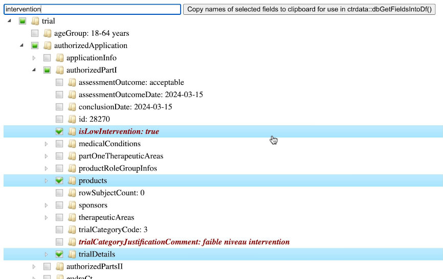

# Show full structure and all data of a trial

If used interactively, the function shows a widget of all data in the
trial as a tree of field names and values. The widget opens in the
default browser. Fields names and values can be search and selected.
Selected fields can be copied to the clipboard for use with function
[dbGetFieldsIntoDf](https://rfhb.github.io/ctrdata/reference/dbGetFieldsIntoDf.md).
The trial is retrieved with
[ctrLoadQueryIntoDb](https://rfhb.github.io/ctrdata/reference/ctrLoadQueryIntoDb.md)
if no database `con` is provided or if the trial is not in database
`con`. For use in a Shiny app, see output and render functions in source
code
[here](https://github.com/rfhb/ctrdata/blob/master/R/ctrShowOneTrial.R#L196).

## Usage

``` r
ctrShowOneTrial(identifier = NULL, con = NULL)
```

## Arguments

- identifier:

  A trial identifier (\`\_id\`) string, see examples

- con:

  A database connection object, created with `nodbi`. See section \`1 -
  Database connection\` in
  [ctrdata](https://rfhb.github.io/ctrdata/reference/ctrdata.md).

## Value

Invisibly, the trial data for constructing an HTML widget.

## Details

This is the widget for CTIS trial 2022-501142-30-00:



## Examples

``` r

dbc <- nodbi::src_sqlite(
  dbname = system.file("extdata", "demo.sqlite", package = "ctrdata"),
  collection = "my_trials",
  flags = RSQLite::SQLITE_RO)

# get sample of identifiers of trials in database
sample(dbFindIdsUniqueTrials(con = dbc), 5L)
#> Searching for duplicate trials... 
#> - Getting all trial identifiers...
#>  (may take some time)...
#> , 31 found in collection
#> - Finding duplicates among registers' and sponsor ids...
#> - 2 EUCTR _id were not preferred EU Member State record for 11 trials
#> - Unique are 8 / 5 / 5 / 3 / 8 records from CTGOV / CTGOV2 / CTIS / EUCTR / ISRCTN
#> = Returning keys (_id) of 29 records in collection "my_trials"
#>         CTGOV        ISRCTN        ISRCTN        ISRCTN         CTGOV 
#> "NCT03325439"    "80181452"    "61070850"    "13281214" "NCT03280147" 

# all such identifiers work
id <- "2014-003556-31"
id <- "2014-003556-31-SE"
id <- "76463425"
id <- "ISRCTN76463425"
id <- "NCT03431558"
id <- "2022-501142-30-00"

# note these ids also work with
# ctrGetQueryUrl(url = id) and
# ctrLoadQueryIntoDb(queryterm = id, ...)

# show widget for user to explore and search content as well as to
# select fields of interest and to click on "Copy names of selected
# fields to clipboard..." to use them with dbGetFieldsIntoDf()
ctrShowOneTrial(identifier = id, con = dbc)
#> Error in utils::browseURL(tf): 'browser' must be a non-empty character string
```
