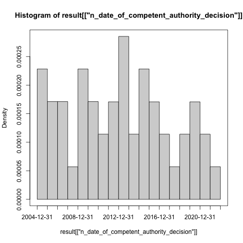
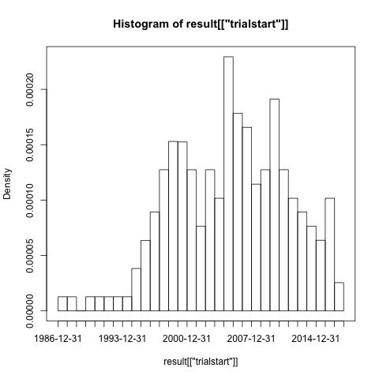
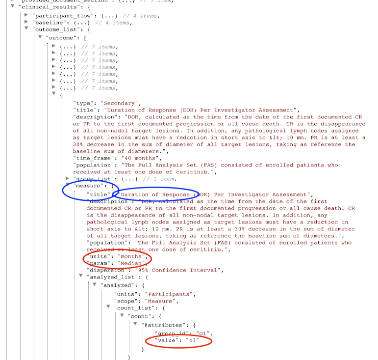
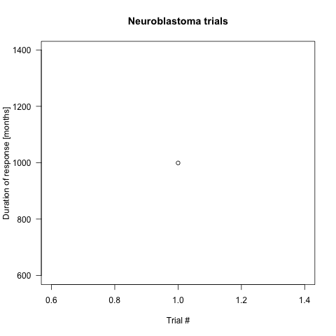
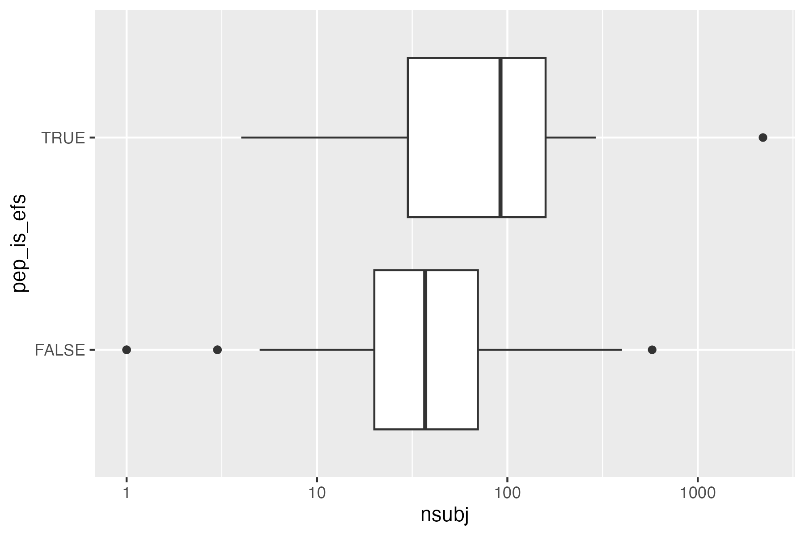

  
```{r setup, include=FALSE}
knitr::opts_chunk$set(
  eval = FALSE, 
  warning = FALSE, 
  message = FALSE, 
  results = "hide")
```


General information on the `ctrdata` package is available here: [https://github.com/rfhb/ctrdata](https://github.com/rfhb/ctrdata). 

Remember to respect the registers' terms and conditions (see `ctrOpenSearchPagesInBrowser(copyright = TRUE)`). Please cite this package in any publication as follows: Ralf Herold (2020). ctrdata: Retrieve and Analyze Clinical Trials in Public Registers. R package version 1.4, https://github.com/rfhb/ctrdata

# Preparations 

Here using MongoDB, which is faster than SQLite, can handle credentials, provides access to remote servers and can directly retrieve nested elements from paths. See [README.md](../README.md) and [Retrieve clinical trial information](ctrdata_retrieve.Rmd) for examples using SQLite. 

```{r connect_mongodb}
db <- nodbi::src_mongo(
  url = "mongodb://localhost",
  db = "some_database_name",
  collection = "some_collection_name")
db
# MongoDB 3.6.8 (uptime: 244492s)
# URL: laptop.home/some_database_name 
# Collection: some_collection_name
```

See [Retrieve clinical trial information](ctrdata_retrieve.Rmd) for more details. 

```{r ctrLoadQueryIntoDb}
library(ctrdata)

# These two queries are equivalent, for 
# completed interventional (drug) trials 
# with children with a neuroblastoma
# from either register. 
ctrLoadQueryIntoDb(
  # using queryterm and register ...
  queryterm = "query=neuroblastoma&age=under-18&status=completed", 
  register = "EUCTR",
  euctrresults = TRUE,
  con = db
)
ctrLoadQueryIntoDb(
  # ... or using full url of search results
  queryterm = 
    "https://clinicaltrials.gov/ct2/results?cond=neuroblastoma&recrs=e&age=0&intr=Drug", 
  con = db
)
dbQueryHistory(con = db)
#       query-timestamp query-register query-records
# 1 2020-10-11 22:11:49          EUCTR           128
# 2 2020-10-11 22:12:08          CTGOV           190
```

# Find fields / variables of interest

Specify a part of the name of a variable of interest; all variables including deeply nested variable names are searched. 

```{r dbFindFields}
dbFindFields(namepart = "date", con = db)
# Finding fields in database (may take some time)
# Field names cached for this session.
#  [1] "completion_date"                                                                  
#  [2] "e231_full_title_date_and_version_of_each_substudy_and_their_related_objectives"   
#  [3] "e231_full_title_date_and_version_of_each_substudy_and_their_related_objectives_es"
#  [4] "last_update_posted"                                                               
#  [5] "last_update_submitted"                                                            
#  [6] "last_update_submitted_qc"                                                         
#  [7] "n_date_of_competent_authority_decision"                                           
#  [8] "n_date_of_ethics_committee_opinion"                                               
#  [9] "p_date_of_the_global_end_of_the_trial"                                            
# [10] "primary_completion_date"                                                          
# [11] "provided_document_section.provided_document.document_date"                        
# [12] "required_header.download_date"                                                    
# [13] "start_date"                                                                       
# [14] "verification_date"                                                                
# [15] "x6_date_on_which_this_record_was_first_entered_in_the_eudract_database"
```

The search for fields is cached and thus accelerated during the R session, as long as no new `ctrLoadQueryIntoDb()` is executed. 

# Data frame from database

The fields of interest can be obtained from the database and are represented in an R data.frame:

```{r dbGetFieldsIntoDf}
result <- dbGetFieldsIntoDf(
  c("f41_in_the_member_state", 
    "f422_in_the_whole_clinical_trial",
    "a1_member_state_concerned", 
    "p_end_of_trial_status",
    "n_date_of_competent_authority_decision", 
    "a2_eudract_number",
    "overall_status",
    "start_date",
    "primary_completion_date"), 
  con = db)
```

# Metadata from data frame

The objects returned by functions of this package include attributes with metadata to indicate from which database, table / collection and query details. Metadata can be reused in R. 

```{r attributes}
attributes(
  result
)
# $`ctrdata-dbname`
# [1] "some_database_name"
# 
# $`ctrdata-table`
# [1] "some_collection_name"
# 
# $`ctrdata-dbqueryhistory`
#       query-timestamp query-register query-records
# 1 2020-10-12 22:11:49          EUCTR           128
# 2 2020-10-12 22:12:08          CTGOV           190
#                                          query-term
# 1 query=neuroblastoma&age=under-18&status=completed
# 2        cond=neuroblastoma&recrs=e&age=0&intr=Drug
```


In the database, the variable "_id" is the unique index for a record. This "_id" is the NCT number for CTGOV records (e.g., "NCT00002560"), and it is the EudraCT number for EUCTR records including the postfix identifying the EU Member State (e.g., "2008-001436-12-NL"). 

It is relevant to de-duplicate records because a trial can be registered in both CTGOV and EUCTR, and can have records by involved country in EUCTR. 

De-duplication is done at the analysis stage because this enables to select if a trial record should be taken from one or the other register, and from one or the other EU Member State. 

The basis of de-duplication is the recording of additional trial identifiers in supplementary fields (variables), which are checked and reported when using function `dbFindIdsUniqueTrials()`: 

```{r dbFindIdsUniqueTrials}
# Obtain de-duplicate trial record ids
ids <- dbFindIdsUniqueTrials(
  preferregister = "EUCTR",
  con = db
)
# * Total of 318 records in collection.
# Searching for duplicates, found 
#  - 93 EUCTR _id were not preferred EU Member State record of trial
#  - 3 CTGOV _id (nct) in EUCTR a52_us_nct_...
#  - 5 CTGOV secondary_id / nct_alias / org_study_id in EUCTR a2_eudract_number
#  - 0 CTGOV secondary_id / nct_alias / org_study_id in EUCTR a52_us_nct_...
#  - 0 CTGOV secondary_id / nct_alias / org_study_id in EUCTR a51_isrctn_...
#  - 10 CTGOV secondary_id / nct_alias / org_study_id in EUCTR a41_sponsors_protocol_...
# Concatenating 35 records from EUCTR and 179 from CTGOV:
# = Returning keys (_id) of 214 out of total 318 records in collection "some_collection_name".
```

The unique ids can be used like this to de-duplicate the data.frame created above: 

```{r subset_unique}
# Eliminate duplicate trials records: 
result <- result[ result[["_id"]] %in% ids, ]
#
nrow(result)
# [1] 214
```

# Simple analysis - dates

In a data.frame generated with `dbGetFieldsIntoDf()`, fields are typed as dates, logical and numbers. 

```{r str_data_frame}
str(result)
# $ _id                                    : "2005-001267-63-IT" "2005-002089-13-GB" ...
# $ f41_in_the_member_state                : int  NA 15 5 37 NA 24 100 NA 600 24 ...
# $ f422_in_the_whole_clinical_trial       : int  230 63 12 67 70 NA 100 156 2230 NA ...
# $ a1_member_state_concerned              : chr  "Italy - Italian Medicines Agency"
# $ p_end_of_trial_status                  : chr  "Completed" "Completed" ...
# $ n_date_of_competent_authority_decision : Date, format: "2005-06-02" "2005-09-06" ...
# $ a2_eudract_number                      : chr  "2005-001267-63" "2005-002089-13" ...
# $ overall_status                         : chr  NA NA NA NA ...
# $ start_date                             : Date, format: NA NA ...
# $ primary_completion_date                : Date, format: NA NA ...
```

This facilitates using the respective type of data for analysis, for example of dates with base R graphics:  
 
```{r simple_analysis_dates}
# Open file for saving
png("vignettes/nb1.png")
# Visualise trial start date
hist(
  result[["n_date_of_competent_authority_decision"]], 
  breaks = "years")
box()
dev.off()
```

# Merge corresponding fields from registers

However, the field "n_date_of_competent_authority_decision" used above exists only in EUCTR, and it corresponds to the field "start_date" in CTGOV. Thus, to provide a wider picture, the two fields can be merged for analysis, using the convenience function `dfMergeTwoVariablesRelevel()` in `ctrdata` package: 

```{r dfMergeTwoVariablesRelevel}
# Merge two variables into a new variable:
result$trialstart <- dfMergeTwoVariablesRelevel(
  result, 
  colnames = c(
    "n_date_of_competent_authority_decision", 
    "start_date"))
# Plot from both registers
png("vignettes/nb2.png")
hist(
  result[["trialstart"]], 
  breaks = "years")
box()
dev.off()
```


In a more sophisticated use of `dfMergeTwoVariablesRelevel()`, values of the original variables can be mapped into new values of the merged variable, as follows: 

```{r dfMergeTwoVariablesRelevel_relevel}
# First, define how values of the new, merged variable 
# (e.g., "ongoing") will result from values of the 
# original variable (e.g, "Recruiting):
mapped_values <- list(
  "ongoing" = c("Recruiting", "Active", "Ongoing", 
                "Active, not recruiting", 
                "Enrolling by invitation", "Restarted"),
  "completed" = c("Completed", "Prematurely Ended", "Terminated"),
  "other"     = c("Withdrawn", "Suspended", "No longer available", 
                  "Not yet recruiting", "Temporarily Halted", 
                  "Unknown status"))

# Secondly, use the list of mapped
# values when merging two variable: 
tmp <- dfMergeTwoVariablesRelevel(
  result, 
  colnames = c("overall_status", 
               "p_end_of_trial_status"), 
  levelslist = mapped_values)

table(tmp)
# completed   ongoing 
#       209         5 
```

# Annotations made by user

The fields that `ctrdata` adds to each record are `annotation` and `record_last_import`. The annotation field is a single string that is only added if a user specifies an annotations when retrieving trials ([Retrieve clinical trial information](ctrdata_retrieve.Rmd)). The last date and time when the trial record was imported is updated automatically. Also these fields can be used for analysis. For example, string functions can be used for annotations e.g. to split it into components. Since no annotations were specified when retrieving the trials in the steps above, there are so far no annotation fields and `stopifnodata` is set to `FALSE` to avoid the function raises an error to alert users:   

```{r annalyse_annotation}
result <- dbGetFieldsIntoDf(
  fields = c("annotation", "record_last_import"), 
  stopifnodata = FALSE,
  con = db)

str(result)
 # $ _id               : chr  "2004-004386-15-DE" "2004-004386-15-ES"  ...
 # $ annotation        : chr  "site_de" NA ...
 # $ record_last_import: POSIXct, format: "2020-10-12 20:11:45" ...
```

# Analysing nested fields such as trial results

The registers represent clinical trial information by nesting fields (e.g., several reporting groups within several measures within one of several endpoints). A visualisation of this hierarchical representation for CTGOV is this: 

```{r show_nesting}
# remotes::install_github("https://github.com/hrbrmstr/jsonview")
jsonview::json_tree_view(result[["clinical_results.outcome_list.outcome"]][
 result[["_id"]] == "NCT00520936"])
```


The analysis of nested information such as the highlighted duration of response can be done with `ctrdata` as follows. The main steps are:

- to transform nested information to a long, name-value data.frame and then 

- to identify where the measures of interest (e.g. duration of response, blue circles above) are located in the information hierarchy by specifying the name and value of fields (`wherename`, `wherevalue`) and finally 

- to obtain the value of the item by specifying the name(s) of its value field(s) (`valuename`, red circles above). 

```{r analyse_nested_data}
# 1. Create data frame from results fields. 
# These are the key results fields from 
# CTGOV and from EUCTR: 
result <- ctrdata::dbGetFieldsIntoDf(
  fields = c(
    # CTGOV
    "clinical_results.baseline.analyzed_list.analyzed.count_list.count",
    "clinical_results.baseline.group_list.group",
    "clinical_results.baseline.analyzed_list.analyzed.units",
    "clinical_results.outcome_list.outcome",
    "study_design_info.allocation",
    # EUCTR
    "@attributes.eudractNumber",
    "trialInformation", 
    "subjectDisposition.recruitmentDetails", 
    "baselineCharacteristics.baselineReportingGroups.baselineReportingGroup",
    "endPoints.endPoint",
    "trialChanges.hasGlobalInterruptions",
    "subjectAnalysisSets",
    "adverseEvents.seriousAdverseEvents.seriousAdverseEvent"
  ),
  con = db
)
# Keep only unique trial records
result <- result[
  result[["_id"]] %in% ctrdata::dbFindIdsUniqueTrials(
    con = db),
]

# 2. The columns of the results data.frame 
# contain nested lists of fields, see
str(result[["endPoints.endPoint"]])

# All nested data are transformed to a long,
# name-value data.frame (resulting in several
# hundred rows per trial record): 
long_result <- ctrdata::dfTrials2Long(
  df = result
)

# 3. Obtain values for fields of interest where
# they related to measures of interest. The
# parameters can be regular expressions. 
dor <- dfName2Value(
  df = long_result,
  wherename = paste0(
    "clinical_results.*outcome.measure.title|", 
    "endPoints.endPoint.title"),
  wherevalue = "duration of response",
  valuename = paste0(
    "endPoints.*armReportingGroup.tendencyValues.tendencyValue.value|",
    "clinical_results.*category_list.category.measurement_list.measurement.value"
  )
)
# 
str(dor)
# 'data.frame':	31 obs. of  5 variables:
#  $ trial_id: chr  "2013-001142-34-GB" "2013-001142-34-GB" ...
#  $ main_id : int  4 4 7 7 7 7 7 1 1 10 ...
#  $ sub_id  : int  1 2 1 2 3 4 5 1 2 NA ...
#  $ name    : chr  "endPoints.endPoint.armReportingGroups ...
#  $ value   : num  7.2 18.6 706 84.5 413.5 ...

# Just in this case and to make the example meaningful:
# Duration of response has been reported variably in
# months and days. Here, just select trials reporting 
# duration of response in months: 
dor <- dor[ 
  grepl("months", 
        dfName2Value(
          df = long_result,
          wherename = paste0(
            "clinical_results.*outcome.measure.title|", 
            "endPoints.endPoint.title"),
          wherevalue = "duration of response",
          valuename = paste0(
            "clinical_results.*measure.units|", 
            "endPoints.endPoint.unit")
        )[["value"]]), ]

# Finally plot
png("vignettes/dorplot.png")
plot(
  dor[["value"]], 
  las = 1,
  xlab = "Trial #",
  ylab = "Duration of response [months]",
  main = "Neuroblastoma trials")
dev.off()
```


# Analysing primary endpoints

Text analysis has to be used for many fields of trial information from the registers. Here is an example to simply categorise the type of primary endpoint. In addition, the number of subjects are extracted and compared by type of primary endpoint. 

```{r plot_endpoint_frequencies}
# Several "measure" entries are in "primary_outcome". 
# They are concatenated into a list when specifying
# the JSON path "primary_outcome.measure"
result <- dbGetFieldsIntoDf(c(
  # CTGOV
  "primary_outcome.measure",
  "enrollment",
  # EUCTR
  "e51_primary_end_points",
  # "f11_trial_has_subjects_under_18"
  "f11_number_of_subjects_for_this_age_range"), 
  con = db)

# De-duplicate 
result <- result[ 
  result[["_id"]] %in% 
    dbFindIdsUniqueTrials(con = db), ]

# Merge primary endpoint (pep)
result$pep <- dfMergeTwoVariablesRelevel(
  df = result,
  colnames = 
    c("primary_outcome.measure",
      "e51_primary_end_points")
)

# Merge number of subjects
result$nsubj <- dfMergeTwoVariablesRelevel(
  df = result,
  colnames = 
    c("enrollment",
      "f11_number_of_subjects_for_this_age_range")
)

# For primary endpoint of interest, 
# use regular expression on text:
result$pep_is_efs <- grepl(
  pattern = "((progression|event|relapse|recurrence|disease)[- ]free)|pfs|dfs|efs)", 
  x = result$pep, 
  ignore.case = TRUE)

# Tabulate
table(result$pep_is_efs)

# Plot
library(ggplot2)
ggplot(data = result, 
       aes(x = nsubj,
           y = pep_is_response)) + 
  geom_boxplot() + 
  scale_x_log10()
# ggsave("vignettes/boxpep.png", width = 6, height = 4)
```


# Investigational or authorised medicinal product?

The information about the status of authorisation (licencing) of a medicine used in a trial is record in EUCTR; a corresponding field in CTGOV is not known. The status is in the tree starting from the `dimp` element. 

```{r product_status}

# Get results
result <- dbGetFieldsIntoDf(
  fields = 
    c("a1_member_state_concerned", 
      "n_date_of_competent_authority_decision",
      "dimp.d21_imp_to_be_used_in_the_trial_has_a_marketing_authorisation", 
      "x6_date_on_which_this_record_was_first_entered_in_the_eudract_database",
      "f422_in_the_whole_clinical_trial", 
      "a2_eudract_number"), 
  con = db)
# Note: requested field dimp.d21_imp_to_be_used_in_the_trial_has_a_marketing_authorisation
# has subitems dimp, collapsed using ' / '

# Find first date of authorisation in EU member state
tmp <- aggregate(
  result[["n_date_of_competent_authority_decision"]], 
  by = list(result[["a2_eudract_number"]]),
  FUN = function(x) min(x))
result <- merge(
  x = result, 
  y = tmp, 
  by.x = "a2_eudract_number", 
  by.y = "Group.1", 
  all.x = TRUE)
result[["startdatefirst"]] <- dfMergeTwoVariablesRelevel(
  df = result,
  colnames = c(
    "x", 
    "x6_date_on_which_this_record_was_first_entered_in_the_eudract_database")
)

# Now de-duplicate
result <- result[ 
  result[["_id"]] %in% 
    dbFindIdsUniqueTrials(
      include3rdcountrytrials = FALSE, 
      con = db), ]

# How many of the investigational medicinal product(s) 
# used in the trial are authorised?
number_authorised <- stringi::stri_count(
  result[["dimp.d21_imp_to_be_used_in_the_trial_has_a_marketing_authorisation"]], 
  fixed = "Yes")
table(number_authorised, exclude = "")
result[["any_authorised"]] <- number_authorised > 0

# Plot
library(ggplot2)
library(scales)
ggplot(
  data = result, 
  aes(
    x = startdatefirst, 
    fill = any_authorised)) +
  scale_x_date(
    breaks = breaks_width(width = "2 years"), 
    labels = date_format("%Y")) +
  geom_histogram() + 
  labs(
    title = "Neuroblastoma trials in EU", 
    x = "Year of trial authorisation (or entered in EUCTR)", 
    y = "Number of trials", 
    fill = "Medicine\nauthorised?")
# ggsave("vignettes/nbtrials.png", width = 6, height = 4)
```


# Analyses using aggregation pipeline and mapreduce

Here are example of analysis functions that can be run on the MongoDB server, which are fast and do not consume R resources.

```{r mongodb_aggregation_pipeline}
# Load library for database access
library(mongolite)

# Creat R object m to access the 
# collection created above:
m <- mongo(url = paste0(db[["url"]], "/", db[["db"]]), 
           collection = db[["collection"]])

# Number of records in  collection:
m$count()

# Number of EUCTR records, using JSON for query:
m$count(query = '{"_id": {"$regex": "[0-9]{4}-[0-9]{6}-[0-9]{2}", 
                 "$options": "i"}}')
# Alternative: 
m$count(query = '{"ctrname": "EUCTR"}')

# Number of CTGOV records:
m$count(query = '{"_id": {"$regex": "NCT[0-9]{8}", 
                 "$options": "i"}}')
# Alternative:
m$count(query = '{"ctrname": "CTGOV"}')


# The following examples use the aggregation pipeline in MongoDB:

# See here for details on mongo's aggregation pipleline: 
# https://docs.mongodb.org/manual/core/aggregation-pipeline/
 
# To best define regular expressions for analyses, 
# inspect the field (here, primary_outcome.measure):
# Regular expressions ("$regex") are case insensitive ("i")
head(
  m$distinct(key = "primary_outcome.measure", 
             query = '{"_id": {"$regex": "NCT[0-9]{8}", "$options": "i"}}'))


# [Example 1.] Total count of PFS, EFS, RFS or DFS
out <- m$aggregate(
  # Count number of documents in collection that 
  # matches in primary_outcome.measure the 
  # regular expression, 
  pipeline = 
    '[{"$match": {"primary_outcome.measure": 
      {"$regex": "(progression|event|relapse|recurrence|disease)[- ]free", 
                 "$options": "i"}}}, 
      {"$group": {"_id": "null", "count": {"$sum": 1}}}]')
out


# [Example 2.] Lists records of OS trials with start date
out <- m$aggregate(
  pipeline = 
    '[{"$match": {"primary_outcome.measure": 
      {"$regex": "overall survival", "$options": "i"}}}, 
      {"$project": {"_id": 1, "start_date": 1}}]')
head(out)
#           _id   start_date
# 1 NCT00793845  August 2008
# 2 NCT00923351 June 2, 2007


# [Example 3.] Count number of trials by number of
# study participants in bins of hundreds of participants:
hist <- m$mapreduce(
  map = "function(){emit(Math.floor(this.f422_in_the_whole_clinical_trial/100)*100, 1)}", 
  reduce = "function(id, counts){return Array.sum(counts)}"
)

hist
#    _id value
# 1  NaN   195
# 2    0    74
# 3  100    35
# 4  200     4
# 5  600     1
# 6 2200     4
# 7 2700     2
# 8 3300     4
```

