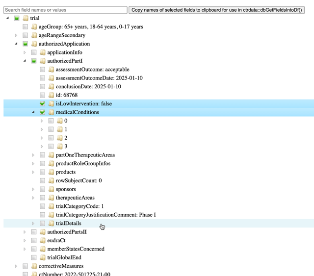
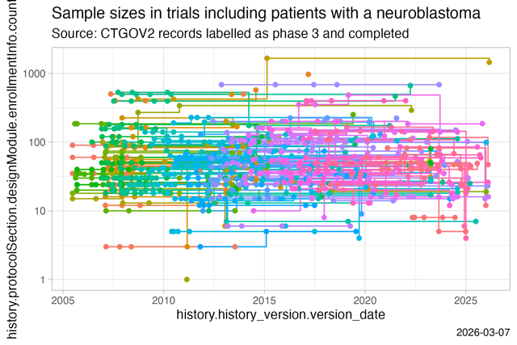
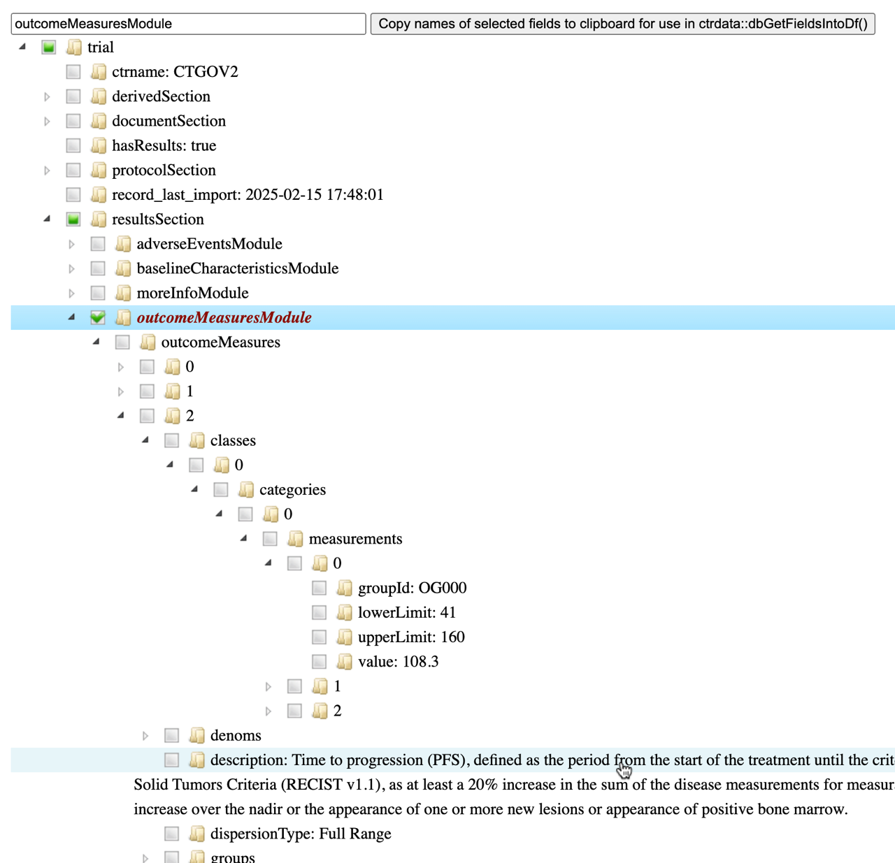
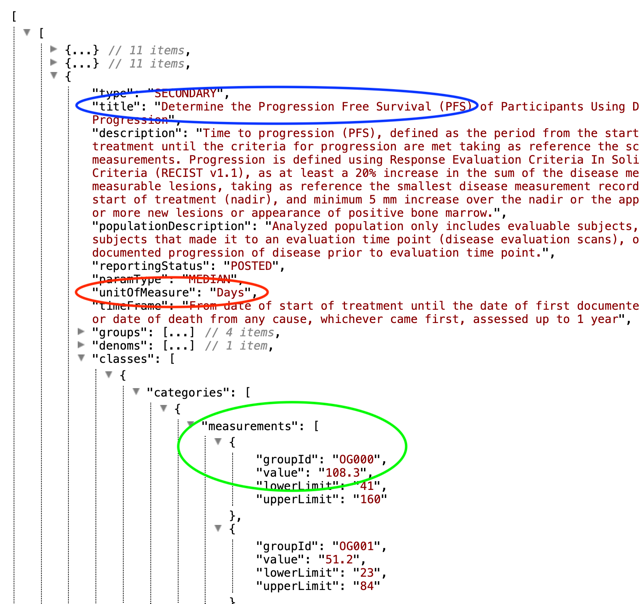
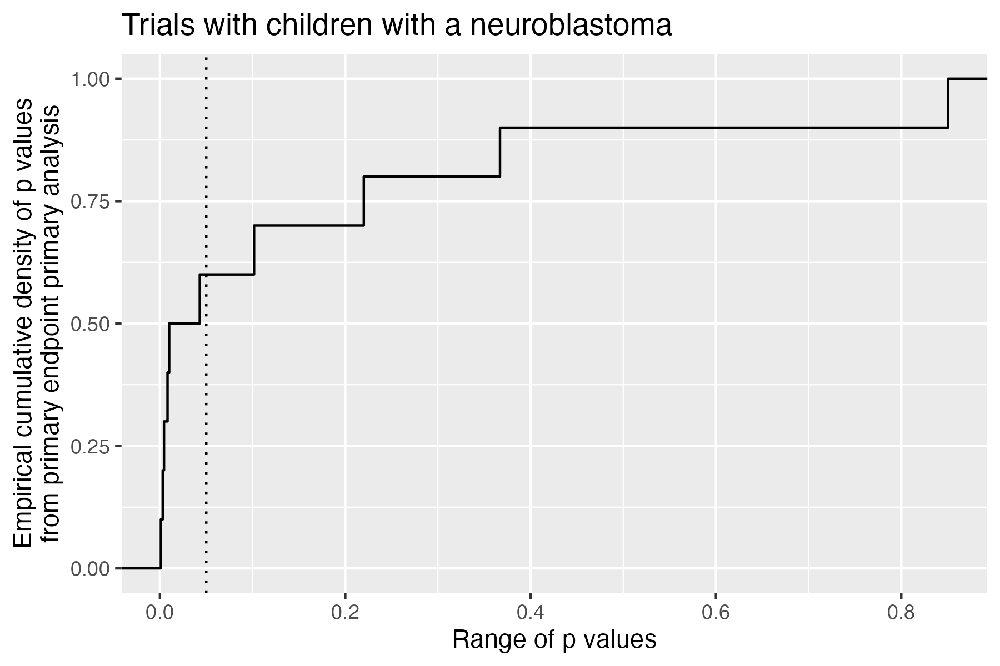
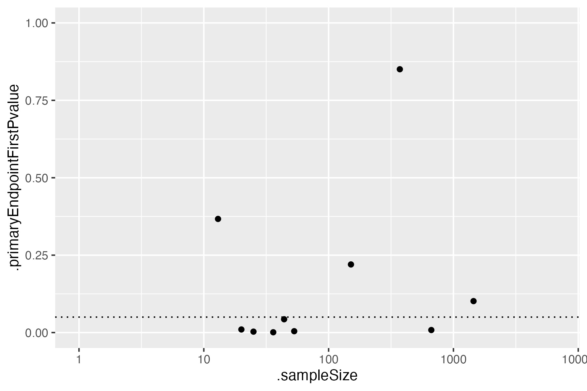

```{r setup, include=FALSE}
knitr::opts_chunk$set(
  eval = FALSE,
  warning = FALSE,
  message = FALSE,
  results = "hide"
)
```


General information on the `ctrdata` package is available here: [https://github.com/rfhb/ctrdata](https://github.com/rfhb/ctrdata).

Remember to respect the registers' terms and conditions (see `ctrOpenSearchPagesInBrowser(copyright = TRUE)`). Please cite this package in any publication as follows: Ralf Herold (2025). ctrdata: Retrieve and Analyze Clinical Trials in Public Registers. R package version 1.21.0. https://cran.r-project.org/package=ctrdata

## Preparations

Here using MongoDB, which may be faster than SQLite, can handle credentials, provides access to remote servers and can directly retrieve nested elements from paths. See [README.md](../README.md) and [Retrieve clinical trial information](ctrdata_retrieve.Rmd) for examples using SQLite. Also PostgreSQL can be used as database, see [Install R package ctrdata](ctrdata_install.Rmd).

```{r connect_mongodb}
db <- nodbi::src_mongo(
  url = "mongodb://localhost",
  db = "my_database_name",
  collection = "my_collection_name"
)
db
# MongoDB  8.0.4 (uptime: 298113s) 
# URL: mongodb://localhost
# Database: my_database_name
# Collection: my_collection_name

# empty collection if exists
nodbi::docdb_delete(db, db$collection)
```

See [Retrieve clinical trial information](ctrdata_retrieve.Rmd) for more details.

```{r ctrLoadQueryIntoDb}
# Load package
library(ctrdata)

# Model queries
queries <- ctrGenerateQueries(
  condition = "neuroblastoma",
  population = "P"
)

# Load trials from all queries into collection
result <- lapply(queries, ctrLoadQueryIntoDb, euctrresults = TRUE, con = db)

# Show results of loading
sapply(result, "[[", "n")
# EUCTR CTGOV2 ISRCTN   CTIS 
#   390    613      3     19
```

## Find fields / variables of interest

Specify a part of the name of a variable of interest; all variables including deeply nested variable names are searched. Set `sample = TRUE` (default) to rapidly execute the function in large database collections. The search for fields is cached and thus accelerated during the R session; calling `ctrLoadQueryIntoDb()` or changing `sample = ...` invalidates the cache. 

```{r dbFindFields}
#
dbFindFields(namepart = "date", sample = FALSE, con = db)
# Finding fields in database collection (may take some time) . . . . . 
# Field names cached for this session.
# [...]
#                                                                            EUCTR 
# "e231_full_title_date_and_version_of_each_substudy_and_their_related_objectives" 
# [...]
#                                                                           CTGOV2 
#      "annotationSection.annotationModule.unpostedAnnotation.unpostedEvents.date" 
#                                                                           CTGOV2 
#                            "protocolSection.statusModule.studyFirstSubmitQcDate" 
# [...]
#                                                                             CTIS 
#                                                                    "publishDate" 
#                                                                             CTIS 
#                                                                    "startDateEU" 
# [...]
#                                                                           ISRCTN 
#                                                     "trialDesign.overallEndDate" 
```


## Data frame from database

The fields of interest can be obtained from the database and are represented in an R data frame, for example:

```{r dbGetFieldsIntoDf}
# Define vector of fields
fieldsOfInterest <- c(
  # EUCTR protocol-related information
  "f41_in_the_member_state",
  "f422_in_the_whole_clinical_trial",
  "a1_member_state_concerned",
  #
  # EUCTR results-related information
  "trialInformation.recruitmentStartDate", 
  "trialInformation.globalEndOfTrialDate",
  #
  # CTGOV2
  "protocolSection.statusModule.startDateStruct.date",
  "trialInformation.recruitmentStartDate",
  "protocolSection.statusModule.primaryCompletionDateStruct.date"
)

# Create data frame with records of trials 
# which for at least one field have a value
result <- dbGetFieldsIntoDf(
  fields = fieldsOfInterest,
  con = db
)
# Querying database (7 fields)...

# dim(result)
# [1] 984   8
```

## Metadata from data frame

The objects returned by functions of this package include attributes with metadata to indicate from which database, table / collection and query details. Metadata can be reused in R.

```{r attributes}
attributes(result)
# [...]
#
# $class
# [1] "data.frame"
# 
# $`ctrdata-dbname`
# [1] "my_database_name"
# 
# $`ctrdata-table`  <-- this attribute will be retired by end 2024
# [1] "my_collection_name"
# 
# $`ctrdata-table-note`
# [1] "^^^ attr ctrdata-table will be removed by end 2024"
# 
# $`ctrdata-collection`
# [1] "my_collection_name"
# 
# $`ctrdata-dbqueryhistory`
#       query-timestamp query-register query-records
# 1 2025-03-02 15:26:22          EUCTR           390
# 2 2025-03-02 15:26:25         CTGOV2           613
# 3 2025-03-02 15:26:26         ISRCTN             3
# 4 2025-03-02 15:26:28           CTIS            19
#                                                               query-term
# 1                                       query=neuroblastoma&age=under-18
# 2                               cond=neuroblastoma&aggFilters=ages:child
# 3                     &filters=condition:neuroblastoma,ageRange:Child&q=
# 4 searchCriteria={"medicalCondition":"neuroblastoma","ageGroupCode":[2]}
```

## De-duplicate records

In the database, the variable "_id" is the unique index for a record. This "_id" is the NCT number for CTGOV records (e.g., "NCT00002560"), and it is the EudraCT number for EUCTR records including the postfix identifying the EU Member State (e.g., "2008-001436-12-NL"). It is relevant to de-duplicate records because a trial can be registered in both CTGOV2 and EUCTR, and can have records by involved country in EUCTR. 

De-duplication is done at the analysis stage because this enables to select if a trial record should be taken from one or the other register, and from one or the other EU Member State. The basis of de-duplication is the recording of additional trial identifiers in supplementary fields (variables), which are checked and reported when using function `dbFindIdsUniqueTrials()`:

```{r dbFindIdsUniqueTrials}
# Obtain de-duplicated trial record ids
ids <- dbFindIdsUniqueTrials(
  preferregister = "EUCTR",
  con = db
)
# Searching for duplicate trials... 
# - Getting all trial identifiers (may take some time), 1025 found in collection
# - Finding duplicates among registers' and sponsor ids...
# - 284 EUCTR _id were not preferred EU Member State record for 109 trials
# - Keeping 106 / 0 / 423 / 1 / 19 records from EUCTR / CTGOV / CTGOV2 / ISRCTN / CTIS
# = Returning keys (_id) of 549 records in collection "my_collection_name"

# Eliminate duplicate trials records:
result <- result[result[["_id"]] %in% ids, ]

nrow(result)
# [1] 513
#
# Note that "ids" are the identifiers of unique trials in the whole collection,
# whereas the data frame "result" only includes those trials in which any of 
# the fields of interest had a value, thus explaining why "result" has fewer
# rows than "ids" has identifiers. 
```


## Use trial concepts to simplify analyses

An alternative is to calculate a column `isUniqueTrial` already at the time that a data frame is created. This uses one of the trial concepts that provide a canonical field, calculated from trial information of any register, see `help(ctrdata-trial-concepts)`. 

```{r unique}
# Obtain data of interest
result <- dbGetFieldsIntoDf(
  fields = fieldsOfInterest, 
  calculate = "f.isUniqueTrial",
  con = db
)
# Querying database (30 fields)...
# - Finding duplicates among registers' and sponsor ids... 
# - 132 EUCTR _id were not preferred EU Member State record for 83 trials
# - Keeping 613 / 50 / 0 / 1 / 19 records from CTGOV2 / EUCTR / CTGOV / ISRCTN / CTIS

# Eliminate duplicate trials records:
result <- result[result[[".isUniqueTrial"]], ]

nrow(result)
# [1] 267
#
# Note this has used a different register as priority.
# Also, the data frame result includes all trials which
# had a value in at least one of the fields of interest
# or the fields needed to calculate the trial concept. 

# See description of concept .isUniqueTrial: 
help("f.isUniqueTrial")

# See how concept .isUniqueTrial is implemented
f.isUniqueTrial
```


## Reviewing a specific trial

It will often be useful to inspect all data for a single trial, e.g. to understand the meaning and relation of fields, to see where certain information is stored, and to identify fields of interest. 

For a given trial, function [ctrShowOneTrial()](https://rfhb.github.io/ctrdata/reference/ctrShowOneTrial.html) enables the user to visualise the hiearchy of fields and contents in the user's local web browser, to search for field names and field values, and to select and copy selected fields' names for use with function [dbGetFieldsIntoDf()](https://rfhb.github.io/ctrdata/reference/dbGetFieldsIntoDf.html). 

```{r single_trial_widget}
# Opens a web browser for user interaction.
# If the trial is not found in the database,
# it will be loaded from the register. 
#
# The search is for both, field names and values
ctrShowOneTrial("2022-501725-21-00", con = db)
```

Alternatively, use any standard database function to retrieve the trial's `JSON` representation that `ctrdata` had stored in the collection and visualise its nested structure of field names and values.

```{r single_trial_widget_jsonview}
# Requires additional package for visualisation
remotes::install_github("hrbrmstr/jsonview")

# Works with DuckDb, SQLite, PostgreSQL, MongoDB
oneTrial <- nodbi::docdb_query(
  src = db, 
  key = db$collection, 
  query = '{"_id":"2022-501725-21-00"}',
  limit = 1L
)

# Interactive widget where nodes can be expanded,
# note that fields and values cannot be searched
jsonview::json_tree_view(oneTrial)
```


## Simple analysis of dates

In a data frame generated with `dbGetFieldsIntoDf()`, fields are typed as dates, logical, character or numbers.
This typing facilitates using the data for analysis, for example of dates with base R graphics:

```{r str_data_frame}
# Get data of interest
result <- dbGetFieldsIntoDf(
  fields = c("ctrname"),
  calculate = c("f.isUniqueTrial", "f.startDate"),
  con = db
)
# Querying database (33 fields)...
# - Finding duplicates among registers' and sponsor ids... 
# - 132 EUCTR _id were not preferred EU Member State record for 83 trials
# - Keeping 613 / 50 / 0 / 1 / 19 records from CTGOV2 / EUCTR / CTGOV / ISRCTN / CTIS
# Calculating .startDate...  

str(result)
# 'data.frame':	1025 obs. of  4 variables:
#  $ _id           : chr  "2004-004386-15-DE" "2004-004386-15-ES" "2004-004386-15-GB" "2004-004386-15-IT" ...
#  $ ctrname       : chr  "EUCTR" "EUCTR" "EUCTR" "EUCTR" ...
#  $ .isUniqueTrial: logi  FALSE FALSE FALSE FALSE FALSE FALSE ...
#  $ .startDate    : Date, format: "2005-07-26" "2005-11-15" "2005-07-26" ...

# Open file for saving
png("vignettes/nb1.png")

# De-duplicate and visualise start date
hist(
  result[result$.isUniqueTrial, ".startDate"],
  breaks = "years"
)
box()
dev.off()
```


## Cross-register clinical trial concepts

A number of calculations across fields from different registers are available in `ctrdata`. 
This offers much convenience for users, because it provides a canonical 
understanding and implementation of the mapping of corresponding fields and 
value lists across different registers. 
Available calculations can be listed, and a specific documentation shown.

```{r dfcalculate}
# All concepts available at this time
#  [1] "f.controlType"             "f.isMedIntervTrial"        "f.isPlatformTrial"        
#  [4] "f.isUniqueTrial"           "f.numSites"                "f.numTestArmsSubstances"  
#  [7] "f.primareEndpointEstimand" "f.sampleSize"              "f.sponsorType"            
# [10] "f.startDate"               "f.statusRecruitment"       "f.trialObjective"         
# [13] "f.trialPhase"

# Introduction to trial concepts
help("ctrdata-trial-concepts")

# Show documentation of a specific trial concept 
help("f.isMedIntervTrial")
```


## Merging fields for analysis 

With the function `dfMergeVariablesRelevel()`, users have control how to merge 
values of a set of original variables to a new variable, optionally with 
a new set of values. For more, see `help(dfMergeVariablesRelevel)`. 
This can be used for concepts that are very specific to the use case and / or 
not implemented so far, see `help(ctrdata-trial-concepts)`. 


## Historic versions of trial records and changes in sample sizes

Historic versions can set to be retrieved for CTGOV2 by specifying `ctgov2history = <...>` when using `ctrLoadQueryIntoDb()`; this functionality was added in `ctrdata` version 1.18.0. The versions include all trial data available at the date of the respective version. Only CTGOV2 provides historic versions at this time; they were available for `CTIS` only until its relaunch on 2024-06-17. 

For CTGOV2 records, the historic versions are added as follows into the `ctrdata` data model of a trial record, where the ellipsis `...` represents all trial data fields: `{"_id":"NCT01234567", "title": "Current title", ..., "history": [{"history_version": {"version_number": 1, "version_date": "2020-21-22 10:11:12"}, "title": "Original title", ...}, {"history_version": {"number": 2, "date": "2021-22-23 11:13:13"}, "title": "Later title", ...}]}`

The example shows how planned or realised number of participants (sample size) changed over time for individual trials, using available data 

```{r sample_size_over_time}
# Load previous query (above), specifying that 
# for each trial, 5 versions should be retrieved
ctrLoadQueryIntoDb(
  queryterm = queries["CTGOV2"], 
  con = db, 
  ctgov2history = 5L
)

# Get relevant fields
result <- dbGetFieldsIntoDf(
  fields = c(
    # only CTGOV2 has structured historic information
    "history.protocolSection.designModule.enrollmentInfo.count",
    "history.history_version.version_date"
  ),
  calculate = "f.statusRecruitment",
  con = db
)

# Helper packages
library(dplyr)
library(tidyr)
library(ggplot2)

# Mangle and plot
result %>%
  unnest(cols = starts_with("history.")) %>%
  filter(.statusRecruitment == "completed") %>% 
  filter(!is.na(history.protocolSection.designModule.enrollmentInfo.count)) %>% 
  filter(history.protocolSection.designModule.enrollmentInfo.count > 0L) %>% 
  group_by(`_id`) %>%
  ggplot(
    mapping = aes(
      x = history.history_version.version_date,
      y = history.protocolSection.designModule.enrollmentInfo.count,
      colour = `_id`)
  ) +
  geom_step() +
  geom_point() +
  theme_light() +
  scale_y_log10() +
  guides(colour = "none") +
  labs(
    title = "Sample sizes in trials including patients with a neuroblastoma", 
    subtitle = "Source: CTGOV2 records labelled as phase 3 and completed", 
    caption = Sys.Date()
  )

ggsave("vignettes/samplesizechanges.png", width = 6, height = 4)
```


## Analysing nested fields such as trial results

The registers represent clinical trial information by nesting fields (e.g., several reporting groups within several measures within one of several endpoints). A visualisation of this hierarchical representation for CTGOV2 follows. Compare this with the outcome measures presented here: https://clinicaltrials.gov/study/NCT02139397?tab=results#outcome-measures, specifically "3. Determine the Progression Free Survival (PFS)..." 

```{r ctrShowOneTrial}
# Since version 1.20.0, an interactive widget is built into ctrdata
# and can be used to search in all field names and all values 
ctrShowOneTrial("NCT02139397", con = db)
```

Alternative: 

```{r show_nesting}
# Helper package
remotes::install_github("https://github.com/hrbrmstr/jsonview")

# Get relevant data
result <- dbGetFieldsIntoDf("resultsSection.outcomeMeasuresModule", con = db)

# Create interactive widget
jsonview::json_tree_view(result[result[["_id"]] == "NCT02139397", -1])
```


The analysis of nested information such as the highlighted duration of response is facilitated with `ctrdata` as follows. The main steps are:

1. Create a data from fields identified as shown in previous sections (using `dbGetFieldsIntoDf()`)

2. Transform nested information to a long, name-value data frame (using `dfTrials2Long()`)

3. Identify the measures of interest (e.g. PFS, blue circle above) by specifying the name and value of these fields (`wherename`, `wherevalue` in function `dfName2Value()`) 

4. Obtain values by specifying the name(s) of its value field(s) (red and green circles in figure above; `valuename` in function `dfName2Value()`)

5. Tabulate the results of interest

This is put together in the following example. Note that `CTGOV` fields are no longer downloadable (see NEWS.md) but may exist in previously created databases. 

```{r analyse_nested_data}
#### 1. Create data frame from results fields
# These are key results fields from
# CTGOV2, CTGOV and from EUCTR:
result <- dbGetFieldsIntoDf(
  fields = c(
    # EUCTR - note this requires to set parameter
    # euctrresults = TRUE in ctrLoadQueryIntoDb()
    # as shown above in section "User annotations"
    "trialInformation.populationAgeGroup",
    "subjectDisposition.recruitmentDetails",
    "baselineCharacteristics.baselineReportingGroups.baselineReportingGroup",
    "endPoints.endPoint",
    "subjectAnalysisSets",
    "adverseEvents.seriousAdverseEvents.seriousAdverseEvent", 
    # CTGOV2
    "resultsSection.outcomeMeasuresModule",
    "protocolSection.designModule.designInfo.allocation", 
    "resultsSection.participantFlowModule",
    # CTGOV
    "clinical_results.baseline.analyzed_list.analyzed.count_list.count",
    "clinical_results.baseline.group_list.group",
    "clinical_results.baseline.analyzed_list.analyzed.units",
    "clinical_results.outcome_list.outcome",
    "study_design_info.allocation"
  ),
  calculate = "f.isUniqueTrial",
  con = db
)

# Keep only unique trial records
result <- result[result[[".isUniqueTrial"]], ]


#### 2. All nested data are transformed to a long,
# Name value data frame (which has several hundred
# rows for each trial, with one row per field):
# 
long_result <- dfTrials2Long(df = result)
# Total 89253 rows, 159 unique names of variables
long_result[c(100, 10000, 80000), ]
# # A tibble: 3 × 4
#   `_id`             identifier name                                                        value
#   <chr>             <chr>      <chr>                                                       <chr>
# 1 2007-000371-42-PL 36         adverseEvents.seriousAdverseEvents.seriousAdverseEvent.dic… false
# 2 2013-003595-12-CZ 13.3       adverseEvents.seriousAdverseEvents.seriousAdverseEvent.val… 0    
# 3 NCT02124772       25.3       resultsSection.outcomeMeasuresModule.outcomeMeasures.denom… OG002


#### 3. and 4. Obtain values for measures of interest 
#
# The parameters can be regular expressions
clinicalDuration <- dfName2Value(
  df = long_result,
  # 3. Identify measures of interest
  wherename = paste0(
    "endPoints.endPoint.title|",
    "resultsSection.outcomeMeasuresModule.outcomeMeasures.title"
  ),
  wherevalue = paste0(
    "duration of response|DOR|",
    "free survival|DFS|PFS|EFS"
  ),
  # 4. Obtain result values for measure
  valuename = paste0(
    "resultsSection.*outcomeMeasures.classes.categories.measurements.value|",
    "endPoints.*armReportingGroup.tendencyValues.tendencyValue.value|",
    "resultsSection.outcomeMeasuresModule.outcomeMeasures.unitOfMeasure|",
    "endPoints.endPoint.unit|",
    "resultsSection.outcomeMeasuresModule.outcomeMeasures.groups.title|",
    "endPoints.*armReportingGroup.armId"
  )
)
# Returning values for 53 out of 683 trials


#### 5. Tabulate the results

# PFS / EFS duration has been reported with various units:
sort(unique(clinicalDuration[
  grepl("unit", clinicalDuration$name), "value", drop = TRUE]))
# [1] "3 year EFS"                               "Days"                                    
# [3] "Estimated probability"                    "L/hr"                                    
# [5] "months"                                   "Months"                                  
# [7] "number of participants with No VOD/Death" "Participants"                            
# [9] "percent of probability"                   "percent probability" 

# Helper packages for convenience
library(dplyr)
library(tidyr)

# Mangle data for tabulation
clinicalDuration %>% 
  as_tibble() %>%
  mutate(
    group_id = paste0(`_id`, "_", sub("([0-9]+)[.]?.*", "\\1", identifier)),
    name_short = sub(".*[.](.+)", "\\1", name),
    name_short = if_else(name_short == "unitOfMeasure", "unit", name_short)
  ) %>%
  group_by(group_id) %>% 
  mutate(
    is_duration = any(grepl("day|month|week|year", value, ignore.case = TRUE))) %>%
  ungroup() %>% 
  filter(is_duration) %>% 
  select(name_short, value, where, group_id) %>% 
  pivot_wider(id_cols = c(group_id, where), names_from = name_short, values_fn = list) %>%
  unnest(c(value, unit)) %>% 
  filter(!grepl("999[9]*", value)) %>%
  rowwise() %>% 
  mutate(
    value = as.numeric(value),
    arm_names = paste(armId, title, collapse = " / "),
  ) %>% 
  ungroup() %>% 
  mutate(
    days = case_when(
      grepl("[wW]eek", unit) ~ value * 7,
      grepl("[mM]onth", unit) ~ value * 30,
      grepl("[yY]ear", unit) ~ value * 30,
      .default = value
    )) %>% 
  select(!c(value, unit, armId, title)) -> clinicalDuration

clinicalDuration[sample(seq_len(nrow(clinicalDuration)), 10L), ]
# # A tibble: 10 × 4
#    group_id             where                                                    arm_names  days
#    <chr>                <chr>                                                    <chr>     <dbl>
#  1 NCT01962103_22       Phase 2: Progression-Free Survival (PFS)                 " Phase …  91  
#  2 NCT02162732_4        Progression Free Survival (PFS) Interval Will be Measur… " Neurob… 283  
#  3 2014-004685-25-DE_11 PFS as Determined by the Investigator using RANO criter… ""         NA  
#  4 NCT01355679_4        Activity of Treatments Chosen Based on Progression Free… " Guided…  59  
#  5 2014-004697-41-IT_16 Duration of Response (DOR) as Determined by the Investi… "Arm-104… 396  
#  6 NCT02162732_4        Progression Free Survival (PFS) Interval Will be Measur… " Neurob… 163  
#  7 NCT01483820_3        Number of Days Participants Experienced Progression Fre… " TPI 28…  46  
#  8 NCT01505608_5        Progression Free Survival (PFS) of Participants Using D… " Arm A-… 125  
#  9 NCT02139397_3        Determine the Progression Free Survival (PFS) of Partic… " Phase …  51.2
# 10 NCT04029688_14       Part 1b: PFS in Participants With Neuroblastoma From SE… " Part 1…  54  
```


## Analysing primary endpoints

Text analysis has to be used for many fields of trial information from the registers. Here is an example to simply categorise the type of primary endpoint. In addition, the number of subjects are compared by type of primary endpoint. The example uses trial concepts introduced in earlier sections, see `help(ctrdata-trial-concepts)`. 

```{r plot_endpoint_frequencies}
# Get relevant data
result <- dbGetFieldsIntoDf(
  calculate = c(
    "f.isUniqueTrial",
    "f.sampleSize",
    "f.trialPopulation",
    "f.primaryEndpointDescription"
  ),
  con = db
)
# Querying database (75 fields)...
# - Finding duplicates among registers' and sponsor ids... 
# - 132 EUCTR _id were not preferred EU Member State record for 83 trials
# - Keeping 613 / 50 / 0 / 1 / 19 records from CTGOV2 / EUCTR / CTGOV / ISRCTN / CTIS
# Calculating .primaryEndpointDescription... 

# De-duplicate
result <- result[result[[".isUniqueTrial"]], ]

# For primary endpoint of interest, use regular expression on text to
# identify time to the respective event (mostly includes death events)
regex <- "((progression|event|relapse|recurrence|disease)[- ]free)|pfs|dfs|efs)"

# .primaryEndpointDescription is in each cell a list of one or more 
# items with an endpoint description; grepl works on each such item
result$pep_is_efs <- grepl(
  pattern = regex,
  x = result$.primaryEndpointDescription,
  ignore.case = TRUE
)

# Tabulate
table(result$pep_is_efs)
# FALSE  TRUE
#   606    76

# Plot
library(ggplot2)
ggplot(
  data = result,
  aes(
    x = .sampleSize,
    y = pep_is_efs
  )
) +
  geom_boxplot() +
  scale_x_log10()
# Warning message:
# Removed 90 rows containing non-finite values (`stat_boxplot()`). 

ggsave("vignettes/boxpep.png", width = 6, height = 4)
```


## Analysis methods and p values

It may be interesting to review results of the primary endpoint in a set of trials, for a therapeutic area or a types of endpoints or designs. 
The results of null-hypothesis significance testing (NHST) may show an interesting distribution of p values (see also Robinson-D 2014, http://varianceexplained.org/statistics/interpreting-pvalue-histogram/, which refers to cases with many p values, possibly from a single experiment). 
When analysed robustly in a well-defined set of trials, such distributions may allow assumptions about equipoise, forking path or reporting preferences. 

The example merely shows the technical approach, without asserting relevance. For a robust analysis, consider further trial concepts (in particular, "f.trialObjectives", "f.controlType", "f.isMedIntervTrial", "f.trialPhase"), see `help(ctrdata-trial-concepts)`. 

```{r analyse_results_data}
# Get result set
result <- dbGetFieldsIntoDf(
  calculate = c(
    "f.isUniqueTrial",
    "f.sampleSize",
    "f.primaryEndpointResults"
  ), 
  con = db
)
# Querying database (53 fields)...

# De-duplicate
result <- result[result[[".isUniqueTrial"]], ]

# Helper package
library(ggplot2)

# Plot p values ECDF
ggplot(
  data = result, 
  aes(x = .primaryEndpointFirstPvalue)) + 
  stat_ecdf(geom = "step") +
  labs(
    title = "Trials with children with a neuroblastoma", 
    x = "Range of p values", 
    y = "Empirical cumulative density of p values\nfrom primary endpoint primary analysis") +
  geom_vline(
    xintercept = 0.05, 
    linetype = 3)

ggsave("vignettes/phase23_paed_p_values.png", width = 6, height = 4)

# Plot sample size vs. p value
ggplot(
  data = result, 
  aes(
    x = .sampleSize, 
    y = .primaryEndpointFirstPvalue)) +
  geom_point() + 
  ylim(0, 1) + 
  xlim(0, 1000) + 
  scale_x_log10() + 
  geom_hline(yintercept = 0.05, linetype = 3)

ggsave("vignettes/phase23_paed_p_values_participants.png", width = 6, height = 4)


# Statistical method used for primary endpoint analysis
tmp <- table(result$.primaryEndpointFirstPmethod)
tmp <- tmp[rev(order(tmp))]
tmp <- data.frame(tmp)
knitr::kable(tmp)
```
|Var1                      | Freq|
|:-------------------------|----:|
|logrank                   |    4|
|fisherexact               |    3|
|wilcoxon                  |    1|
|regressioncox             |    1|
|mcnemar                   |    1|
|exactonesidedbinomialtest |    1|
|cochranarmitagetrendtest  |    1|
|chisquared                |    1|





## Investigational or authorised medicinal product?

The information about the status of authorisation (licensing) of a medicine used in a trial is recorded in EUCTR in the field `dimp.d21_imp_to_be_used_in_the_trial_has_a_marketing_authorisation`. A corresponding field in CTGOV, CTGOV2 and ISRCTN is not known. The status is in the tree starting from the `dimp` element.

```{r product_status}
# Helper package
library(dplyr)

# Get results
result <- dbGetFieldsIntoDf(
  fields = c(
    "a1_member_state_concerned",
    "n_date_of_competent_authority_decision",
    "dimp.d21_imp_to_be_used_in_the_trial_has_a_marketing_authorisation",
    "x6_date_on_which_this_record_was_first_entered_in_the_eudract_database",
    "f422_in_the_whole_clinical_trial",
    "a2_eudract_number"
  ),
  calculate = c(
    "f.isUniqueTrial",
    "f.startDate"
    ), 
  con = db
)

# De-duplicate
result <- result[result[[".isUniqueTrial"]], ]

# How many of the investigational medicinal product(s)
# that are being used in the trial are authorised?
number_authorised <- sapply(
  result[["dimp.d21_imp_to_be_used_in_the_trial_has_a_marketing_authorisation"]],
  function(i) if (all(is.na(i))) NA else sum(i, na.rm = TRUE)
)
table(number_authorised, exclude = "")
# number_authorised
#    0    1    2    3    4    5    6    7   13 <NA> 
#   19   12    5    2    3    3    1    1    1  636

result[["any_authorised"]] <- number_authorised > 0L

# Helper packages
library(ggplot2)
library(scales)
library(dplyr)

# Plot
ggplot(
  data = result %>% 
    filter(!is.na(any_authorised)),
  aes(
    x = .startDate,
    fill = any_authorised
  )
) +
  scale_x_date(
    breaks = breaks_width(width = "2 years"),
    labels = date_format("%Y")
  ) +
  geom_histogram(binwidth = 2 * 365.25) +
  labs(
    title = "Selected clinical trials in EU",
    x = "Year of trial start",
    y = "Number of trials",
    fill = "Medicine\nauthorised?"
  )

ggsave("vignettes/nbtrials.png", width = 6, height = 4)
```


## Analyses using aggregation pipeline and mapreduce

Here is an example of analysis functions that can be run directly on a MongoDB server, which are fast and do not consume R resources.

```{r mongolite}
# Load package for database access
library(mongolite)

# Create R object m to access the
# collection db created above
m <- mongo(
  url = paste0(db[["url"]], "/", db[["db"]]),
  collection = db[["collection"]]
)

# Number of records in  collection
m$count()
# [1] 1026

# Number of EUCTR records, using JSON for query
m$count(query = '{"_id": {"$regex": "[0-9]{4}-[0-9]{6}-[0-9]{2}-[3A-Z]{2,3}", "$options": "i"}}')
# [1] 390

# Alternative
m$count(query = '{"ctrname": "EUCTR"}')
# [1] 390

# Number of CTGOV records
m$count(query = '{"_id": {"$regex": "NCT[0-9]{8}", "$options": "i"}}')
# [1] 613

# Alternative
m$count(query = '{"ctrname": "CTGOV2"}')
# [1] 613

# To best define regular expressions for analyses, inspect the field:
head(
  m$distinct(
    key = "protocolSection.outcomesModule.primaryOutcomes.measure",
    query = '{"ctrname": "CTGOV2"}'
  )
)
# [1] "- To demonstrate that 123I-mIBG planar scintigraphy is sensitive and ...
# [2] "1-year Progression-free Survival"                                                                                                                              
# [3] "18F-mFBG PET Scan identification of Neuroblastoma on the LAFOV PET/CT"                                                                                         
# [4] "1p36 deletion status and its association with UBE4B"                                                                                                           
# [5] "2-year progression free survival"                                                                                                                              
# [6] "2-year progression free survival (PFS)" 
```

### Aggregation

The following example uses the aggregation pipeline in MongoDB. See here for details on mongo's aggregation pipleline: https://docs.mongodb.org/manual/core/aggregation-pipeline/

```{r mongodb_aggregation_pipeline}
#
# Total count of PFS, EFS, RFS or DFS
out <- m$aggregate(
  # Count number of documents in collection that
  # matches in primary_outcome.measure the
  # regular expression,
  pipeline =
    '[{"$match": {"protocolSection.outcomesModule.primaryOutcomes.measure":
      {"$regex": "(progression|event|relapse|recurrence|disease)[- ]free",
                 "$options": "i"}}},
      {"$group": {"_id": "null", "count": {"$sum": 1}}}]'
)
out
#    _id count
# 1 null    64

# List records of trials with overall survival
# as primary endpoint, and list start date
out <- m$aggregate(
  pipeline =
    '[{"$match": {"protocolSection.outcomesModule.primaryOutcomes.measure":
      {"$regex": "overall survival", "$options": "i"}}},
      {"$project": {"_id": 1, "protocolSection.statusModule.startDateStruct.date": 1}}]'
)
head(out)
#          _id       date
# 1 NCT00445965    2006-01
# 2 NCT00801931 2007-09-06
# 3 NCT05303727    2022-08
# 4 NCT02176967 2014-08-08
# 5 NCT02558244    2016-01
# 6 NCT04897880 2019-01-09
```

### Mapreduce

Since Mapreduce is deprecated starting in MongoDB 5 (https://docs.mongodb.com/manual/core/map-reduce/), use an aggregation pipeline:  

```{r mongodb_mapreduce}
# Count number of trials by number of study
# participants in bins of hundreds of participants:
m$aggregate(pipeline = '
[
  {
    "$project": {
      "flooredNumber": {
        "$multiply": [
          {
            "$floor": {
              "$divide": [
                {
                  "$toInt": "$protocolSection.designModule.enrollmentInfo.count"
                },
                100
              ]
            }
          },
          100
        ]
      }
    }
  },
  {
    "$group": {
      "_id": "$flooredNumber",
      "count": {
        "$count": {}
      }
    }
  },
  {
    "$sort": {
      "_id": 1
    }
  }
]
')
#      _id count
# 1     NA   463
# 2      0   419
# 3    100    67
# 4    200    18
# 5    300    12
# 6    400     8
# 7    500     9
# 8    600     6
# 9    700     1
# 10   800     2
# 11   900     1
# 12  1000     5
# [...]
```
