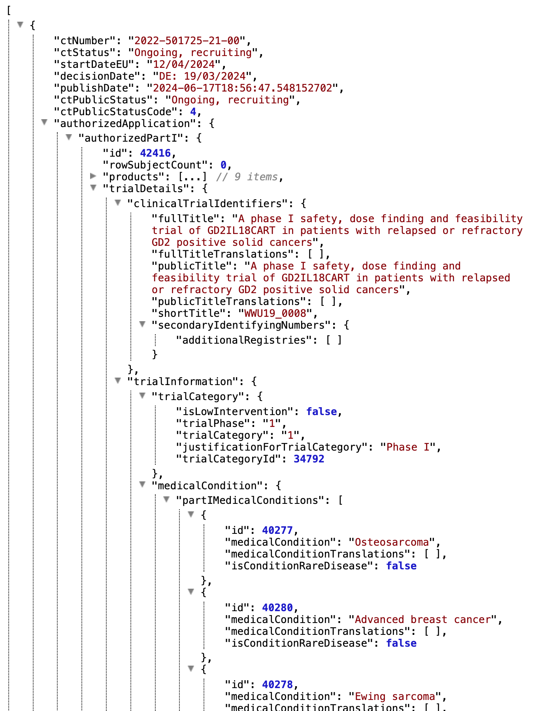

```{r setup, include=FALSE}
knitr::opts_chunk$set(
  eval = FALSE,
  warning = FALSE,
  message = FALSE,
  results = "hide"
)
```


General information on the `ctrdata` package is available here: [https://github.com/rfhb/ctrdata](https://github.com/rfhb/ctrdata).

Remember to respect the registers' terms and conditions (see `ctrOpenSearchPagesInBrowser(copyright = TRUE)`). Please cite this package in any publication as follows: Ralf Herold (2024). ctrdata: Retrieve and Analyze Clinical Trials in Public Registers. R package version 1.18.0. https://cran.r-project.org/package=ctrdata

## Preparations

Here using MongoDB, which is faster than SQLite, can handle credentials, provides access to remote servers and can directly retrieve nested elements from paths. See [README.md](../README.md) and [Retrieve clinical trial information](ctrdata_retrieve.Rmd) for examples using SQLite. Also PostgreSQL can be used as database, see [Install R package ctrdata](ctrdata_install.Rmd).

```{r connect_mongodb}
db <- nodbi::src_mongo(
  url = "mongodb://localhost",
  db = "my_database_name",
  collection = "my_collection_name"
)
db
# MongoDB 7.0.8 (uptime: 265661s)
# URL: mongodb://localhost
# Database: my_database_name
# Collection: my_collection_name

# empty collection if exists
nodbi::docdb_delete(db, db$collection)
```

See [Retrieve clinical trial information](ctrdata_retrieve.Rmd) for more details.

```{r ctrLoadQueryIntoDb}
#
library(ctrdata)

# These two queries are similar, for completed interventional (drug)
# trials with children with a neuroblastoma from either register
ctrLoadQueryIntoDb(
  # using queryterm and register...
  queryterm = "query=neuroblastoma&age=under-18&status=completed",
  register = "EUCTR",
  euctrresults = TRUE,
  con = db
)
# [...]
# $n
# [1] 226

ctrLoadQueryIntoDb(
  # ...or using full URL of search results
  queryterm = paste0(
    "https://classic.clinicaltrials.gov/ct2/results?",
    "cond=neuroblastoma&recrs=e&age=0&intr=Drug"),
  con = db
)
# * Appears specific for CTGOV Classic website
# Since 2024-06-25, the classic CTGOV servers are no longer available. Package ctrdata has translated 
# the classic CTGOV query URL from this call of function ctrLoadQueryIntoDb(queryterm = ...) into a 
# query URL that works with the current CTGOV2. This is printed below and is also part of the return 
# value of this function, ctrLoadQueryIntoDb(...)$url. This URL can be used with ctrdata functions. 
# Note that the fields and data schema of trials differ between CTGOV and CTGOV2. 
# 
# Replace this URL:
# 
# https://classic.clinicaltrials.gov/ct2/results?cond=neuroblastoma&recrs=e&age=0&intr=Drug
# 
# with this URL:
# 
# https://clinicaltrials.gov/search?cond=neuroblastoma&intr=Drug&aggFilters=ages:child,status:com
# 
# * Found search query from CTGOV2: cond=neuroblastoma&intr=Drug&aggFilters=ages:child,status:com
# * Checking trials using CTGOV REST API 2.0, found 222 trials
# (1/3) Downloading in 1 batch(es) (max. 1000 trials each; estimate: 22 Mb total)
# Download status: 1 done; 0 in progress. Total size: 9.79 Mb (615%)... done!             
# (2/3) Converting to NDJSON...
# (3/3) Importing records into database...
# JSON file #: 1 / 1                               
# = Imported or updated 222 trial(s)
# Updated history ("meta-info" in "my_collection_name")
# $n
# [1] 222

dbQueryHistory(con = db)
#       query-timestamp query-register query-records                                                    query-term
# 1 2024-06-29 09:01:16          EUCTR           226             query=neuroblastoma&age=under-18&status=completed
# 2 2024-06-29 09:02:12         CTGOV2           222 cond=neuroblastoma&intr=Drug&aggFilters=ages:child,status:com
```

## Find fields / variables of interest

Specify a part of the name of a variable of interest; all variables including deeply nested variable names are searched. Set `sample = TRUE` (default) to rapidly execute the function in large databases. 

```{r dbFindFields}
#
dbFindFields(namepart = "date", sample = FALSE, con = db)
# Finding fields in database collection (may take some time)  .  .  .  .  . 
# Field names cached for this session.
#                                                                              CTGOV2 
#         "annotationSection.annotationModule.unpostedAnnotation.unpostedEvents.date" 
#                                                                              CTGOV2 
#  "derivedSection.miscInfoModule.submissionTracking.estimatedResultsFirstSubmitDate" 
#                                                                              CTGOV2 
#      "derivedSection.miscInfoModule.submissionTracking.firstMcpInfo.postDateStruct" 
#                                                                              CTGOV2 
# "derivedSection.miscInfoModule.submissionTracking.firstMcpInfo.postDateStruct.date" 
#                                                                              CTGOV2 
# "derivedSection.miscInfoModule.submissionTracking.firstMcpInfo.postDateStruct.type" 
#                                                                              CTGOV2 
#      "derivedSection.miscInfoModule.submissionTracking.submissionInfos.releaseDate" 
#                                                                              CTGOV2 
#        "derivedSection.miscInfoModule.submissionTracking.submissionInfos.resetDate" 
#                                                                              CTGOV2 
#                                "documentSection.largeDocumentModule.largeDocs.date" 
#                                                                              CTGOV2 
#                          "documentSection.largeDocumentModule.largeDocs.uploadDate" 
#                                                                              CTGOV2 
#                                 "protocolSection.statusModule.completionDateStruct" 
#                                                                              CTGOV2 
#                            "protocolSection.statusModule.completionDateStruct.date" 
#                                                                              CTGOV2 
#                            "protocolSection.statusModule.completionDateStruct.type" 
#                                                                              CTGOV2 
#                              "protocolSection.statusModule.dispFirstPostDateStruct" 
#                                                                              CTGOV2 
#                         "protocolSection.statusModule.dispFirstPostDateStruct.date" 
#                                                                              CTGOV2 
#                         "protocolSection.statusModule.dispFirstPostDateStruct.type" 
#                                                                              CTGOV2 
#                                  "protocolSection.statusModule.dispFirstSubmitDate" 
#                                                                              CTGOV2 
#                                "protocolSection.statusModule.dispFirstSubmitQcDate" 
#                                                                              CTGOV2 
#                             "protocolSection.statusModule.lastUpdatePostDateStruct" 
#                                                                              CTGOV2 
#                        "protocolSection.statusModule.lastUpdatePostDateStruct.date" 
#                                                                              CTGOV2 
#                        "protocolSection.statusModule.lastUpdatePostDateStruct.type" 
#                                                                              CTGOV2 
#                                 "protocolSection.statusModule.lastUpdateSubmitDate" 
#                                                                              CTGOV2 
#                          "protocolSection.statusModule.primaryCompletionDateStruct" 
#                                                                              CTGOV2 
#                     "protocolSection.statusModule.primaryCompletionDateStruct.date" 
#                                                                              CTGOV2 
#                     "protocolSection.statusModule.primaryCompletionDateStruct.type" 
#                                                                              CTGOV2 
#                           "protocolSection.statusModule.resultsFirstPostDateStruct" 
#                                                                              CTGOV2 
#                      "protocolSection.statusModule.resultsFirstPostDateStruct.date" 
#                                                                              CTGOV2 
#                      "protocolSection.statusModule.resultsFirstPostDateStruct.type" 
#                                                                              CTGOV2 
#                               "protocolSection.statusModule.resultsFirstSubmitDate" 
#                                                                              CTGOV2 
#                             "protocolSection.statusModule.resultsFirstSubmitQcDate" 
#                                                                              CTGOV2 
#                                      "protocolSection.statusModule.startDateStruct" 
#                                                                              CTGOV2 
#                                 "protocolSection.statusModule.startDateStruct.date" 
#                                                                              CTGOV2 
#                                 "protocolSection.statusModule.startDateStruct.type" 
#                                                                              CTGOV2 
#                                   "protocolSection.statusModule.statusVerifiedDate" 
#                                                                              CTGOV2 
#                             "protocolSection.statusModule.studyFirstPostDateStruct" 
#                                                                              CTGOV2 
#                        "protocolSection.statusModule.studyFirstPostDateStruct.date" 
#                                                                              CTGOV2 
#                        "protocolSection.statusModule.studyFirstPostDateStruct.type" 
#                                                                              CTGOV2 
#                                 "protocolSection.statusModule.studyFirstSubmitDate" 
#                                                                              CTGOV2 
#                               "protocolSection.statusModule.studyFirstSubmitQcDate" 
#                                                                               EUCTR 
#    "e231_full_title_date_and_version_of_each_substudy_and_their_related_objectives" 
#                                                                               EUCTR 
# "e231_full_title_date_and_version_of_each_substudy_and_their_related_objectives_es" 
#                                                                               EUCTR 
# "e231_full_title_date_and_version_of_each_substudy_and_their_related_objectives_it" 
#                                                                               EUCTR 
#                                            "n_date_of_competent_authority_decision" 
#                                                                               EUCTR 
#                                                "n_date_of_ethics_committee_opinion" 
#                                                                               EUCTR 
#                                             "p_date_of_the_global_end_of_the_trial" 
#                                                                               EUCTR 
#                                "trialChanges.globalAmendments.globalAmendment.date" 
#                                                                               EUCTR 
#                          "trialChanges.globalInterruptions.globalInterruption.date" 
#                                                                               EUCTR 
#                   "trialChanges.globalInterruptions.globalInterruption.restartDate" 
#                                                                               EUCTR 
#                                                "trialInformation.analysisStageDate" 
#                                                                               EUCTR 
#                                             "trialInformation.globalEndOfTrialDate" 
#                                                                               EUCTR 
#                                            "trialInformation.primaryCompletionDate" 
#                                                                               EUCTR 
#                                             "trialInformation.recruitmentStartDate" 
#                                                                               EUCTR 
#            "x6_date_on_which_this_record_was_first_entered_in_the_eudract_database"
```

The search for fields is cached and thus accelerated during the R session; calling `ctrLoadQueryIntoDb()` or changing `sample = ...` invalidates the cache. 

## Data frame from database

The fields of interest can be obtained from the database and are represented in an R data.frame, for example:

```{r dbGetFieldsIntoDf}
#
result <- dbGetFieldsIntoDf(
  c(
    # EUCTR protocol-related information
    "f41_in_the_member_state",
    "f422_in_the_whole_clinical_trial",
    "a1_member_state_concerned",
    "p_end_of_trial_status",
    "n_date_of_competent_authority_decision",
    "a2_eudract_number",
    # EUCTR results-related information
    "trialInformation.recruitmentStartDate", 
    "trialInformation.globalEndOfTrialDate",
    # CTGOV2
    "protocolSection.statusModule.overallStatus",
    "protocolSection.statusModule.startDateStruct.date",
    "trialInformation.recruitmentStartDate",
    "protocolSection.statusModule.primaryCompletionDateStruct.date"
  ),
  con = db
)
```

## Metadata from data frame

The objects returned by functions of this package include attributes with metadata to indicate from which database, table / collection and query details. Metadata can be reused in R.

```{r attributes}
attributes(result)
# [...]
#
# $class
# [1] "data.frame"
# 
# $`ctrdata-dbname`
# [1] "my_database_name"
# 
# $`ctrdata-table`  <-- this attribute will be retired by end 2024
# [1] "my_collection_name"
# 
# $`ctrdata-table-note`
# [1] "^^^ attr ctrdata-table will be removed by end 2024"
# 
# $`ctrdata-collection`
# [1] "my_collection_name"
# 
# $`ctrdata-dbqueryhistory`
#       query-timestamp query-register query-records                                                    query-term
# 1 2024-06-29 09:01:16          EUCTR           226             query=neuroblastoma&age=under-18&status=completed
# 2 2024-06-29 09:02:12         CTGOV2           222 cond=neuroblastoma&intr=Drug&aggFilters=ages:child,status:com
```

## De-duplicate records

In the database, the variable "_id" is the unique index for a record. This "_id" is the NCT number for CTGOV records (e.g., "NCT00002560"), and it is the EudraCT number for EUCTR records including the postfix identifying the EU Member State (e.g., "2008-001436-12-NL").

It is relevant to de-duplicate records because a trial can be registered in both CTGOV and EUCTR, and can have records by involved country in EUCTR.

De-duplication is done at the analysis stage because this enables to select if a trial record should be taken from one or the other register, and from one or the other EU Member State.

The basis of de-duplication is the recording of additional trial identifiers in supplementary fields (variables), which are checked and reported when using function `dbFindIdsUniqueTrials()`:

```{r dbFindIdsUniqueTrials}
# Obtain de-duplicated trial record ids
ids <- dbFindIdsUniqueTrials(
  preferregister = "EUCTR",
  con = db
)
# Searching for duplicate trials... 
# - Getting all trial identifiers (may take some time), 448 found in collection
# - Finding duplicates among registers' and sponsor ids...
# - 173 EUCTR _id were not preferred EU Member State record for 56 trials
# - Keeping 53 / 0 / 0 / 0 / 205 records from EUCTR / CTGOV / ISRCTN / CTIS / CTGOV2
# = Returning keys (_id) of 258 records in collection "my_collection_name"
```

The unique ids can be used like this to de-duplicate the data.frame created above:

```{r subset_unique}
# Eliminate duplicate trials records:
result <- result[result[["_id"]] %in% ids, ]
#
nrow(result)
# [1] 258
```


## Reviewing a specific trial

It will often be useful to inspect all data for a single, for example to understand the meaning and relation of fields, and to see neighbouring elements to fields of interest. 

```{r ctis_load}
#
# Adding some trials from CTIS for a search similar to above
ctrLoadQueryIntoDb(
  queryterm = 'searchCriteria={"containAll":"","containAny":"neuroblastoma","containNot":""}',
  register = "CTIS",
  con = db
)
# $n
# [1] 12
# 
# $success
#  [1] "2023-509673-22-00" "2024-513141-37-00" "2024-511071-16-00" "2024-512095-35-00"
#  [5] "2023-507178-41-00" "2023-506778-11-00" "2022-501725-21-00" "2023-504880-18-00"
#  [9] "2023-508587-29-00" "2022-502668-20-00" "2023-504246-64-00" "2023-503684-42-00"
```

Identify a trial of interest by its `_id`, and use this in any standard database function. Retrieve the trial's full `JSON` representation that `ctrdata` had loaded into the database and visualise its nested structure of field names and values. 

```{r single_trial_widget}
# 
# This example requires to install this package for visualisation:
# remotes::install_github("hrbrmstr/jsonview")

# Get a particular trial from any database supported 
# by ctrdata (duckdb, SQLite, PostgreSQL, MongoDB):
oneTrial <- nodbi::docdb_query(
  src = db, 
  key = db$collection, 
  query = '{"_id":"2022-501725-21-00"}',
  limit = 1L
)

# Create an interactive widget where nodes can be expanded:
jsonview::json_tree_view(oneTrial)

```




## Simple analysis of dates

In a data.frame generated with `dbGetFieldsIntoDf()`, fields are typed as dates, logical, character or numbers.

```{r str_data_frame}
#
str(result)
# 'data.frame':	258 obs. of  12 variables:
#  $ _id                                                          : chr  "2004-004386-15-DE" "2005-000915-80-IT" "2005-001267-63-IT" "2005-002089-13-GB" ...
#  $ f41_in_the_member_state                                      : int  NA NA 5 37 70 24 100 35 10 24 ...
#  $ f422_in_the_whole_clinical_trial                             : int  230 NA 12 67 70 NA 100 156 2230 NA ...
#  $ a1_member_state_concerned                                    : chr  "Germany - BfArM" "...
#  $ p_end_of_trial_status                                        : chr  "Completed" "Completed" "Completed" ...
#  $ n_date_of_competent_authority_decision                       : Date, format: "2005-07-08" "2005-04-21" ...
#  $ a2_eudract_number                                            : chr  "2004-004386-15" "2005-000915-80" ...
#  $ trialInformation.recruitmentStartDate                        : Date, format: "2005-07-26" NA NA ...
#  $ trialInformation.globalEndOfTrialDate                        : Date, format: "2006-10-27" NA NA ...
#  $ protocolSection.statusModule.overallStatus                   : chr  NA NA NA NA ...
#  $ protocolSection.statusModule.startDateStruct.date            : Date, format: NA NA NA ...
#  $ protocolSection.statusModule.primaryCompletionDateStruct.date: Date, format: NA NA NA ...
#  - attr(*, "ctrdata-dbname")= chr "my_database_name"
#  - attr(*, "ctrdata-table")= chr "my_collection_name"
#  - attr(*, "ctrdata-table-note")= chr "^^^ attr ctrdata-table will be removed by end 2024"
#  - attr(*, "ctrdata-collection")= chr "my_collection_name"
#  - attr(*, "ctrdata-dbqueryhistory")='data.frame':	2 obs. of  4 variables:
#   ..$ query-timestamp: chr [1:2] "2024-06-29 09:01:16" "2024-06-29 09:02:12"
#   ..$ query-register : chr [1:2] "EUCTR" "CTGOV2"
#   ..$ query-records  : int [1:2] 226 222
#   ..$ query-term     : chr [1:2] "query=neuroblastoma&age=under-18&status=completed"
#    "cond=neuroblastoma&intr=Drug&aggFilters=ages:child,status:com"
```

This typing facilitates using the respective type of data for analysis, for example of dates with base R graphics:

```{r simple_analysis_dates}
# Open file for saving
png("vignettes/nb1.png")
# Visualise trial start date
hist(
  result[["n_date_of_competent_authority_decision"]],
  breaks = "years"
)
box()
dev.off()
```


## Merge corresponding fields from registers

The field "n_date_of_competent_authority_decision" used above exists only in EUCTR, yet it corresponds to the field "start_date" in CTGOV. Thus, to give the start of the trial, the two fields can be merged for analysis, using the convenience function `dfMergeVariablesRelevel()` in `ctrdata` package:

```{r dfMergeVariablesRelevel}
# Merge two variables into a new variable:
result$trialstart <- dfMergeVariablesRelevel(
  result,
  colnames = c(
    # EUCTR
    "n_date_of_competent_authority_decision",
    # CTGOV2
    "protocolSection.statusModule.startDateStruct.date"
  )
)

# Plot from both registers
png("vignettes/nb2.png")
hist(
  result[["trialstart"]],
  breaks = "years"
)
box()
dev.off()
```


In a more sophisticated use of `dfMergeVariablesRelevel()`, values of the original variables can be mapped into new values of the merged variable, as follows:

```{r dfMergeVariablesRelevel_relevel}
# First, define how values of the new, merged variable
# (e.g., "ongoing") will result from values of the
# original variable (e.g, "Recruiting):
mapped_values <- list(
  "ongoing" = c(
    # EUCTR
    "Recruiting", "Active", "Ongoing", 
    "Temporarily Halted", "Restarted",
    # CTGOV
    "Active, not recruiting", "Enrolling by invitation", 
    "Not yet recruiting", 
    # CTGOV2
    "ACTIVE_NOT_RECRUITING", "ENROLLING_BY_INVITATION",
    "RECRUITING", "TEMPORARILY_NOT_AVAILABLE",
    # CTIS
    "Ongoing, recruiting", "Ongoing, recruitment ended", 
    "Ongoing, not yet recruiting", "Authorised, not started"
  ),
  #
  "completed" = c(
    "Completed", "COMPLETED", "Ended"),
  #
  "other" = c(
    "GB - no longer in EU/EEA", "Trial now transitioned",
    "Withdrawn", "Suspended", "No longer available", 
    "SUSPENDED", "NO_LONGER_AVAILABLE", "WITHDRAWN",
    "WITHHELD", "UNKNOWN",
    "Terminated", "TERMINATED", "Prematurely Ended", 
    "Under evaluation")
)

# Secondly, use the list of mapped
# values when merging two variable:
tmp <- dfMergeVariablesRelevel(
  result,
  colnames = c(
    # EUCTR
    "p_end_of_trial_status",
    # CTGOV2
    "protocolSection.statusModule.overallStatus"
  ),
  levelslist = mapped_values
)

table(tmp)
# ongoing completed  other 
#       5       248      4 
```

## User annotations

When using `ctrLoadQueryIntoDb()`, `ctrdata` adds to each record the fields `annotation` and `record_last_import`. The annotation field is a single string that the user specifies when retrieving trials ([Retrieve clinical trial information](ctrdata_retrieve.Rmd)). The user can specify to append, prefix or replace any existing annotations when a trial record is loaded again, see example below. The last date and time when the trial record was imported is updated automatically when using `ctrLoadQueryIntoDb()`. These fields can also be used for analysis. For example, string functions can be used for annotations, e.g. to split it into components. Since no annotations were specified when retrieving the trials in the steps above, there are so far no annotation fields and `stopifnodata` is set to `FALSE` to avoid the function raises an error to alert users:

```{r annalyse_annotation}
#
ctrLoadQueryIntoDb(
  queryterm = "query=neuroblastoma&resultsstatus=trials-with-results",
  register = "EUCTR",
  euctrresults = TRUE,
  annotation.text = "test annotation",
  annotation.mode = "append",
  con = db
)

result <- dbGetFieldsIntoDf(
  fields = c(
    "annotation",
    "record_last_import"
  ),
  con = db
)

str(result)
# 'data.frame':	494 obs. of  3 variables:
#  $ _id               : chr  "2004-004386-15-DE" "2004-004386-15-ES" ...
#  $ record_last_import: Date, format: "2024-06-29" "2024-06-29" ...
#  $ annotation        : chr  "test annotation" "test annotation" ...
```

## Analysing sample sizes in historic versions of trial records

Historic versions can set to be retrieved for CTGOV2 by specifying `ctgov2history = <...>` when using `ctrLoadQueryIntoDb()`; this functionality was added in `ctrdata` version 1.18.0. The versions include all trial data available at the date of the respective version. 

For CTGOV2 records, the historic versions are added as follows into the `ctrdata` data model of a trial record, where the ellipsis `...` represents all trial data fields: 

`{"_id":"NCT01234567", "title": "Current title", ..., "history": [{"history_version": {"version_number": 1, "version_date": "2020-21-22 10:11:12"}, "title": "Original title", ...}, {"history_version": {"number": 2, "date": "2021-22-23 11:13:13"}, "title": "Later title", ...}]}`

The example shows how planned or realised number of participants (sample size) changed over time for individual trials, using available data (that is, only from `CTGOV2`; historic versions were available for `CTIS` only until its relaunch on 2024-06-17). 

```{r sample_size_over_time}
#
# load some trials from CTGOV2 specifying that 
# for each trial, 5 versions should be retrieved
ctrLoadQueryIntoDb(
  queryterm = "cond=neuroblastoma&aggFilters=phase:3,status:com", 
  register = "CTGOV2", 
  con = db, 
  ctgov2history = 5L
)
# * Appears specific for CTGOV REST API 2.0
# * Found search query from CTGOV2: cond=neuroblastoma&aggFilters=phase:3,status:com
# * Checking trials using CTGOV REST API 2.0, found 24 trials
# (1/3) Downloading in 1 batch(es) (max. 1000 trials each; estimate: 2.4 Mb total)
# Download status: 1 done; 0 in progress. Total size: 1.11 Mb (482%)... done!             
# (2/3) Converting to NDJSON...
# (3/3) Importing records into database...
# JSON file #: 1 / 1                               
# * Checking and processing historic versions... 
# Download status: 24 done; 0 in progress. Total size: 1.35 Mb (515%)... done!             
# - Downloading 117 historic versions (estimate: 4.4 MB total)...
# Download status: 117 done; 0 in progress. Total size: 4.14 Mb (532%)... done!             
# - Merging trial versions . . . . . . . . . . . . . . . . . . . . . . . . 
# - Updating trial records . . . . . . . . . . . . . . . . . . . . . . . . 
# Updated 24 trial(s) with historic versions
# = Imported or updated 24 trial(s)
# Updated history ("meta-info" in "my_collection_name")

# get relevant fields
result <- dbGetFieldsIntoDf(
  fields = c(
    # CTGOV2
    "history.protocolSection.designModule.enrollmentInfo.count",
    "history.history_version.version_date"
  ),
  con = db
)

# helpers
library(dplyr)
library(tidyr)
library(ggplot2)

# mangle and plot
result %>%
  unnest(cols = starts_with("history.")) %>%
  group_by(`_id`) %>%
  ggplot(
    mapping = aes(
      x = history.history_version.version_date,
      y = history.protocolSection.designModule.enrollmentInfo.count,
      colour = `_id`)
  ) +
  geom_step() +
  geom_point() +
  theme_light() +
  guides(colour = "none") +
  labs(
    title = "Sample sizes in trials including patients with a neuroblastoma", 
    subtitle = "Source: CTGOV2 records labelled as phase 3 and completed", 
    caption = Sys.Date()
  )

ggsave("vignettes/samplesizechanges.png", width = 6, height = 4)
```


## Analysing nested fields such as trial results

The registers represent clinical trial information by nesting fields (e.g., several reporting groups within several measures within one of several endpoints). A visualisation of this hierarchical representation for CTGOV2 follows. Compare this with the outcome measures presented here: https://clinicaltrials.gov/study/NCT02139397?tab=results#outcome-measures, specifically "3. Determine the Progression Free Survival (PFS)..." 

```{r show_nesting}
# Prepare
# remotes::install_github("https://github.com/hrbrmstr/jsonview")

# Find top level nodes within resultsSection
dbFindFields("^resultsSection[.][^.]+$", db, sample = FALSE)
# Using cache of fields. 
#                                         CTGOV2 
#           "resultsSection.adverseEventsModule" 
#                                         CTGOV2 
# "resultsSection.baselineCharacteristicsModule" 
#                                         CTGOV2 
#                "resultsSection.moreInfoModule" 
#                                         CTGOV2 
#         "resultsSection.outcomeMeasuresModule" 
#                                         CTGOV2 
#         "resultsSection.participantFlowModule" 

# Get relevant data
result <- dbGetFieldsIntoDf("resultsSection.outcomeMeasuresModule", db)

# Create interactive widget
jsonview::json_tree_view(result[result[["_id"]] == "NCT02139397", -1])

```


The analysis of nested information such as the highlighted duration of response is facilitated with `ctrdata` as follows. The main steps are:

1. Create a data from fields identified as shown in previous sections (using `dbGetFieldsIntoDf()`)

2. Transform nested information to a long, name-value data frame (using `dfTrials2Long()`)

3. Identify the measures of interest (e.g. PFS, blue circle above) by specifying the name and value of these fields (`wherename`, `wherevalue` in function `dfName2Value()`) and 

4. Obtain values by specifying the name(s) of its value field(s) (red and green circles in figure above; `valuename` in function `dfName2Value()`).

This is put together in the following example. Note that `CTGOV` fields are no longer downloadable (see NEWS.md) but may exist in previously created databases. 

```{r analyse_nested_data}
#
#### 1. Create data frame from results fields
# 
# These are key results fields from
# CTGOV2, CTGOV and from EUCTR:
result <- dbGetFieldsIntoDf(
  fields = c(
    # EUCTR
    "trialInformation.populationAgeGroup",
    "subjectDisposition.recruitmentDetails",
    "baselineCharacteristics.baselineReportingGroups.baselineReportingGroup",
    "endPoints.endPoint",
    "subjectAnalysisSets",
    "adverseEvents.seriousAdverseEvents.seriousAdverseEvent", 
    # CTGOV2
    "resultsSection.outcomeMeasuresModule",
    "protocolSection.designModule.designInfo.allocation", 
    "resultsSection.participantFlowModule",
    # CTGOV
    "clinical_results.baseline.analyzed_list.analyzed.count_list.count",
    "clinical_results.baseline.group_list.group",
    "clinical_results.baseline.analyzed_list.analyzed.units",
    "clinical_results.outcome_list.outcome",
    "study_design_info.allocation"
  ),
  con = db
)

# Keep only unique trial records
result <- result[result[["_id"]] %in% dbFindIdsUniqueTrials(con = db), ]


#### 2. All nested data are transformed to a long,
# name-value data.frame (resulting in several
# hundred rows per trial record):
# 
long_result <- dfTrials2Long(df = result)
# Total 166677 rows, 157 unique names of variables


result <- dbGetFieldsIntoDf("endPoints", db)
jsonview::json_tree_view(result[result[["_id"]] == "2010-019348-37-IT", -1])


#### 3. Obtain values for measures of interest 
#
# The parameters can be regular expressions.
clinicalDuration <- dfName2Value(
  df = long_result,
  wherename = paste0(
    "endPoints.endPoint.title|",
    "resultsSection.outcomeMeasuresModule.outcomeMeasures.title"
  ),
  wherevalue = paste0(
    "duration of response|DOR|",
    "free survival|DFS|PFS|EFS"
  ),
  valuename = paste0(
    "resultsSection.*outcomeMeasures.classes.categories.measurements.value|",
    "endPoints.*armReportingGroup.tendencyValues.tendencyValue.value|",
    "resultsSection.outcomeMeasuresModule.outcomeMeasures.unitOfMeasure|",
    "endPoints.endPoint.unit|",
    "resultsSection.outcomeMeasuresModule.outcomeMeasures.groups.title|",
    "endPoints.*armReportingGroup.armId"
  )
)
# Returning values for 45 out of 131 trials

# Duration has been reported with various units: 
sort(unique(clinicalDuration[grepl("unit", clinicalDuration$name), "value"]))

# For convenience, `dplyr` and related functions can be used, as follows: 
library(dplyr)
library(tidyr)

clinicalDuration %>% 
  as_tibble() %>%
  mutate(
    group_id = paste0(`_id`, "_", sub("([0-9]+)[.]?.*", "\\1", identifier)),
    name_short = sub(".*[.](.+)", "\\1", name),
    name_short = if_else(name_short == "unitOfMeasure", "unit", name_short)
  ) %>%
  group_by(group_id) %>% 
  mutate(
    is_duration = any(grepl("day|month|week|year", value, ignore.case = TRUE))) %>%
  ungroup() %>% 
  filter(is_duration) %>% 
  select(name_short, value, where, group_id) %>% 
  pivot_wider(id_cols = c(group_id, where), names_from = name_short, values_fn = list) %>%
  unnest(c(value, unit)) %>% 
  filter(!grepl("999[9]*", value)) %>%
  rowwise() %>% 
  mutate(
    value = as.numeric(value),
    arm_names = paste(armId, title, collapse = " / "),
  ) %>% 
  ungroup() %>% 
  mutate(
    days = case_when(
      grepl("[wW]eek", unit) ~ value * 7,
      grepl("[mM]onth", unit) ~ value * 30,
      grepl("[yY]ear", unit) ~ value * 30,
      .default = value
    )) %>% 
  select(!c(value, unit, armId, title)) -> clinicalDuration

clinicalDuration
# # A tibble: 163 x 4
#    group_id            where                                                arm_names  days
#    <chr>               <chr>                                                <chr>     <dbl>
#  1 2010-019348-37-IT_8 Duration of response by treatment                    "Arm-235   211.
#  2 2010-019348-37-IT_8 Duration of response by treatment                    "Arm-235   242.
#  3 2010-019348-37-IT_8 Duration of response by treatment                    "Arm-235   146.
#  4 2010-022951-49-LV_2 Progression-free Survival                            "Arm-648   108 
#  5 2010-022951-49-LV_2 Progression-free Survival                            "Arm-648    51 
#  6 2010-022951-49-LV_4 Progression Free Survival (PFS) in Participants wit  "Arm-648   156 
#  7 2010-022951-49-LV_4 Progression Free Survival (PFS) in Participants wit  "Arm-648    51 
#  8 2011-004168-30-DE_2 Progression-free survival PP population              "Arm-937   159 
#  9 2011-004168-30-DE_2 Progression-free survival PP population              "Arm-937   132 
# 10 2012-000510-10-GB_2 Progression Free Survival                            "Arm-782    NA 
```


## Analysing primary endpoints

Text analysis has to be used for many fields of trial information from the registers. Here is an example to simply categorise the type of primary endpoint. In addition, the number of subjects are extracted and compared by type of primary endpoint.

```{r plot_endpoint_frequencies}
#
result <- dbGetFieldsIntoDf(
  c(
    # CTGOV
    "resultsSection.outcomeMeasuresModule.outcomeMeasures.title",
    "protocolSection.designModule.enrollmentInfo.count",
    # EUCTR
    "e51_primary_end_points",
    "f11_number_of_subjects_for_this_age_range"
  ),
  con = db
)

# De-duplicate
result <- result[
  result[["_id"]] %in%
    dbFindIdsUniqueTrials(con = db),
]

# Merge primary endpoint (pep)
result$pep <- dfMergeVariablesRelevel(
  df = result,
  colnames = c(
    "resultsSection.outcomeMeasuresModule.outcomeMeasures.title",
    "e51_primary_end_points"
  )
)

# Merge number of subjects
result$nsubj <- dfMergeVariablesRelevel(
  df = result,
  colnames = c(
    "protocolSection.designModule.enrollmentInfo.count",
    "f11_number_of_subjects_for_this_age_range"
  )
)

# For primary endpoint of interest,
# use regular expression on text:
result$pep_is_efs <- grepl(
  pattern = "((progression|event|relapse|recurrence|disease)[- ]free)|pfs|dfs|efs)",
  x = result$pep,
  ignore.case = TRUE
)

# Tabulate
table(result$pep_is_efs)
# FALSE  TRUE
#   211    33

# Plot
library(ggplot2)
ggplot(
  data = result,
  aes(
    x = nsubj,
    y = pep_is_efs
  )
) +
  geom_boxplot() +
  scale_x_log10()
# Warning message:
# Removed 24 rows containing non-finite values (`stat_boxplot()`). 

ggsave("vignettes/boxpep.png", width = 6, height = 4)
```


## Analysis methods and p values

```{r analyse_results_data}

# helper 
normalise_string <- function(x) {
  
  x <- gsub(",", "",  x)
  x <- gsub("-", " ", x)
  x <- tolower(x)
  x <- tools::toTitleCase(x)
  x <- gsub("[ ]+", " ", x)
  x <- trimws(x)
  x
  
}

# get trials into database
ctrLoadQueryIntoDb(
  queryterm = paste0(
    "https://clinicaltrials.gov/search?start=2010-01-01_2012-12-31", "
    &intr=Drug&aggFilters=ages:child,phase:2 3,results:with"), 
  con = db)

# see definitions linked in help("ctrdate-registers") or directly go to
# https://clinicaltrials.gov/data-api/about-api/study-data-structure

# get result set
result <- dbGetFieldsIntoDf(c(
  "protocolSection.armsInterventionsModule.armGroups.type",
  "protocolSection.designModule.designInfo.allocation",
  "protocolSection.designModule.designInfo.interventionModel",
  "protocolSection.designModule.designInfo.maskingInfo.masking",
  "protocolSection.designModule.enrollmentInfo.count",
  "protocolSection.statusModule.startDateStruct.date",
  "protocolSection.outcomesModule.primaryOutcomes.measure",
  "resultsSection.outcomeMeasuresModule.outcomeMeasures.analyses.statisticalMethod",
  "resultsSection.outcomeMeasuresModule.outcomeMeasures.analyses.pValue"
), 
con = db)

# # number of participants (last number is typically all groups summed up)
# # also see README.Rmd for alternative way, summing up non-total groups
# # result$totalparticipants <- vapply(
# # result[["clinical_results.baseline.analyzed_list.analyzed.count_list.count.value"]],
# # FUN = function(x) rev(x)[1], numeric(1L))
# 
# View(result)
# 
# result$totalparticipants <- result$protocolSection.designModule.enrollmentInfo.count

# first reported p value for primary endpoint analysis
result$pvalueprimaryanalysis <- vapply(
  result[["resultsSection.outcomeMeasuresModule.outcomeMeasures.analyses.pValue"]],
  FUN = function(x) as.numeric(trimws(gsub("[<>=]", "", strsplit(x, " / ")[[1]][1]))), numeric(1))

# statistical method used for primary endpoint analysis
result$methodprimaryanalysis <- vapply(
  result[["resultsSection.outcomeMeasuresModule.outcomeMeasures.analyses.statisticalMethod"]],
  FUN = function(x) normalise_string(strsplit(x, " / ")[[1]][1]), character(1))

# keep randomised, parallel-group, placebo-controlled, blinded clinical trials
result$prct <- 
  grepl("PLACEBO|NO_INT", result$protocolSection.armsInterventionsModule.armGroups.type) &
  grepl("^RANDOM", result$protocolSection.designModule.designInfo.allocation) &
  grepl("^PARALLEL", result$protocolSection.designModule.designInfo.interventionModel) &
  !grepl("NONE", result$protocolSection.designModule.designInfo.maskingInfo.masking)
#
table(result$prct)
# FALSE  TRUE 
#   923   281
#
result <- subset(result, prct == TRUE)

# helper
library(ggplot2)

# http://varianceexplained.org/statistics/interpreting-pvalue-histogram/
# http://www.pnas.org/content/100/16/9440.full
# plot p values
ggplot(
  result, 
  aes(pvalueprimaryanalysis)) + 
  stat_ecdf(geom = "step") +
  labs(
    title = paste0(
      "Paediatric phase 2 or 3 parallel-group interventional trials\n", 
      "with randomisation to placebo or to no intervention"), 
    x = "Range of p values", 
    y = "Empirical cumulative density of p values\nof primary endpoint results") +
  geom_vline(
    xintercept = 0.05, 
    linetype = 3)

ggsave("vignettes/phase23_paed_p_values.png", width = 6, height = 4)

# plot sample size v p value
ggplot(
  result, 
  aes(
    x = protocolSection.designModule.enrollmentInfo.count, 
    y = pvalueprimaryanalysis)) +
  geom_point() + 
  ylim(0, 1) + 
  xlim(0, 1000) + 
  scale_x_log10() + 
  geom_hline(yintercept = 0.05, linetype = 3)

ggsave("vignettes/phase23_paed_p_values_participants.png", width = 6, height = 4)

# statistical method used for primary endpoint analysis
tmp <- table(result$methodprimaryanalysis)
tmp <- tmp[rev(order(tmp))]
tmp <- data.frame(tmp)
knitr::kable(tmp[1:10,])
```

|Var1                                     | Freq|
|:----------------------------------------|----:|
|Ancova                                   |   49|
|Cochran Mantel Haenszel                  |   17|
|Mixed Models Analysis                    |   14|
|Anova                                    |   11|
|Chi Squared                              |   10|
|Fisher Exact                             |    9|
|t Test 2 Sided                           |    8|
|Wilcoxon (Mann Whitney)                  |    5|
|Mixed Model Repeated Measures (Mmrm)     |    4|
|Mixed Model for Repeated Measures (Mmrm) |    3|


## Investigational or authorised medicinal product?

The information about the status of authorisation (licensing) of a medicine used in a trial is recorded in EUCTR in the field `dimp.d21_imp_to_be_used_in_the_trial_has_a_marketing_authorisation`. A corresponding field in CTGOV is not known. The status is in the tree starting from the `dimp` element.

```{r product_status}
#
library(dplyr)

# Get results
result <- dbGetFieldsIntoDf(
  fields = c(
    "a1_member_state_concerned",
    "n_date_of_competent_authority_decision",
    "dimp.d21_imp_to_be_used_in_the_trial_has_a_marketing_authorisation",
    "x6_date_on_which_this_record_was_first_entered_in_the_eudract_database",
    "f422_in_the_whole_clinical_trial",
    "a2_eudract_number"
  ),
  con = db
)

# Find first date of authorisation in EU member state
tmp <- aggregate(
  result[["n_date_of_competent_authority_decision"]],
  by = list(result[["a2_eudract_number"]]),
  FUN = function(x) min(x)
)
result <- merge(
  x = result,
  y = tmp,
  by.x = "a2_eudract_number",
  by.y = "Group.1",
  all.x = TRUE
)
result %>% 
  rowwise() %>% 
  mutate(startdatefirst = min(
    x, x6_date_on_which_this_record_was_first_entered_in_the_eudract_database, na.rm = TRUE)
  ) -> result

# Now de-duplicate
result <- result[
  result[["_id"]] %in%
    dbFindIdsUniqueTrials(
      include3rdcountrytrials = FALSE,
      con = db),
]

# How many of the investigational medicinal product(s)
# used in the trial are authorised?
number_authorised <- sapply(
  result[["dimp.d21_imp_to_be_used_in_the_trial_has_a_marketing_authorisation"]],
  function(i) length(i[i])
)
table(number_authorised, exclude = "")
# number_authorised
#  0  1  2  3  4  6  7  8  9 15 
# 26 18  7  5  3  2  1  1  1  1  

result[["any_authorised"]] <- number_authorised > 0L

# Helper
library(ggplot2)
library(scales)

# Plot
ggplot(
  data = result,
  aes(
    x = startdatefirst,
    fill = any_authorised
  )
) +
  scale_x_date(
    breaks = breaks_width(width = "2 years"),
    labels = date_format("%Y")
  ) +
  geom_histogram(binwidth = 2 * 365.25) +
  labs(
    title = "Neuroblastoma trials in EU",
    x = "Year of trial authorisation (or entered in EUCTR)",
    y = "Number of trials",
    fill = "Medicine\nauthorised?"
  )

ggsave("vignettes/nbtrials.png", width = 6, height = 4)
```


## Analyses using aggregation pipeline and mapreduce

Here is an example of analysis functions that can be run directly on a MongoDB server, which are fast and do not consume R resources.

```{r mongolite}
# Load library for database access
library(mongolite)

# Create R object m to access the
# collection db created above:
m <- mongo(
  url = paste0(db[["url"]], "/", db[["db"]]),
  collection = db[["collection"]]
)

# Number of records in  collection:
m$count()
# [1] 2627

# Number of EUCTR records, using JSON for query:
m$count(query = '{"_id": {"$regex": "[0-9]{4}-[0-9]{6}-[0-9]{2}", "$options": "i"}}')
# [1] 1422

# Alternative:
m$count(query = '{"ctrname": "EUCTR"}')
# [1] 272

# Number of CTGOV records:
m$count(query = '{"_id": {"$regex": "NCT[0-9]{8}", "$options": "i"}}')
# [1] 1204

# Alternative:
m$count(query = '{"ctrname": "CTGOV2"}')
# [1] 1204

# To best define regular expressions for analyses, inspect the field:
head(
  m$distinct(
    # key = "resultsSection.outcomeMeasuresModule.outcomeMeasures.title",
    key = "protocolSection.outcomesModule.primaryOutcomes.measure",
    query = '{"ctrname": "CTGOV2"}'
  )
)
# [1] "% Calories Taken Orally"
# [2] "- To demonstrate that 123I-mIBG planar scintigraphy is sensitive ..."
# [3] "1-year Progression-free Survival"
# [4] "10-year Hematologic Cancer Rate"
# [5] "10-year Mortality Rate in Marrow Donors"
# [6] "10-year Overall Cancer Incidence"
```

### Aggregation

The following example uses the aggregation pipeline in MongoDB. See here for details on mongo's aggregation pipleline: https://docs.mongodb.org/manual/core/aggregation-pipeline/

```{r mongodb_aggregation_pipeline}
#
# Total count of PFS, EFS, RFS or DFS
out <- m$aggregate(
  # Count number of documents in collection that
  # matches in primary_outcome.measure the
  # regular expression,
  pipeline =
    '[{"$match": {"protocolSection.outcomesModule.primaryOutcomes.measure":
      {"$regex": "(progression|event|relapse|recurrence|disease)[- ]free",
                 "$options": "i"}}},
      {"$group": {"_id": "null", "count": {"$sum": 1}}}]'
)
out
#    _id count
# 1 null    56

# List records of trials with overall survival
# as primary endpoint, and list start date
out <- m$aggregate(
  pipeline =
    '[{"$match": {"protocolSection.outcomesModule.primaryOutcomes.measure":
      {"$regex": "overall survival", "$options": "i"}}},
      {"$project": {"_id": 1, "protocolSection.statusModule.startDateStruct.date": 1}}]'
)
head(out)
#           _id       date
# 1 NCT00445965    2006-01
# 2 NCT00923351 2007-06-02
# 3 NCT00793845    2008-08
# 4 NCT00499616 2007-10-08
# 5 NCT01190930 2010-08-09
# 6 NCT01514201 2012-02-01
```

### Mapreduce

Since Mapreduce is deprecated starting in MongoDB 5 (https://docs.mongodb.com/manual/core/map-reduce/), use an aggregation pipeline:  

```{r mongodb_mapreduce}
# Count number of trials by number of study
# participants in bins of hundreds of participants:
m$aggregate(pipeline = '
[
  {
    "$project": {
      "flooredNumber": {
        "$multiply": [
          {
            "$floor": {
              "$divide": [
                {
                  "$toInt": "$protocolSection.designModule.enrollmentInfo.count"
                },
                100
              ]
            }
          },
          100
        ]
      }
    }
  },
  {
    "$group": {
      "_id": "$flooredNumber",
      "count": {
        "$count": {}
      }
    }
  },
  {
    "$sort": {
      "_id": 1
    }
  }
]
')
#      _id count
# 1     NA  1450
# 2      0   700
# 3    100   165
# 4    200    78
# 5    300    59
# 6    400    30
# 7    500    32
# 8    600    19
# 9    700    21
# 10   800    13
# 11   900    10
# 12  1000     5
# [...]
```
