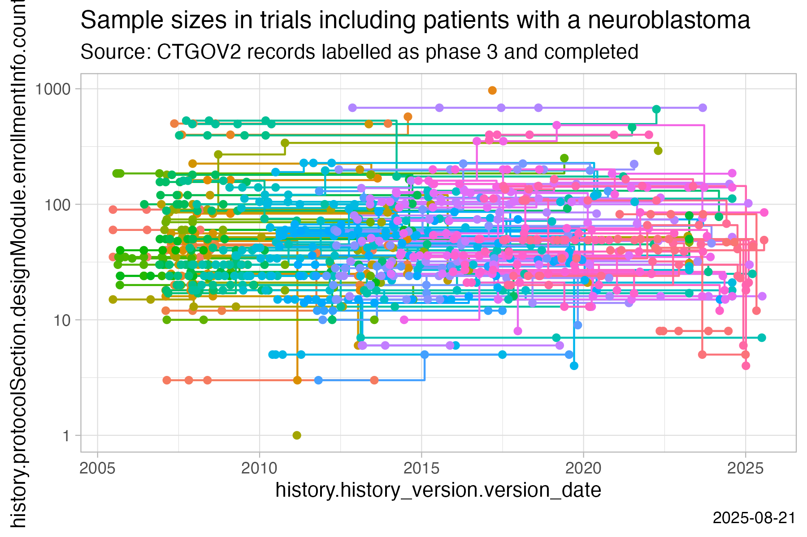
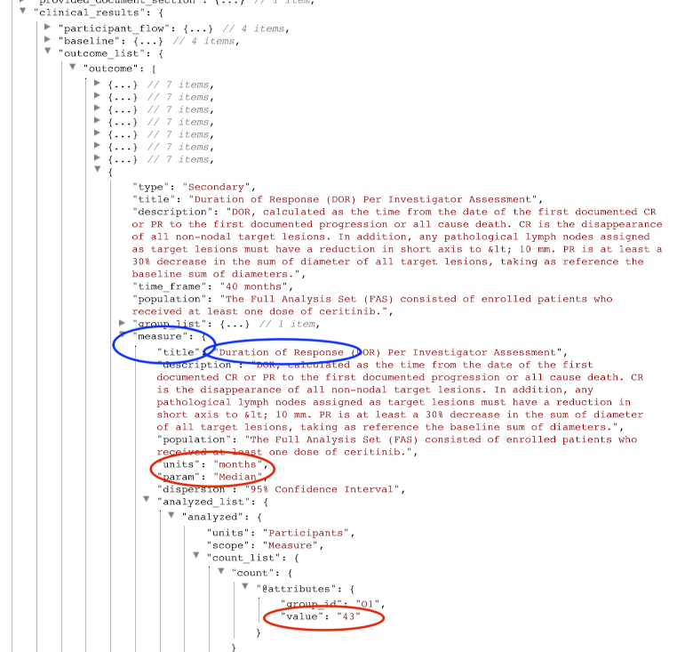
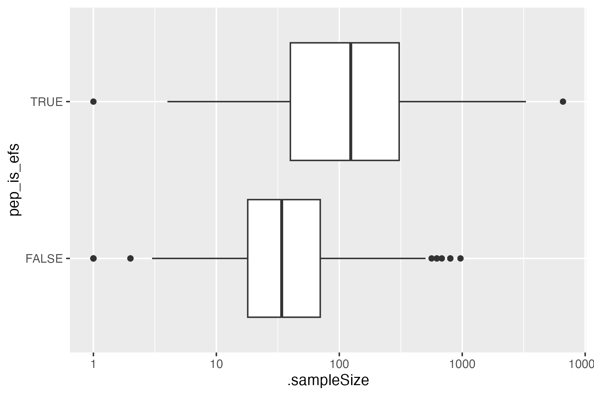

```{r setup, include=FALSE}
knitr::opts_chunk$set(
  eval = FALSE,
  warning = FALSE,
  message = FALSE,
  results = "hide"
)
```


General information on the `ctrdata` package is available here: [https://github.com/rfhb/ctrdata](https://github.com/rfhb/ctrdata).

Remember to respect the registers' terms and conditions (see `ctrOpenSearchPagesInBrowser(copyright = TRUE)`). Please cite this package in any publication as follows: Ralf Herold (2022). ctrdata: Retrieve and Analyze Clinical Trials in Public Registers. R package version 1.9.0. https://cran.r-project.org/package=ctrdata

## Preparations

Here using MongoDB, which is faster than SQLite, can handle credentials, provides access to remote servers and can directly retrieve nested elements from paths. See [README.md](../README.md) and [Retrieve clinical trial information](ctrdata_retrieve.Rmd) for examples using SQLite. Also PostgreSQL can be used as database, see [Install R package ctrdata](ctrdata_install.Rmd).

```{r connect_mongodb}
db <- nodbi::src_mongo(
  url = "mongodb://localhost",
  db = "my_database_name",
  collection = "my_collection_name"
)
db
# MongoDB 7.0.8 (uptime: 265661s)
# URL: mongodb://localhost
# Database: my_database_name
# Collection: my_collection_name

# empty collection
nodbi::docdb_delete(db, db$collection)
```

See [Retrieve clinical trial information](ctrdata_retrieve.Rmd) for more details.

```{r ctrLoadQueryIntoDb}
#
library(ctrdata)

# These two queries are similar, for completed interventional (drug)
# trials with children with a neuroblastoma from either register
ctrLoadQueryIntoDb(
  # using queryterm and register...
  queryterm = "query=neuroblastoma&age=under-18&status=completed",
  register = "EUCTR",
  euctrresults = TRUE,
  con = db
)
ctrLoadQueryIntoDb(
  # or using full URL of search results
  queryterm =
    "https://classic.clinicaltrials.gov/ct2/results?cond=neuroblastoma&recrs=e&age=0&intr=Drug",
  con = db
)
dbQueryHistory(con = db)
#       query-timestamp query-register query-records                                        query-term
# 1 2024-05-12 18:39:52          EUCTR           210 query=neuroblastoma&age=under-18&status=completed
# 2 2024-05-12 18:40:10          CTGOV           226        cond=neuroblastoma&recrs=e&age=0&intr=Drug
```

## Find fields / variables of interest

Specify a part of the name of a variable of interest; all variables including deeply nested variable names are searched.

```{r dbFindFields}
#
dbFindFields(namepart = "date", sample = FALSE, con = db)
# Finding fields in database collection (may take some time)  .  .  .  .  . 
# Field names cached for this session.
#                                                                               CTGOV 
#                                                                   "completion_date" 
#                                                                               CTGOV 
#                                                                "last_update_posted" 
#                                                                               CTGOV 
#                                                             "last_update_submitted" 
#                                                                               CTGOV 
#                                                          "last_update_submitted_qc" 
#                                                                               CTGOV 
#                                                           "primary_completion_date" 
#                                                                               CTGOV 
#                         "provided_document_section.provided_document.document_date" 
#                                                                               CTGOV 
#                                                     "required_header.download_date" 
#                                                                               CTGOV 
#                                                                        "start_date" 
#                                                                               CTGOV 
#                                                                 "verification_date" 
#                                                                               EUCTR 
#    "e231_full_title_date_and_version_of_each_substudy_and_their_related_objectives" 
#                                                                               EUCTR 
# "e231_full_title_date_and_version_of_each_substudy_and_their_related_objectives_es" 
#                                                                               EUCTR 
# "e231_full_title_date_and_version_of_each_substudy_and_their_related_objectives_it" 
#                                                                               EUCTR 
#                                            "n_date_of_competent_authority_decision" 
#                                                                               EUCTR 
#                                                "n_date_of_ethics_committee_opinion" 
#                                                                               EUCTR 
#                                             "p_date_of_the_global_end_of_the_trial" 
#                                                                               EUCTR 
#                                "trialChanges.globalAmendments.globalAmendment.date" 
#                                                                               EUCTR 
#                          "trialChanges.globalInterruptions.globalInterruption.date" 
#                                                                               EUCTR 
#                   "trialChanges.globalInterruptions.globalInterruption.restartDate" 
#                                                                               EUCTR 
#                                                "trialInformation.analysisStageDate" 
#                                                                               EUCTR 
#                                             "trialInformation.globalEndOfTrialDate" 
#                                                                               EUCTR 
#                                            "trialInformation.primaryCompletionDate" 
#                                                                               EUCTR 
#                                             "trialInformation.recruitmentStartDate" 
#                                                                               EUCTR 
#            "x6_date_on_which_this_record_was_first_entered_in_the_eudract_database"
```

The search for fields is cached and thus accelerated during the R session, as long as no new `ctrLoadQueryIntoDb()` is executed.

## Data frame from database

The fields of interest can be obtained from the database and are represented in an R data.frame:

```{r dbGetFieldsIntoDf}
result <- dbGetFieldsIntoDf(
  c(
    "f41_in_the_member_state",
    "f422_in_the_whole_clinical_trial",
    "a1_member_state_concerned",
    "p_end_of_trial_status",
    "n_date_of_competent_authority_decision",
    "a2_eudract_number",
    "overall_status",
    "start_date",
    "primary_completion_date"
  ),
  con = db
)
```

## Metadata from data frame

The objects returned by functions of this package include attributes with metadata to indicate from which database, table / collection and query details. Metadata can be reused in R.

```{r attributes}
attributes(result)
# [...]
#
# $class
# [1] "data.frame"
# 
# $`ctrdata-dbname`
# [1] "my_database_name"
# 
# $`ctrdata-table`
# [1] "my_collection_name"
# 
# $`ctrdata-dbqueryhistory`
#       query-timestamp query-register query-records                                        query-term
# 1 2024-05-12 18:39:52          EUCTR           210 query=neuroblastoma&age=under-18&status=completed
# 2 2024-05-12 18:40:10          CTGOV           226        cond=neuroblastoma&recrs=e&age=0&intr=Drug
```

In the database, the variable "_id" is the unique index for a record. This "_id" is the NCT number for CTGOV records (e.g., "NCT00002560"), and it is the EudraCT number for EUCTR records including the postfix identifying the EU Member State (e.g., "2008-001436-12-NL").

It is relevant to de-duplicate records because a trial can be registered in both CTGOV and EUCTR, and can have records by involved country in EUCTR.

De-duplication is done at the analysis stage because this enables to select if a trial record should be taken from one or the other register, and from one or the other EU Member State.

The basis of de-duplication is the recording of additional trial identifiers in supplementary fields (variables), which are checked and reported when using function `dbFindIdsUniqueTrials()`:

```{r dbFindIdsUniqueTrials}
# Obtain de-duplicated trial record ids
ids <- dbFindIdsUniqueTrials(
  preferregister = "EUCTR",
  con = db
)
# Searching for duplicate trials... 
# - Getting all trial identifiers (may take some time), 436 found in collection
# - Finding duplicates among registers' and sponsor ids...
# - 159 EUCTR _id were not preferred EU Member State record for 54 trials
# - Keeping 51 / 210 / 0 / 0 / 0 records from EUCTR / CTGOV / ISRCTN / CTIS / CTGOV2
# = Returning keys (_id) of 261 records in collection "my_collection_name"
```

The unique ids can be used like this to de-duplicate the data.frame created above:

```{r subset_unique}
# Eliminate duplicate trials records:
result <- result[result[["_id"]] %in% ids, ]
#
nrow(result)
# [1] 261
```

## Simple analysis - dates

In a data.frame generated with `dbGetFieldsIntoDf()`, fields are typed as dates, logical, character or numbers.

```{r str_data_frame}
#
str(result)
# 'data.frame':	261 obs. of  10 variables:
#  $ _id                                   : chr  "2004-004386-15-DE" "2005-000915-80-IT" ...
#  $ a1_member_state_concerned             : chr  "Germany - BfArM" "Italy - Italian Medicines Agency" ...
#  $ a2_eudract_number                     : chr  "2004-004386-15" "2005-000915-80" "2005-001267-63" ...
#  $ f41_in_the_member_state               : int  NA NA 5 37 70 24 100 35 10 24 ...
#  $ f422_in_the_whole_clinical_trial      : int  230 NA 12 67 70 NA 100 156 2230 NA ...
#  $ n_date_of_competent_authority_decision: Date, format: "2005-07-08" "2005-04-21" "2005-07-08" ...
#  $ p_end_of_trial_status                 : chr  "Completed" "Completed" "Completed" "Completed" ...
#  $ overall_status                        : chr  NA NA NA NA ...
#  $ start_date                            : Date, format: NA NA NA ...
#  $ primary_completion_date               : Date, format: NA NA NA ...
#  - attr(*, "ctrdata-dbname")= chr "my_database_name"
#  - attr(*, "ctrdata-table")= chr "my_collection_name"
#  - attr(*, "ctrdata-dbqueryhistory")='data.frame':	2 obs. of  4 variables:
#   ..$ query-timestamp: chr [1:2] "2024-05-12 18:39:52" "2024-05-12 18:40:10"
#   ..$ query-register : chr [1:2] "EUCTR" "CTGOV"
#   ..$ query-records  : int [1:2] 210 226
#   ..$ query-term     : chr [1:2] "query=neuroblastoma&age=under-18&status=completed"
# "cond=neuroblastoma&recrs=e&age=0&intr=Drug"
```

This typing facilitates using the respective type of data for analysis, for example of dates with base R graphics:

```{r simple_analysis_dates}
# Open file for saving
png("vignettes/nb1.png")
# Visualise trial start date
hist(
  result[["n_date_of_competent_authority_decision"]],
  breaks = "years"
)
box()
dev.off()
```


## Merge corresponding fields from registers

The field "n_date_of_competent_authority_decision" used above exists only in EUCTR, yet it corresponds to the field "start_date" in CTGOV. Thus, to give the start of the trial, the two fields can be merged for analysis, using the convenience function `dfMergeVariablesRelevel()` in `ctrdata` package:

```{r dfMergeVariablesRelevel}
# Merge two variables into a new variable:
result$trialstart <- dfMergeVariablesRelevel(
  result,
  colnames = c(
    "n_date_of_competent_authority_decision",
    "start_date"
  )
)

# Plot from both registers
png("vignettes/nb2.png")
hist(
  result[["trialstart"]],
  breaks = "years"
)
box()
dev.off()
```


In a more sophisticated use of `dfMergeVariablesRelevel()`, values of the original variables can be mapped into new values of the merged variable, as follows:

```{r dfMergeVariablesRelevel_relevel}
# First, define how values of the new, merged variable
# (e.g., "ongoing") will result from values of the
# original variable (e.g, "Recruiting):
mapped_values <- list(
  "ongoing" = c(
    # EUCTR
    "Recruiting", "Active", "Ongoing", 
    "Temporarily Halted", "Restarted",
    # CTGOV
    "Active, not recruiting", "Enrolling by invitation", 
    "Not yet recruiting", "ACTIVE_NOT_RECRUITING",
    # CTIS
    "Ongoing, recruiting", "Ongoing, recruitment ended", 
    "Ongoing, not yet recruiting", "Authorised, not started"
  ),
  "completed" = c(
    "Completed", "COMPLETED", "Ended"),
  "other" = c(
    "GB - no longer in EU/EEA", "Trial now transitioned",
    "Withdrawn", "Suspended", "No longer available", 
    "Terminated", "TERMINATED", "Prematurely Ended", 
    "Under evaluation")
)

# Secondly, use the list of mapped
# values when merging two variable:
tmp <- dfMergeVariablesRelevel(
  result,
  colnames = c(
    "overall_status",
    "p_end_of_trial_status"
  ),
  levelslist = mapped_values
)

table(tmp)
# ongoing completed     other 
#       4       252         4 
```

## User annotations

When using `ctrLoadQueryIntoDb()`, `ctrdata` adds to each record the fields `annotation` and `record_last_import`. The annotation field is a single string that the user specifies when retrieving trials ([Retrieve clinical trial information](ctrdata_retrieve.Rmd)). The user can specify to append, prefix or replace any existing annotations when a trial record is loaded again, see example below. The last date and time when the trial record was imported is updated automatically when using `ctrLoadQueryIntoDb()`. These fields can also be used for analysis. For example, string functions can be used for annotations, e.g. to split it into components. Since no annotations were specified when retrieving the trials in the steps above, there are so far no annotation fields and `stopifnodata` is set to `FALSE` to avoid the function raises an error to alert users:

```{r annalyse_annotation}
#
ctrLoadQueryIntoDb(
  queryterm = "query=neuroblastoma&resultsstatus=trials-with-results",
  register = "EUCTR",
  euctrresults = TRUE,
  annotation.text = "test annotation",
  annotation.mode = "append",
  con = db
)

result <- dbGetFieldsIntoDf(
  fields = c(
    "annotation",
    "record_last_import"
  ),
  con = db
)

str(result)
# 'data.frame':	482 obs. of  3 variables:
#  $ _id               : chr  "2004-004386-15-DE" "2004-004386-15-ES" "2004-004386-15-IT" ...
#  $ record_last_import: Date, format: "2024-05-12" "2024-05-12" "2024-05-12" ...
#  $ annotation        : chr  "test annotation" "test annotation" "test annotation" ...
```

## Analysing sample size using historic versions of trial records

Historic versions can set to be retrieved for CTGOV2 by specifying `ctgov2history = <...>` when using `ctrLoadQueryIntoDb()`; this functionality was added in `ctrdata` version 1.18.0. Historic versions are automatically retrieved for CTIS. The versions include all trial data available at the date of the respective version. 

For CTGOV2 records, the historic versions are added as follows into the `ctrdata` data model of a trial record, where the ellipsis `...` represents all trial data fields: 

`{"_id":"NCT01234567", "title": "Current title", ..., "history": [{"history_version": {"version_number": 1, "version_date": "2020-21-22 10:11:12"}, "title": "Original title", ...}, {"history_version": {"number": 2, "date": "2021-22-23 11:13:13"}, "title": "Later title", ...}]}`

The example shows how planned or realised number of participants (sample size) changed over time for individual trials, using data from both registers. 

```{r sample_size_over_time}
#
# load some trials from CTGOV2 specifying that 
# for each trial, 5 versions should be retrieved
ctrLoadQueryIntoDb(
  queryterm = "https://clinicaltrials.gov/search?cond=neuroblastoma&aggFilters=phase:3,status:com", 
  con = db, 
  ctgov2history = 5L
)

ctrLoadQueryIntoDb(
  queryterm = "https://euclinicaltrials.eu/app/#/search?basicSearchInputAND=cancer&ageGroupCode=2", 
  con = db
)

result <- dbGetFieldsIntoDf(
  fields = c(
    # CTGOV2
    "history.protocolSection.designModule.enrollmentInfo.count",
    "history.history_version",
    # CTIS
    "applications.submissionDate",
    "applications.partI.rowSubjectCount"
  ),
  con = db
)

# helpers
library(dplyr)
library(tidyr)
library(ggplot2)

# mangle and plot
result %>%
  unnest(cols = starts_with("history.")) %>%
  unnest(cols = starts_with("applications.")) %>%
  mutate(version_date = as.Date(version_date)) %>% 
  mutate(count = dfMergeVariablesRelevel(., colnames = c(
    "history.protocolSection.designModule.enrollmentInfo.count", 
    "applications.partI.rowSubjectCount"))) %>% 
  mutate(date = dfMergeVariablesRelevel(., colnames = c(
    "applications.submissionDate", "version_date"))) %>% 
  select(`_id`, count, date) %>% 
  arrange(`_id`, date) %>%
  group_by(`_id`) %>%
  ggplot(
    mapping = aes(
      x = date,
      y = count,
      colour = `_id`)
  ) +
  geom_step() +
  geom_point() +
  theme_light() +
  guides(colour = "none")

ggsave("vignettes/samplesizechanges.png", width = 6, height = 4)
```


## Analysing nested fields such as trial results

The registers represent clinical trial information by nesting fields (e.g., several reporting groups within several measures within one of several endpoints). A visualisation of this hierarchical representation for CTGOV is this:

```{r show_nesting}
#
dbFindFields("outcome", db)

# remotes::install_github("https://github.com/hrbrmstr/jsonview")
result <- dbGetFieldsIntoDf("clinical_results.outcome_list.outcome", db)
jsonview::json_tree_view(result[["clinical_results.outcome_list.outcome"]][
  result[["_id"]] == "NCT00520936"
])
```


The analysis of nested information such as the highlighted duration of response is facilitated with `ctrdata` as follows. The main steps are:

- transform nested information to a long, name-value data frame and then

- identify where the measures of interest (e.g. duration of response, blue circles above) are located in the information hierarchy by specifying the name and value of fields (`wherename`, `wherevalue`) and finally

- obtain the value by specifying the name(s) of its value field(s) (`valuename`, red circles in figure above).

```{r analyse_nested_data}
# 1. Create data frame from results fields.
# These are the key results fields from
# CTGOV and from EUCTR:
result <- dbGetFieldsIntoDf(
  fields = c(
    # CTGOV
    "clinical_results.baseline.analyzed_list.analyzed.count_list.count",
    "clinical_results.baseline.group_list.group",
    "clinical_results.baseline.analyzed_list.analyzed.units",
    "clinical_results.outcome_list.outcome",
    "study_design_info.allocation",
    # EUCTR
    "@attributes.eudractNumber",
    "trialInformation.populationAgeGroup",
    "subjectDisposition.recruitmentDetails",
    "baselineCharacteristics.baselineReportingGroups.baselineReportingGroup",
    "endPoints.endPoint",
    "trialChanges.hasGlobalInterruptions",
    "subjectAnalysisSets",
    "adverseEvents.seriousAdverseEvents.seriousAdverseEvent"
  ),
  con = db
)

# Keep only unique trial records
result <- result[result[["_id"]] %in% dbFindIdsUniqueTrials(con = db), ]
# Searching for duplicate trials... 
# - Getting all trial identifiers (may take some time), 497 found in collection
# - Finding duplicates among registers' and sponsor ids...
# - 187 EUCTR _id were not preferred EU Member State record for 79 trials
# - Keeping 69 / 184 / 20 / 0 / 13 records from EUCTR / CTGOV / CTGOV2 / ISRCTN / CTIS
# = Returning keys (_id) of 286 records in collection "my_collection_name"

# 2. The columns of the results data frame
# contain nested lists of fields, example:
str(result[["endPoints.endPoint"]][1])
# List of 1
#  $ :List of 12
#   ..$ title                            : chr "Primary"
#   ..$ readyForValues                   : chr "false"
#   ..$ countable                        : chr "false"
#   ..$ unit                             : chr "TBC"
#   ..$ timeFrame                        : chr "TBC"
#   ..$ type                             :List of 1
#   .. ..$ value: chr "ENDPOINT_TYPE.primary"
#   ..$ centralTendencyType              :List of 1
#   .. ..$ value: chr "MEASURE_TYPE.arithmetic"
#   ..$ dispersionType                   :List of 1
#   .. ..$ value: chr "ENDPOINT_DISPERSION.standardDeviation"
#   ..$ categories                       : chr ""
#   ..$ armReportingGroups               : chr ""
#   ..$ subjectAnalysisSetReportingGroups: chr ""
#   ..$ statisticalAnalyses              : chr ""

# All nested data are transformed to a long,
# name-value data.frame (resulting in several
# hundred rows per trial record):
long_result <- dfTrials2Long(df = result)
# Total 162238 rows, 152 unique names of variables

# 3. Obtain values for fields of interest where
# they related to measures of interest. The
# parameters can be regular expressions.
dor <- dfName2Value(
  df = long_result,
  wherename = paste0(
    "clinical_results.outcome_list.outcome.measure.title|",
    "endPoints.endPoint.title"
  ),
  wherevalue = "duration of response",
  valuename = paste0(
    "clinical_results.*category_list.category.measurement_list.measurement.value|",
    "endPoints.*armReportingGroup.tendencyValues.tendencyValue.value"
  )
)
# Returning values for 7 out of 113 trials

# Duration of response has been reported variably in
# months and days. Here, just select trials reporting
# duration of response in months:
dor <- dor[
  grepl("months",
        dfName2Value(
          df = long_result,
          wherename = paste0(
            "clinical_results.*outcome.measure.title|",
            "endPoints.endPoint.title"
          ),
          wherevalue = "duration of response",
          valuename = paste0(
            "clinical_results.*measure.units|",
            "endPoints.endPoint.unit"
          )
        )[["value"]],
        ignore.case = TRUE
  ),
]
# Returning values for 12 out of 113 trials

# the identifier is generated to identify repeated and
# nested elements in a trial, so that it permits to
# find the valuename that corresponds to the item
# for which wherename has wherevalue)
dor[, c("_id", "identifier", "value")]
#                   _id identifier   value
# 1   2010-019348-37-IT        8.2     7.0
# 2   2010-019348-37-IT        8.3     8.1
# 5   2013-003595-12-SK        6.2   999.0
# 6   2013-003595-12-SK        6.3   999.0
# 7   2013-003595-12-SK        6.4   999.0
# 8   2013-003595-12-SK        6.5   999.0
# 9   2013-003595-12-SK        6.6   999.0
# 10  2013-003595-12-SK        6.7   999.0
# 11  2014-000445-79-DE          3    40.5
# 14 2014-005674-11-3RD        3.4 99999.0
# 15  2015-000230-29-DE      5.1.1 99999.0
# [...]
```

## Analysing primary endpoints

Text analysis has to be used for many fields of trial information from the registers. Here is an example to simply categorise the type of primary endpoint. In addition, the number of subjects are extracted and compared by type of primary endpoint.

```{r plot_endpoint_frequencies}
# Several "measure" entries are in "primary_outcome".
# They are concatenated into a list when specifying
# the JSON path "primary_outcome.measure"
result <- dbGetFieldsIntoDf(
  c(
    # CTGOV
    "primary_outcome.measure",
    "enrollment",
    # EUCTR
    "e51_primary_end_points",
    # "f11_trial_has_subjects_under_18"
    "f11_number_of_subjects_for_this_age_range"
  ),
  con = db
)

# De-duplicate
result <- result[
  result[["_id"]] %in%
    dbFindIdsUniqueTrials(con = db),
]

# Merge primary endpoint (pep)
result$pep <- dfMergeVariablesRelevel(
  df = result,
  colnames = c(
    "primary_outcome.measure",
    "e51_primary_end_points"
  )
)

# Merge number of subjects
result$nsubj <- dfMergeVariablesRelevel(
  df = result,
  colnames = c(
    "enrollment",
    "f11_number_of_subjects_for_this_age_range"
  )
)

# For primary endpoint of interest,
# use regular expression on text:
result$pep_is_efs <- grepl(
  pattern = "((progression|event|relapse|recurrence|disease)[- ]free)|pfs|dfs|efs)",
  x = result$pep,
  ignore.case = TRUE
)

# Tabulate
table(result$pep_is_efs)
# FALSE  TRUE
#   207    21

# Plot
library(ggplot2)
ggplot(
  data = result,
  aes(
    x = nsubj,
    y = pep_is_efs
  )
) +
  geom_boxplot() +
  scale_x_log10()
# Warning message:
# Removed 25 rows containing non-finite values (`stat_boxplot()`). 

ggsave("vignettes/boxpep.png", width = 6, height = 4)
```


## Analysis methods and p values

```{r analyse_results_data}

# helper 
normalise_string <- function(x) {
  
  x <- gsub(",", "",  x)
  x <- gsub("-", " ", x)
  x <- tolower(x)
  x <- tools::toTitleCase(x)
  x <- gsub("[ ]+", " ", x)
  x <- trimws(x)
  x
  
}

# get trials into database
ctrLoadQueryIntoDb(
  queryterm = paste0(
    "https://clinicaltrials.gov/ct2/results?rslt=With&age=0&intr=Drug&", 
    "phase=1&phase=2&strd_s=01%2F01%2F2010&strd_e=12%2F31%2F2012"), 
  con = db)

# get result set
result <- dbGetFieldsIntoDf(c(
  "start_date", 
  "detailed_description.textblock", 
  "official_title", 
  "eligibility.maximum_age",
  "study_design_info.allocation", "primary_outcome.measure", "arm_group.arm_group_type", 
  "clinical_results.outcome_list.outcome.analysis_list.analysis.method",
  "clinical_results.outcome_list.outcome.analysis_list.analysis.p_value",
  "clinical_results.outcome_list.outcome.analysis_list.analysis.param_type",
  "clinical_results.outcome_list.outcome.analysis_list.analysis.non_inferiority_type",
  "clinical_results.baseline.analyzed_list.analyzed.units", 
  "clinical_results.baseline.analyzed_list.analyzed.count_list.count.value"
), 
con = db)

# number of participants (last number is typically all groups summed up)
# also see README.Rmd for alternative way, summing up non-total groups
result$totalparticipants <- vapply(
  result[["clinical_results.baseline.analyzed_list.analyzed.count_list.count.value"]],
  FUN = function(x) rev(x)[1], numeric(1L))

# first reported p value for primary endpoint analysis
result$pvalueprimaryanalysis <- vapply(
  result[["clinical_results.outcome_list.outcome.analysis_list.analysis.p_value"]],
  FUN = function(x) as.numeric(trimws(gsub("[<>=]", "", strsplit(x, " / ")[[1]][1]))), numeric(1))

# statistical method used for primary endpoint analysis
result$methodprimaryanalysis <- vapply(
  result[["clinical_results.outcome_list.outcome.analysis_list.analysis.method"]],
  FUN = function(x) normalise_string(strsplit(x, " / ")[[1]][1]), character(1))

# based on allocation arms, keep trials that are likely to investigate safety and efficacy
result$controlled <- grepl(
  "Placebo|No Intervention", 
  result$arm_group.arm_group_type, ignore.case = TRUE)

table(result$controlled)
# FALSE  TRUE 
#   871   326

result <- subset(result, controlled == TRUE)

# http://varianceexplained.org/statistics/interpreting-pvalue-histogram/
# http://www.pnas.org/content/100/16/9440.full
# plot p values
library(ggplot2)
ggplot(result, aes(pvalueprimaryanalysis)) + 
  stat_ecdf(geom = "step") +
  labs(
    title = "Paediatric phase 2 or 3 interventional trials\nwith randomisation to placebo or to no intervention", 
    x = "Range of p values", 
    y = "Empirical cumulative density of p values\nof primary endpoint results") +
  geom_vline(xintercept = 0.05, linetype = 3)
ggsave("vignettes/phase23_paed_p_values.png", width = 6, height = 4)

# plot sample size v p value
ggplot(result, aes(x = totalparticipants, y = pvalueprimaryanalysis)) +
  geom_point() + 
  ylim(0, 1) + 
  xlim(0, 1000) + 
  scale_x_log10() + 
  geom_hline(yintercept = 0.05, linetype = 3)
ggsave("vignettes/phase23_paed_p_values_participants.png", width = 6, height = 4)

# statistical method used for primary endpoint analysis
tmp <- table(result$methodprimaryanalysis)
tmp <- tmp[rev(order(tmp))]
tmp <- data.frame(tmp)
knitr::kable(tmp[1:10,])
```

|Var1                                 | Freq|
|:------------------------------------|----:|
|Ancova                               |   51|
|Mixed Models Analysis                |   19|
|Cochran Mantel Haenszel              |   18|
|Anova                                |   14|
|t Test 2 Sided                       |   10|
|Chi Squared                          |   10|
|Fisher Exact                         |    9|
|Wilcoxon (Mann Whitney)              |    6|
|Mixed Model Repeated Measures (Mmrm) |    6|
|Regression Logistic                  |    3|


## Investigational or authorised medicinal product?

The information about the status of authorisation (licensing) of a medicine used in a trial is recorded in EUCTR in the field `dimp.d21_imp_to_be_used_in_the_trial_has_a_marketing_authorisation`. A corresponding field in CTGOV is not known. The status is in the tree starting from the `dimp` element.

```{r product_status}
#
library(dplyr)

# Get results
result <- dbGetFieldsIntoDf(
  fields = c(
    "a1_member_state_concerned",
    "n_date_of_competent_authority_decision",
    "dimp.d21_imp_to_be_used_in_the_trial_has_a_marketing_authorisation",
    "x6_date_on_which_this_record_was_first_entered_in_the_eudract_database",
    "f422_in_the_whole_clinical_trial",
    "a2_eudract_number"
  ),
  con = db
)

# Find first date of authorisation in EU member state
tmp <- aggregate(
  result[["n_date_of_competent_authority_decision"]],
  by = list(result[["a2_eudract_number"]]),
  FUN = function(x) min(x)
)
result <- merge(
  x = result,
  y = tmp,
  by.x = "a2_eudract_number",
  by.y = "Group.1",
  all.x = TRUE
)
result %<>% 
  rowwise() %>% 
  mutate(startdatefirst = min(
    x, x6_date_on_which_this_record_was_first_entered_in_the_eudract_database, na.rm = TRUE))

# Now de-duplicate
result <- result[
  result[["_id"]] %in%
    dbFindIdsUniqueTrials(
      include3rdcountrytrials = FALSE,
      con = db),
]

# How many of the investigational medicinal product(s)
# used in the trial are authorised?
number_authorised <- sapply(
  result[["dimp.d21_imp_to_be_used_in_the_trial_has_a_marketing_authorisation"]],
  function(i) length(i[i])
)
table(number_authorised, exclude = "")
# number_authorised
#  0  1  2  3  4  6  8 15 
# 26 18  7  5  3  2  1  1 

result[["any_authorised"]] <- number_authorised > 0L

# Plot
library(ggplot2)
library(scales)
ggplot(
  data = result,
  aes(
    x = startdatefirst,
    fill = any_authorised
  )
) +
  scale_x_date(
    breaks = breaks_width(width = "2 years"),
    labels = date_format("%Y")
  ) +
  geom_histogram(binwidth = 2 * 365.25) +
  labs(
    title = "Neuroblastoma trials in EU",
    x = "Year of trial authorisation (or entered in EUCTR)",
    y = "Number of trials",
    fill = "Medicine\nauthorised?"
  )

ggsave("vignettes/nbtrials.png", width = 6, height = 4)
```


## Analyses using aggregation pipeline and mapreduce

Here is an example of analysis functions that can be run directly on a MongoDB server, which are fast and do not consume R resources.

```{r mongolite}
# Load library for database access
library(mongolite)

# Create R object m to access the
# collection db created above:
m <- mongo(
  url = paste0(db[["url"]], "/", db[["db"]]),
  collection = db[["collection"]]
)

# Number of records in  collection:
m$count()
# [1] 1490

# Number of EUCTR records, using JSON for query:
m$count(query = '{"_id": {"$regex": "[0-9]{4}-[0-9]{6}-[0-9]{2}", "$options": "i"}}')
# [1] 269

# Alternative:
m$count(query = '{"ctrname": "EUCTR"}')
# [1] 256

# Number of CTGOV records:
m$count(query = '{"_id": {"$regex": "NCT[0-9]{8}", "$options": "i"}}')
# [1] 1220

# Alternative:
m$count(query = '{"ctrname": "CTGOV"}')
# [1] 1197

# To best define regular expressions for analyses,
# inspect the field (here, primary_outcome.measure):
# Regular expressions ("$regex") are case insensitive ("i")
head(
  m$distinct(
    key = "primary_outcome.measure",
    query = '{"ctrname": "CTGOV"}'
  )
)
# [1] "% Calories Taken Orally"             "1-year Progression-free Survival"       
# [3] "10-year Hematologic Cancer Rate"     "10-year Mortality Rate in Marrow Donors"
# [5] "10-year Overall Cancer Incidence"    "17-hydroxyprogesterone Response to ACTH"
```

### Aggregation

The following example uses the aggregation pipeline in MongoDB. See here for details on mongo's aggregation pipleline: https://docs.mongodb.org/manual/core/aggregation-pipeline/

```{r mongodb_aggregation_pipeline}
#
# Total count of PFS, EFS, RFS or DFS
out <- m$aggregate(
  # Count number of documents in collection that
  # matches in primary_outcome.measure the
  # regular expression,
  pipeline =
    '[{"$match": {"primary_outcome.measure":
      {"$regex": "(progression|event|relapse|recurrence|disease)[- ]free",
                 "$options": "i"}}},
      {"$group": {"_id": "null", "count": {"$sum": 1}}}]'
)
out
#    _id count
# 1 null    51

# List records of trials with overall survival
# as primary endpoint, and list start date
out <- m$aggregate(
  pipeline =
    '[{"$match": {"primary_outcome.measure":
      {"$regex": "overall survival", "$options": "i"}}},
      {"$project": {"_id": 1, "start_date": 1}}]'
)
head(out)
#           _id     start_date
# 1 NCT00445965   January 2006
# 2 NCT00793845    August 2008
# 3 NCT00923351   June 2, 2007
# 4 NCT00796510      July 2010
# 5 NCT01182350 September 2011
# 6 NCT01190930 August 9, 2010
```

### Mapreduce

The following examples uses the map-reduce operation in MongoDB. Note this is deprecated starting in MongoDB 5. More information: https://docs.mongodb.com/manual/core/map-reduce/ Thus, below is the same query expressed as aggregation pipeline. 

```{r mongodb_mapreduce}
# Count number of trials by number of study
# participants in bins of hundreds of participants:
hist <- m$mapreduce(
  map = "function() {emit(Math.floor(this.enrollment/100)*100, 1)}",
  reduce = "function(id, counts) {return Array.sum(counts)}"
)
# read as: 141 trials had 0 to less than 100 participants
hist[order(hist[["_id"]]), ]
#      _id value
# 33     0   707
# 19   100   162
# 30   200    76
# 10   300    59
# 6    400    30
# 37   500    29
# 26   600    17
# 36   700    21
# 27   800    13
# 8    900     9
# 35  1000     5
# 23  1100     3
# [...]

# same as aggregation pipeline,
# which is more future proof 
m$aggregate(pipeline = '
[
  {
    "$project": {
      "flooredNumber": {
        "$multiply": [
          {
            "$floor": {
              "$divide": [
                {
                  "$toInt": "$enrollment"
                },
                100
              ]
            }
          },
          100
        ]
      }
    }
  },
  {
    "$group": {
      "_id": "$flooredNumber",
      "count": {
        "$count": {}
      }
    }
  },
  {
    "$sort": {
      "_id": 1
    }
  }
]
')
#      _id count
# 1     NA   317
# 2      0   707
# 3    100   162
# 4    200    76
# 5    300    59
# 6    400    30
# 7    500    29
# 8    600    17
# 9    700    21
# 10   800    13
# [...]
```
