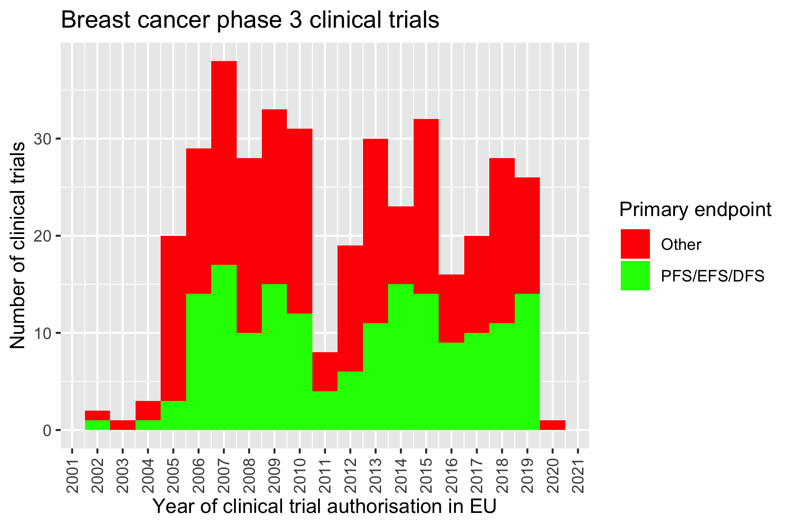
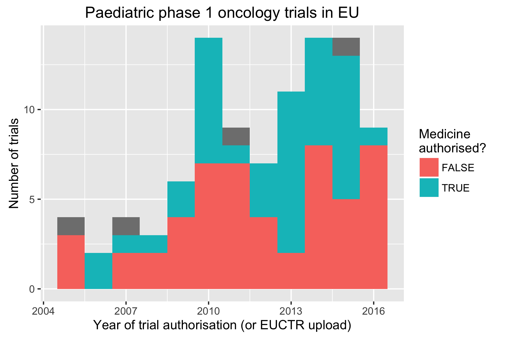
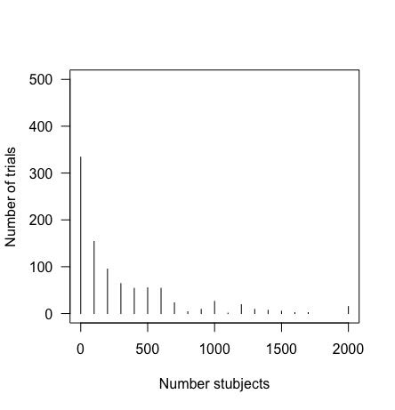

# Examples for using R package `ctrdata` for clinical trial protocol-related information

```{r setup, include=FALSE}
#
library(ctrdata)
#
knitr::opts_chunk$set(eval=FALSE, warning=FALSE, message=FALSE, results="hide")
#
# render this document to PDF with this command executed in the vignettes/ folder: 
# Rscript -e 'rmarkdown::render("ctrdata_examples.Rmd", output_format = "pdf_document")'
#
if (knitr::opts_knit$get('rmarkdown.pandoc.to') == 'latex') knitr::opts_chunk$set(dev = 'pdf')
#
```

General information on the `ctrdata` package is available here: [https://github.com/rfhb/ctrdata](https://github.com/rfhb/ctrdata). 

## Execute a search query and load into database

```{r execute_load_query}
# 
# Load library which has previously been installed:
library(ctrdata)
#
# In the browser, this is a search query used as example: 
# all phase 3 adult breast cancer trials
q <- "https://www.clinicaltrialsregister.eu/ctr-search/search?query=cancer+AND+breast&age=adult&phase=phase-three"
# 
# Load details on all clinical trials into local data base:
ctrLoadQueryIntoDb(q)
#
```

## Execute in browser a search query that was previously stored

```{r execute_browser_query}
# 
# The function ctrOpenSearchPagesInBrowser() can be used to open blank search pages, but 
# also to execute a previous search. This can be used to check if user searches are 
# properly handled by this package, for example by comparing the number of search results.
# 
# Example 1: a search is done in the browser and a list of trials found is shown. 
# Mark all of the browser address field has copy it onto the system clipboard. Then:
q <- ctrGetQueryUrlFromBrowser()  # read search from clipboard
ctrOpenSearchPagesInBrowser(q)    # open search newly in broweser
#
# Example 2: After records have already been downloaded: 
q <- ctrQueryHistoryInDb()        # list the searches in the database (returns a data frame)
q <- q [2,]                       # select exactly one of the searches (by subsetting q)
ctrOpenSearchPagesInBrowser(q)    # open selected search newly in broweser
#
# This opens a browser already executing an example search:
ctrOpenSearchPagesInBrowser(register = "EUCTR", queryterm = "cancer&age=under-18")
#
```


## Find fields / variables of interest

```{r find_variables}
# 
dbFindVariable("date", allmatches = TRUE)
#  [1] "firstreceived_date"                                                               
#  [2] "lastchanged_date"                                                                 
#  [3] "required_header.download_date"                                                    
#  [4] "verification_date"                                                                
#  [5] "start_date"                                                                       
#  [6] "primary_completion_date"                                                          
#  [7] "completion_date"                                                                  
#  [8] "x6_date_on_which_this_record_was_first_entered_in_the_eudract_database"           
#  [9] "n_date_of_competent_authority_decision"                                           
# [10] "n_date_of_ethics_committee_opinion"                                               
# [11] "firstreceived_results_date"                                                       
# [12] "p_date_of_the_global_end_of_the_trial"                                            
# [...]
#
```

## Update data base from query in specified register

```{r execute_update_query}
#
# List queries:
ctrQueryHistoryInDb()
# 
# 
# Update query number 1 in the history:
#  - EUCTR information can be incrementally downloaded or updated only
#    for the last 7 days, after which a full new download is necessary. 
#  - CTGOV intformation can always be incrementally downloaded or updated. 
ctrLoadQueryIntoDb(querytoupdate = 1)
#
ctrQueryHistoryInDb()
# Note: after such an update, the column "query-records" refers 
# to the number of records that were added or updated, only, 
# when the update was run as per the "query-timestamp", 
# not to the total number of records. 
#
#
# The date and time of the last download of individual records
# is stored in the variable "record_last_import" as follows: 
resultDate <- dbGetVariablesIntoDf("record_last_import")
lastUpdate <- strptime(resultDate$record_last_import, format = "%Y-%m-%d %H:%M:%S")
summary(lastUpdate)
#                  Min.               1st Qu.                Median  [...]
# "2016-04-21 19:49:54" "2016-04-21 19:49:54" "2016-04-21 19:49:54"  [...] 
#
```


## Deduplicate country-specific records of a trial, visualise trial information

Note EUCTR provides country-specific records for trials, see README.md. 

```{r deduplicate_visualise_euctr}
#
# Example 1: Relation between number of study participants in one country and in whole trial? 
#
result <- dbGetVariablesIntoDf(c("f41_in_the_member_state", "f422_in_the_whole_clinical_trial"))
#
if(interactive()) plot(f41_in_the_member_state ~ f422_in_the_whole_clinical_trial, result)
# [result not shown]
# 
#
# Example 2: How many clinical trials are ongoing or completed, per country?
#
result <- dbGetVariablesIntoDf(c("a1_member_state_concerned", "x5_trial_status"))
#
if(interactive()) with (result, table(a1_member_state_concerned, x5_trial_status))
# [result not shown]
#
# 
# Example 3: How many clinical trials where started in which year?
#
result <- dbGetVariablesIntoDf(c("a1_member_state_concerned", 
                                 "n_date_of_competent_authority_decision", 
                                 "a2_eudract_number"))
#
# Eliminate trials records duplicated by member state: 
result <- dfFindUniqueEuctrRecord(result)
# 1781 EUCTR records dropped that were not the preferred of multiple records for the trial.
#
# Visualise:
result$startdate <- strptime(result$n_date_of_competent_authority_decision, "%Y-%m-%d")
hist(result$startdate, breaks = "years", freq = TRUE, las = 1); box()
#
```


## Download from another register, check for duplicates, merge variables and re-organise values 

```{r execute_ctgov_query}
#
# Get data from another register: 
#
# Ongoing phase 3 interventional trials in breast carcinoma
q <- "https://clinicaltrials.gov/ct2/results?term=&recr=Open&type=Intr&cond=breast+carcinoma&intr=Drug&state1=&age=1&phase=2"
#
# Show and check search in browser: 
ctrOpenSearchPagesInBrowser(q)
#
# Load data: 
ctrLoadQueryIntoDb(q)
# ctrLoadQueryIntoDb(queryterm = "ependymoma&recr=Open&type=Intr&age=0", register = "CTGOV")
#
# Data from which queries have now been downloaded into the database? 
ctrQueryHistoryInDb()
# 
# Get columns from the database from different registers
# (takes some time as variables are merged one after the other): 
dbFindVariable("status", allmatches = TRUE)
result <- dbGetVariablesIntoDf(c("overall_status", 
                                 "x5_trial_status", 
                                 "a2_eudract_number"))
#
# Find ids of unique trials and subset the result set to these unique trials:
ids_of_unique_trials <- dbFindIdsUniqueTrials()
# Searched for EUCTR identifiers in second id fields of CTGOV records.
# Searched for CTGOV identifiers in second id fields of CTGOV records.
# Total 24 duplicate(s) found, returning keys (_id) of 2513 records.
#
# Subset the result set to these unique trials:
result <- subset (result, subset = `_id` %in% ids_of_unique_trials)
#
# Select one Member State's version of an internactional trial:
result <- dfFindUniqueEuctrRecord(result)
# 1766 EUCTR records dropped that were not the preferred of multiple records for the trial.
#
# Now merge two variables into a new variable for analysis:
tmp <- dfMergeTwoVariablesRelevel(result, 
                                  varnames = c("overall_status", "x5_trial_status"))
# Unique values returned: Ongoing, Completed, Prematurely Ended, Temporarily Halted, 
#  Restarted, Recruiting, Not yet recruiting
#
table(tmp)
# Active, not recruiting    Completed   Enrolling by invitation  [...] 
#                     812        2572                        29  [...]
#              Recruiting   Suspended        Temporarily Halted  [...]
#                    1148          38                         2  [...]
#
# Merge two variables as above and in addition, 
# condense their values into a new value:
statusvalues <- list("ongoing" = c("Recruiting", "Active", "Ongoing", 
                                   "Active, not recruiting", 
                                   "Enrolling by invitation", "Restarted"),
                    "completed" = c("Completed", "Prematurely Ended", "Terminated"),
                    "other"     = c("Withdrawn", "Suspended", "No longer available", 
                                    "Not yet recruiting", "Temporarily Halted"))
#
tmp <- dfMergeTwoVariablesRelevel(result, 
                                  varnames = c("overall_status", "x5_trial_status"), 
                                  levelslist = statusvalues)
# Unique values returned: ongoing, completed, other
#
table(tmp)
# completed   ongoing     other 
#       159       671       115
#
```

## Use another mongo package for analysis, for example to count sites per trial

Note: Packages to access mango such as `mongolite` or `RMongo` may work to access data that are already in the dababase. However, package `rmongodb` is still necessary to retrieve data from registers and to store these data into the database. 

```{r mongolite_count_details}
#
library(mongolite)
#
m <- mongo(db = "users", collection = "ctrdata")
# 
# Check if there are any duplicates:
ids_of_unique_trials <- dbFindIdsUniqueTrials()
# Searched for EUCTR identifiers in second id fields of CTGOV records.
# Searched for CTGOV identifiers in second id fields of CTGOV records.
# Total 24 duplicate(s) found, returning keys (_id) of 2513 records.
#
# Find the database elements that represent a site:
out <- m$find('{}', '{"location.facility.name": 1}')
#
# If there were duplicates, the unique trials could be retained like this:
out <- subset (out, subset = `_id` %in% ids_of_unique_trials)
#
# Define a helper function to count elements, irrespective of whether
# the elements are in an array or are a set of subdocuments in the database:
count.elements <- function (dataframecolumn) {
   return(sapply(dataframecolumn, 
                 function(x) ifelse (is.data.frame(tmp <- unlist (x[[1]])), 
                                     nrow(tmp), length(tmp))))
}
#
# Sum up number of sites per trial:
out$number_of_sites <- count.elements (out$location)
#
# Inspect first rows:
out[1:5,]
#                 _id                                      location  number_of_sites
# 1       NCT00097292  Children's Hospital LA, UCSF, Stanford [...]               21
# 2       NCT00129259                   The Diabetes Center at UCSF                1
# 3 2006-001238-41-IT                                          NULL                0
#
# For many trials, no locations seem to be specified:
out <- out [out$number_of_sites >= 1 & out$number_of_sites <50, ]
#
# Draw histogram:
hist (out$number_of_sites)
#
```

## Plot frequency of certain end points

```{r plot_endpoint_frequencies}
#
# Search for interesting variables,  
# note the spelling in EUCTR:
dbFindVariable("end_point", allmatches = TRUE)
#
# Get interesting variables from database 
# for further analysis within R:
result <- dbGetVariablesIntoDf(c("a2_eudract_number", 
                                 "a41_sponsors_protocol_code_number", 
                                 "n_date_of_competent_authority_decision", 
                                 "e73_therapeutic_confirmatory_phase_iii", 
                                 "e51_primary_end_points"))
#
# Eliminate trials records duplicated by member state
# keep a single record and if available use preference:
result <- dfFindUniqueEuctrRecord(result)
#
# Checking expected number of trials:
nrow(result)
length(unique(result$a2_eudract_number))
#
# Only use phase 3 trials:
table(result$e73_therapeutic_confirmatory_phase_iii, exclude = "")
result <- result[!is.na(result$e73_therapeutic_confirmatory_phase_iii) &
                        result$e73_therapeutic_confirmatory_phase_iii == "Yes", ]
#
# Is the a primary endpoint of interest? This uses regular expressions:
#
# PFS / EFS / RFS / DFS
result$pe_is_efs <- grepl("((progression|event|relapse|recurrence|disease)[- ]free)|pfs|dfs|efs)", 
                          result$e51_primary_end_points, ignore.case = TRUE)
#
# Prepare for summarising:
result$trial_start_year <- as.Date(substr(result$n_date_of_competent_authority_decision, 1, 4), format = "%Y")
#
# Plot:
library(ggplot2)
ggplot(data = result, aes(x = trial_start_year, fill = pe_is_efs)) + 
  geom_histogram(binwidth = 365.25)  + 
  labs(title = "Breast cancer phase 3 clinical trials", 
       x = "Year of clinical trial authorisation in EU", 
       y = "Number of clinical trials") +
  scale_fill_manual(name = "Primary endpoint", 
                    values = c("red", "green"), 
                    labels = c("FALSE" = "Other", "TRUE" = "PFS/EFS/DFS")) +
  theme(axis.text.x  = element_text(angle = 90, vjust = 0.5)) + 
  scale_x_date(date_breaks = "1 year", date_labels = "%Y")
#
# Plausibility check - what is the primary endpoint
# if not one of the endpoints of interest? 
# Look into first ten examples foundL
substr(result$e51_primary_end_points[result$pe_is_efs == FALSE], 1, 80)[1:10]
# [results not shown]
#
```



## Plot map of ongoing trials

```{r plot_map_trials}
#
# TODO
#
```

## Histogram of status of investigational medicinal product

```{r hist_medicine_status}
#
if (FALSE) ctrLoadQueryIntoDb(register = "EUCTR", 
                              queryterm = "&age=under-18&phase=phase-one&phase=phase-two", 
                              ns = "paediatric_phase12_trialsxx")
                              ns = "paediatric_phase12_trials")
#
ctrQueryHistoryInDb(ns = "paediatric_phase12_trials")
#
ctrLoadQueryIntoDb(querytoupdate = 1, ns = "paediatric_phase12_trials")
#
dbFindVariable("phase", allmatches = TRUE, ns = "paediatric_phase12_trials")
# [1] "e72_therapeutic_exploratory_phase_ii"   "e71_human_pharmacology_phase_i"
# [3] "e73_therapeutic_confirmatory_phase_iii" "e74_therapeutic_use_phase_iv"  
#
result <- dbGetVariablesIntoDf(c("a1_member_state_concerned", "n_date_of_competent_authority_decision",
                                 "dimp.d21_imp_to_be_used_in_the_trial_has_a_marketing_authorisation", 
                                 "e11_medical_conditions_being_investigated", "e112_therapeutic_area", 
                                 "e71_human_pharmacology_phase_i", "e72_therapeutic_exploratory_phase_ii",
                                 "x6_date_on_which_this_record_was_first_entered_in_the_eudract_database",
                                 "f422_in_the_whole_clinical_trial", 
                                 "a3_full_title_of_the_trial", "a2_eudract_number"), 
                               ns = "paediatric_phase12_trials")
#
searchfor <- "cancer, leukaem, leukem, tumour, tumor, sarcoma, blastom, gliom, germ, lymphom, malign, hodgkin, ewing, rhabdo, terato, tumeur, leucemi"
searchfor <- strsplit(searchfor, ", ")[[1]]
#
# helper function to extend grepl to check for several patterns
grepl_multi <- function (patterns, x, simplify = TRUE) {
  if(!is.vector(patterns)) stop("patterns should be a vector.")
  ret <- apply(as.matrix(patterns), 1, function(pattern) grepl(pattern, x, ignore.case = TRUE))
  ret <- as.data.frame(ret)
  if (simplify) 
    ret <- rowSums(ret) >= 1
  else
    names(ret) <- patterns
  return(ret)
}
#
relevant <- grepl_multi(searchfor, result$a3_full_title_of_the_trial) | 
            grepl_multi(searchfor, result$e11_medical_conditions_being_investigated) |
            grepl_multi("C04",     result$e112_therapeutic_area)
#
# check
table(relevant)
nrow(result) 
length(unique(result[["_id"]]))
length(dbFindIdsUniqueTrials(ns = "paediatric_phase12_trials"))
#
# get relevant trials
result <- result[relevant,]
#
# which phases are included? 
tmp <- dfFindUniqueEuctrRecord (result, include3rdcountrytrials = FALSE)
tmp <- tmp[tmp$e71_human_pharmacology_phase_i == "Yes",]
with(tmp,   plot(f422_in_the_whole_clinical_trial ~ as.numeric(substr(n_date_of_competent_authority_decision, 1, 4))))
with(tmp, tapply(f422_in_the_whole_clinical_trial,  
                 as.numeric(substr(n_date_of_competent_authority_decision, 1, 4)), 
                 function (x) median (as.numeric (x), na.rm = TRUE)))
4tmp <- tmp[grepl ("^201[1-9]-.+", tmp$n_date_of_competent_authority_decision), ]
with(tmp, table(e71_human_pharmacology_phase_i, e72_therapeutic_exploratory_phase_ii))
#
# for further steps only look at phase 1 trials
result <- result[result$e71_human_pharmacology_phase_i == "Yes",]
#
# adjust date format
result$startdate <- ifelse(!is.na(tmp <- result$n_date_of_competent_authority_decision), tmp, 
                          result$x6_date_on_which_this_record_was_first_entered_in_the_eudract_database)
result$startdate <- strptime(result$startdate, "%Y-%m-%d")
#
# find first member state to authorise trial
tmp <- aggregate(result$startdate, 
                 by = list (result$a2_eudract_number),
                 FUN = function (x) min (x))
result <- merge (x = result, y = tmp, 
                 by.x = "a2_eudract_number", by.y = "Group.1", 
                 all.x = TRUE)
# label date and calculate year
names(result)[ncol(result)] <- "startdatefirst"
result$startyearfirst <- as.numeric(format(result$startdatefirst, "%Y"))
#
# create eu single-trial record dataset
table(grepl("-3RD", result[["_id"]]), exclude = "")
result <- dfFindUniqueEuctrRecord (result, include3rdcountrytrials = FALSE)
#
# any of the investigational medicinal product(s) authorised or not?
table(result$dimp.d21_imp_to_be_used_in_the_trial_has_a_marketing_authorisation)
library(stringi)
tmp <- stri_count(result$dimp.d21_imp_to_be_used_in_the_trial_has_a_marketing_authorisation, fixed = "Yes")
table(tmp, exclude = "")
tmp <- tmp > 0
#
# draw plot
library(ggplot2)
ggplot(data = result, 
       aes(x = startyearfirst, fill = tmp)) + 
  geom_histogram(binwidth = 1) + 
  labs(title = "Paediatric phase 1 oncology trials in EU", 
       x = "Year of trial authorisation (or EUCTR upload)", 
       y = "Number of trials", 
       fill = "Medicine\nauthorised?")
#
# possibly save plot
# ggsave("phase1_paed_oncol.png", width = 3, height = 2)
#
```


## Use aggregation functions of the data base to find specific trial endpoints

```{r mongodb_aggregation_pipeline}
#
library(mongolite)
#
# Link R object m to the specified database collection:
m <- mongo(db = "users", collection = "ctrdata")
#
# Number of all records:
m$count()
#
# Number of CTGOV records, using json for query:
m$count('{"_id": {"$regex": "NCT[0-9]{8}"}}')
# 
#
# The following uses the aggregation pipeline in mongo:
#
# Count number of records in which certain terms occur,
# in any of the elements of the array in primary_outcome. 
# Regular expressions ("$regex") are case insensitive ("i")
#
# Recommendation: to best define regular expressions for analyses, 
# inspect the field primary_outcome.measure in data base, or print:
m$distinct("primary_outcome.measure", query = '{"_id": {"$regex": "NCT[0-9]{8}"}}')
#
# PFS, EFS, RFS or DFS
m$aggregate('[{"$match": {"primary_outcome.measure": 
                         {"$regex": "(progression|event|relapse|recurrence|disease)[- ]free", 
                          "$options": "i"}}}, 
              {"$group": {"_id": "null", "count": {"$sum": 1}}}]')
#
#  Imported 1 records. Simplifying into dataframe...
#    _id  count
# 1 null     67
#
#
# See here for details on mongo's aggregation pipleline: 
# https://docs.mongodb.org/manual/core/aggregation-pipeline/
#
#
# OS by year
out <- m$aggregate('[{"$match": {"primary_outcome.measure": 
                                {"$regex": "overall survival", 
                                 "$options": "i"}}}, 
                     {"$project": {"_id": 1, "firstreceived_date": 1}}]')
#
#  Imported 267 records. Simplifying into dataframe...
#
out
#             _id firstreceived_date
# 1   NCT00001941   January 18, 2000
# 2   NCT00002474   November 1, 1999
# 3   NCT00002495   November 1, 1999
# 4   NCT00002514   November 1, 1999
# [...]
#
# Extraction of year from firstreceived_date such as "August 29, 2009"
out$year <- substr (out$firstreceived_date, 
                    tmp <- nchar(out$firstreceived_date) - 4, 
                    tmp + 4)
#
table (out$year)
# [...]  2006  2007  2008  2009  2010  2011  2012  2013  2014  2015 
#           5     4    13     3     8     3     8     4     6     6 
#
```

## Using mapreduce operations to analyse participant numbers

Note that the mongodb documentation includes that a mapreduce operation might not be as fast and efficient as using the aggregation pipeline, which was used in the preceding example. 

```{r mongodb_mapreduce}
#
library(mongolite)
#
m <- mongo(db = "users", collection = "ctrdata")
#
# Count number of trials (trial records) with number of study participants 
# in bins of hundreds of participants:
#
hist <- m$mapreduce(
#
  map = "function(){emit(Math.floor(this.f422_in_the_whole_clinical_trial/100)*100, 1)}", 
  #
  reduce = "function(id, counts){return Array.sum(counts)}"
  #
)
#
hist
#      _id value
# 1    NaN  5364
# 2      0   344
# 3    100   183
# 4    200    79
# 5    300   102
# 6    400    78
#
# note: _id is the bin of hundreds of study participants, 
# value is the number of studies in respective bin
# 
plot (hist, type = "h", las = 1, xlim = c(0, 2000), ylim = c(0, 500), 
      xlab = "Number stubjects", y = "Number trials")
#
```


